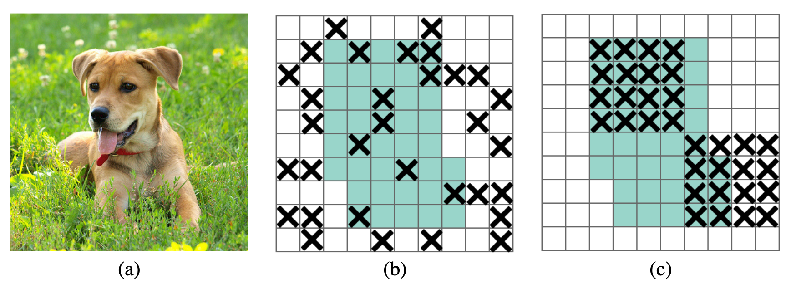

# YOLOv3增强模型

---

## 简介

[YOLOv3](https://arxiv.org/abs/1804.02767) 是由 [Joseph Redmon](https://arxiv.org/search/cs?searchtype=author&query=Redmon%2C+J) 和 [Ali Farhadi](https://arxiv.org/search/cs?searchtype=author&query=Farhadi%2C+A) 提出的单阶段检测器, 该检测
器与达到同样精度的传统目标检测方法相比，推断速度能达到接近两倍.

PaddleDetection实现版本中使用了 [Bag of Freebies for Training Object Detection Neural Networks](https://arxiv.org/abs/1902.04103v3) 中提出的图像增强和label smooth等优化方法，精度优于darknet框架的实现版本，在COCO-2017数据集上，YOLOv3(DarkNet)达到`mAP(0.50:0.95)= 38.9`的精度，比darknet实现版本的精度(33.0)要高5.9。同时，在推断速度方面，基于Paddle预测库的加速方法，推断速度比darknet高30%。

在此基础上，PaddleDetection对YOLOv3进一步改进，进一步提升了速度和精度，最终在COCO mAP上可以达到43.2。


## 方法描述

1.将[YOLOv3](https://arxiv.org/pdf/1804.02767.pdf)骨架网络更换为[ResNet50-VD](https://arxiv.org/pdf/1812.01187.pdf)。ResNet50-VD网络相比原生的DarkNet53网络在速度和精度上都有一定的优势，且相较DarkNet53 ResNet系列更容易扩展，针对自己业务场景可以选择ResNet18、34、101等不同结构作为检测模型的主干网络。

2.引入[Deformable Convolution v2](https://arxiv.org/abs/1811.11168)(可变形卷积)替代原始卷积操作，Deformable Convolution已经在多个视觉任务中广泛验证过其效果，在Yolo v3增强模型中考虑到速度与精度的平衡，我们仅使用Deformable Convolution替换了主干网络中Stage5部分的3x3卷积。

3.在FPN部分增加[DropBlock](https://arxiv.org/abs/1810.12890)模块，提高模型泛化能力。Dropout操作如下图（b）中所示是分类网络中广泛使用的增强模型泛化能力的重要手段之一。DropBlock算法相比于Dropout算法，在Drop特征的时候会集中Drop掉某一块区域，更适应于在检测任务中提高网络泛化能力。



4.Yolo v3作为一阶段检测网络，在定位精度上相比Faster RCNN，Cascade RCNN等网络结构有着其天然的劣势，增加[IoU Loss](https://arxiv.org/abs/1908.03851)分支，可以一定程度上提高BBox定位精度，缩小一阶段和两阶段检测网络的差距。

5.增加[IoU Aware](https://arxiv.org/abs/1912.05992)分支，预测输出BBox和真实BBox的IoU，修正用于NMS的评分，可进一步提高YOLOV3的预测性能。

6.使用[Object365数据集](https://www.objects365.org/download.html)训练得到的模型作为coco数据集上的预训练模型，Object365数据集包含约60万张图片以及365种类别，相比coco数据集进行预训练可以进一步提高YOLOv3的精度。

## 使用方法

### 模型训练

```bash
export CUDA_VISIBLE_DEVICES=0,1,2,3,4,5,6,7
python tools/train.py -c configs/dcn/yolov3_r50vd_dcn_db_iouloss_obj365_pretrained_coco.yml
```

更多模型参数请使用``python tools/train.py --help``查看，或参考[训练、评估及参数说明](../tutorials/GETTING_STARTED_cn.md)文档

### 模型效果

|                   模型                   |                          预训练模型                          | 验证集 mAP |               P4预测速度               |                             下载                             | 配置文件 |
| :--------------------------------------: | :----------------------------------------------------------: | :--------: | :------------------------------------: | :----------------------------------------------------------: | :--------: |
|              YOLOv3 DarkNet              | [DarkNet pretrain](https://paddle-imagenet-models-name.bj.bcebos.com/DarkNet53_pretrained.tar) |    38.9    | 原生：88.3ms<br>tensorRT-FP32: 42.5ms  | [下载链接](https://paddlemodels.bj.bcebos.com/object_detection/yolov3_darknet.tar) |  [配置文件](https://github.com/PaddlePaddle/PaddleDetection/tree/master/configs/yolov3_darknet.yml) |
|          YOLOv3 ResNet50_vd DCN          | [ImageNet pretrain](https://paddle-imagenet-models-name.bj.bcebos.com/ResNet50_vd_pretrained.tar) |    39.1    | 原生：74.4ms<br>tensorRT-FP32: 35.2ms  | [下载链接](https://paddlemodels.bj.bcebos.com/object_detection/yolov3_r50vd_dcn_imagenet.tar) | [配置文件](https://github.com/PaddlePaddle/PaddleDetection/tree/master/configs/dcn/yolov3_r50vd_dcn.yml) |
|          YOLOv3 ResNet50_vd DCN          | [Object365 pretrain](https://paddlemodels.bj.bcebos.com/object_detection/ResNet50_vd_dcn_db_obj365_pretrained.tar) |    42.5    | 原生：74.4ms<br>tensorRT-FP32: 35.2ms  | [下载链接](https://paddlemodels.bj.bcebos.com/object_detection/yolov3_r50vd_dcn_obj365_v2.tar) | [配置文件](https://github.com/PaddlePaddle/PaddleDetection/tree/master/configs/dcn/yolov3_r50vd_dcn_obj365_pretrained_coco.yml) |
|     YOLOv3 ResNet50_vd DCN DropBlock     | [Object365 pretrain](https://paddlemodels.bj.bcebos.com/object_detection/ResNet50_vd_dcn_db_obj365_pretrained.tar) |    42.8    | 原生：74.4ms<br/>tensorRT-FP32: 35.2ms | [下载链接](https://paddlemodels.bj.bcebos.com/object_detection/yolov3_r50vd_dcn_obj365_dropblock.tar) | [配置文件](https://github.com/PaddlePaddle/PaddleDetection/tree/master/configs/dcn/yolov3_r50vd_dcn_db_obj365_pretrained_coco.yml) |
| YOLOv3 ResNet50_vd DCN DropBlock IoULoss | [Object365 pretrain](https://paddlemodels.bj.bcebos.com/object_detection/ResNet50_vd_dcn_db_obj365_pretrained.tar) |    43.2    | 原生：74.4ms<br/>tensorRT-FP32: 35.2ms | [下载链接](https://paddlemodels.bj.bcebos.com/object_detection/yolov3_r50vd_dcn_obj365_dropblock_iouloss.tar) | [配置文件](https://github.com/PaddlePaddle/PaddleDetection/tree/master/configs/dcn/yolov3_r50vd_dcn_db_iouloss_obj365_pretrained_coco.yml) |
| YOLOv3 ResNet50_vd DCN DropBlock IoU-Aware | [Object365 pretrain](https://paddlemodels.bj.bcebos.com/object_detection/ResNet50_vd_dcn_db_obj365_pretrained.tar) |    43.6    | 原生：74.4ms<br/>tensorRT-FP32: 35.2ms | [下载链接](https://paddlemodels.bj.bcebos.com/object_detection/yolov3_r50vd_dcn_db_iouaware_obj365_pretrained_coco.pdparams) | [配置文件](https://github.com/PaddlePaddle/PaddleDetection/tree/master/configs/dcn/yolov3_r50vd_dcn_db_iouaware_obj365_pretrained_coco.yml) |
