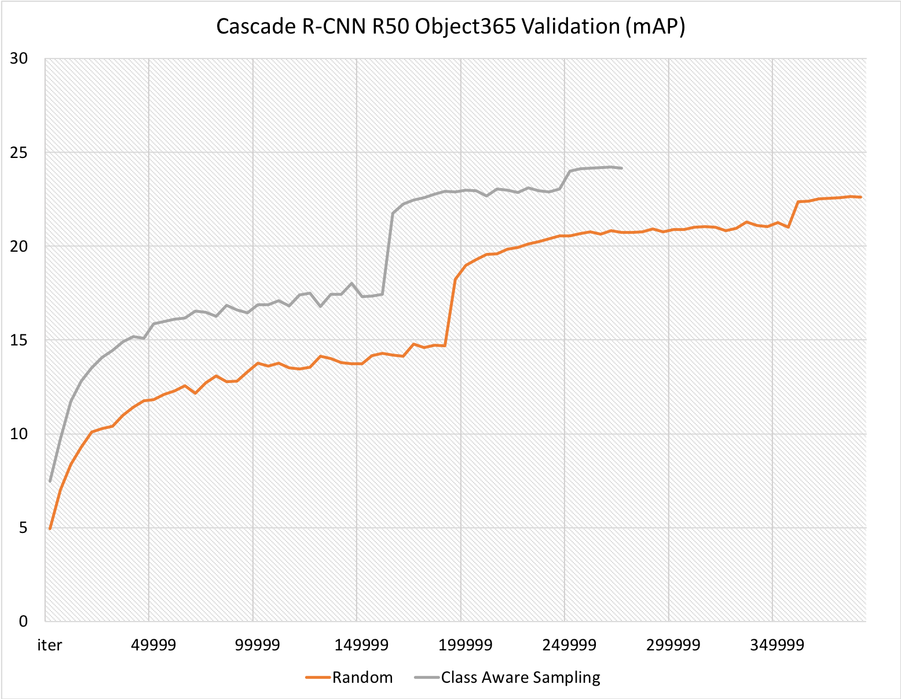
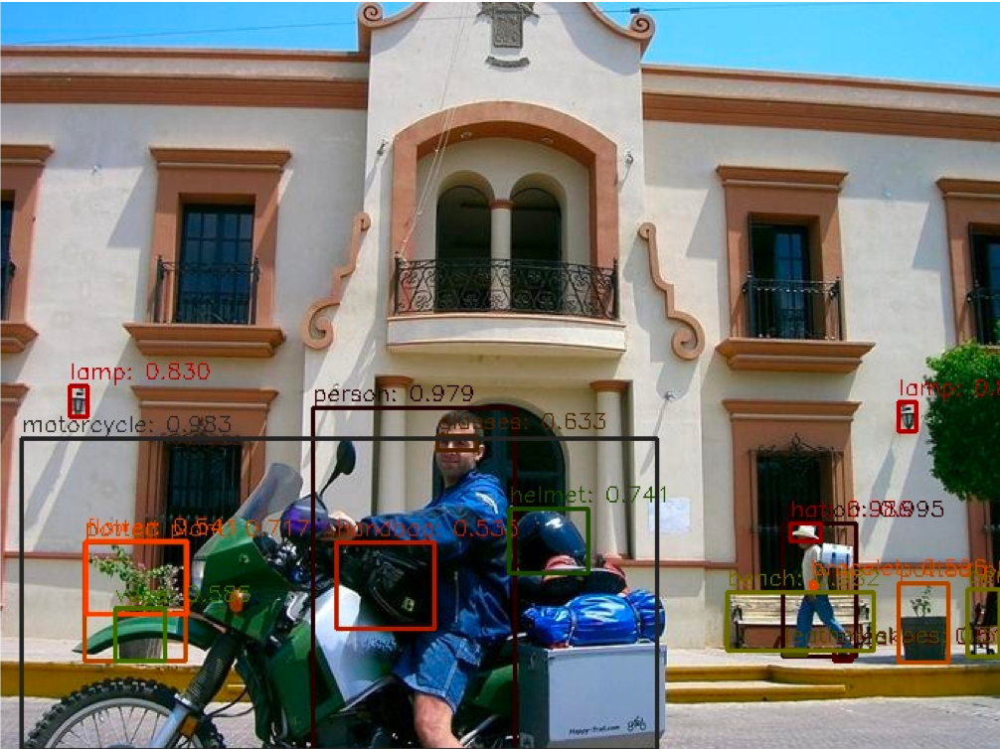

# CACascade RCNN
## 简介
CACascade RCNN是百度视觉技术部在Objects365 2019 Challenge上夺冠的最佳单模型之一，Objects365是在通用物体检测领域的一个全新的数据集，旨在促进对自然场景不同对象的检测研究。Objects365在63万张图像上标注了365个对象类，训练集中共有超过1000万个边界框。这里放出的是Full Track任务中最好的单模型之一。


## 方法描述

针对大规模物体检测算法的特点，我们提出了一种基于图片包含物体类别的数量的采样方式（Class Aware Sampling）。基于这种方式进行训练模型可以在更短的时间使模型收敛到更好的效果。



本次公布的最好单模型是一个基于Cascade RCNN的两阶段检测模型，在此基础上将Backbone替换为更加强大的SENet154模型，Deformable Conv模块以及更复杂二阶段网络结构，针对BatchSize比较小的情况增加了Group Normalization操作并同时使用了多尺度训练，最终达到了非常理想的效果。预训练模型先后分别在ImageNet和COCO数据集上进行了训练，其中在COCO数据集上训练时增加了Mask分支，其余结构与CACascade RCNN相同， 会在启动训练时自动下载。

## 使用方法

1.准备数据

数据需要通过[Objects365官方网站](https://www.objects365.org/download.html)进行申请下载，数据下载后将数据放置在dataset目录中。
```
${THIS REPO ROOT}
  \--dataset
      \-- objects365
           \-- annotations
                |-- train.json
                |-- val.json
           \-- train
           \-- val
```

2.启动训练模型

```bash
python tools/train.py -c configs/obj365/cascade_rcnn_dcnv2_se154_vd_fpn_gn_cas.yml
```

3.模型预测结果

|        模型         | 验证集 mAP |                           下载链接                           | 配置文件 |
| :-----------------: | :--------: | :----------------------------------------------------------: | :--------: |
| CACascadeRCNN SE154 |    31.6    | [model](https://paddlemodels.bj.bcebos.com/object_detection/cascade_rcnn_dcnv2_se154_vd_fpn_gn_cas_obj365.tar) |  [配置文件](https://github.com/PaddlePaddle/PaddleDetection/tree/master/configs/obj365/cascade_rcnn_dcnv2_se154_vd_fpn_gn_cas.yml) |

## 模型效果


