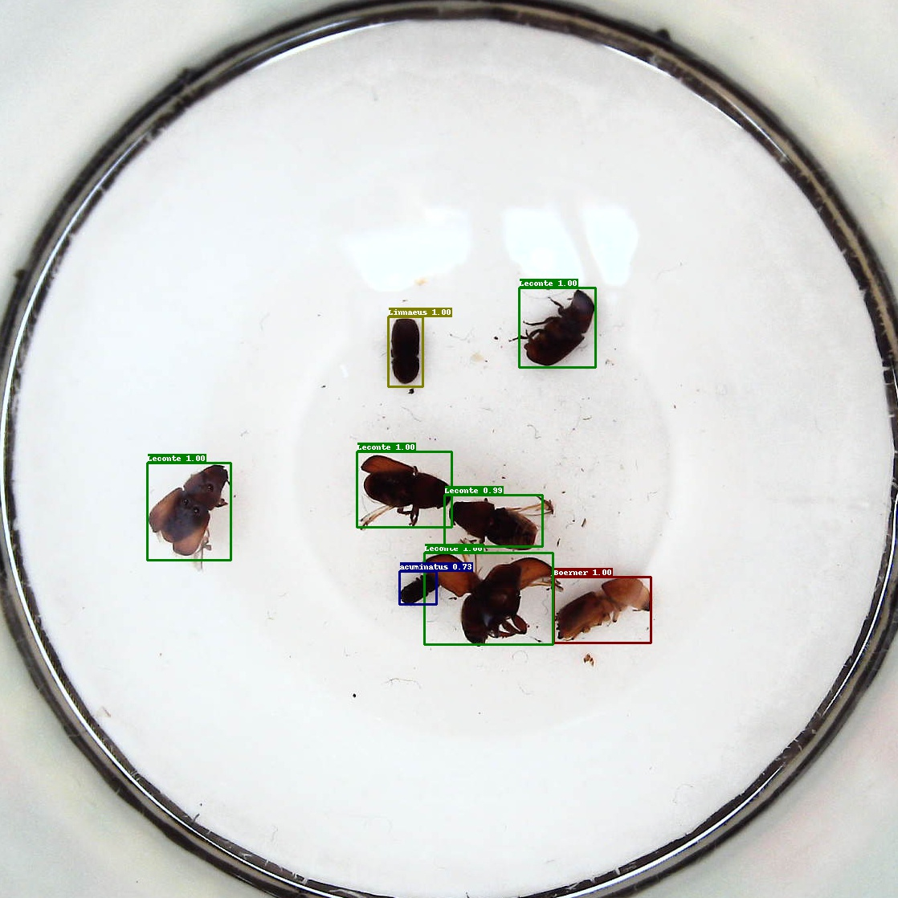

# 如何训练自定义数据集

## 目录
- [1.数据准备](#1准备数据)
    - [将数据集转换为COCO格式](#方式一将数据集转换为COCO格式)
    - [将数据集转换为VOC格式](#方式二将数据集转换为VOC格式)
    - [添加新数据源](#方式三添加新数据源)
- [2.选择模型](#2选择模型)
- [3.生成Anchor](#3生成Anchor)
- [4.修改参数配置](#4修改参数配置)
- [5.开始训练与部署](#5开始训练与部署)
- [附：一个自定义数据集demo](#附一个自定义数据集demo)

## 1.准备数据
如果数据符合COCO或VOC数据集格式，可以直接进入[2.选择模型](#2选择模型)，否则需要将数据集转换至COCO格式或VOC格式。

### 方式一：将数据集转换为COCO格式

在`./tools/`中提供了`x2coco.py`用于将voc格式数据集、labelme标注的数据集或cityscape数据集转换为COCO数据集，例如:

（1）labelmes数据转换为COCO格式：
```bash
python tools/x2coco.py \
                --dataset_type labelme \
                --json_input_dir ./labelme_annos/ \
                --image_input_dir ./labelme_imgs/ \
                --output_dir ./cocome/ \
                --train_proportion 0.8 \
                --val_proportion 0.2 \
                --test_proportion 0.0
```

**参数说明：**

- `--dataset_type`：需要转换的数据格式，目前支持：’voc‘、’labelme‘和’cityscape‘
- `--json_input_dir`：使用labelme标注的json文件所在文件夹
- `--image_input_dir`：图像文件所在文件夹
- `--output_dir`：转换后的COCO格式数据集存放位置
- `--train_proportion`：标注数据中用于train的比例
- `--val_proportion`：标注数据中用于validation的比例
- `--test_proportion`：标注数据中用于infer的比例

（2）voc数据转换为COCO格式：
```bash
python tools/x2coco.py \
        --dataset_type voc \
        --voc_anno_dir path/to/VOCdevkit/VOC2007/Annotations/ \
        --voc_anno_list path/to/VOCdevkit/VOC2007/ImageSets/Main/trainval.txt \
        --voc_label_list dataset/voc/label_list.txt \
        --voc_out_name voc_train.json
```

**参数说明：**

- `--dataset_type`：需要转换的数据格式，当前数据集是voc格式时，指定’voc‘即可。
- `--voc_anno_dir`：VOC数据转换为COCO数据集时的voc数据集标注文件路径。
例如：
```
├──Annotations/
   ├──	009881.xml
   ├──  009882.xml
   ├──  009886.xml
   ...
```
- `--voc_anno_list`：VOC数据转换为COCO数据集时的标注列表文件，文件中是文件名前缀列表，一般是`ImageSets/Main`下trainval.txt和test.txt文件。
例如：trainval.txt里的内容如下:
```
009881
009882
009886
...
```
- `--voc_label_list`：VOC数据转换为COCO数据集时的类别列表文件，文件中每一行表示一种物体类别。
例如：label_list.txt里的内容如下:
```
background
aeroplane
bicycle
...
```
- `--voc_out_name`：VOC数据转换为COCO数据集时的输出的COCO数据集格式json文件名。


### 方式二：将数据集转换为VOC格式

VOC数据集所必须的文件内容如下所示，数据集根目录需有`VOCdevkit/VOC2007`或`VOCdevkit/VOC2012`文件夹，该文件夹中需有`Annotations`,`JPEGImages`和`ImageSets/Main`三个子目录，`Annotations`存放图片标注的xml文件，`JPEGImages`存放数据集图片，`ImageSets/Main`存放训练trainval.txt和测试test.txt列表。
  ```
  VOCdevkit
  ├──VOC2007(或VOC2012)
  │   ├── Annotations
  │       ├── xxx.xml
  │   ├── JPEGImages
  │       ├── xxx.jpg
  │   ├── ImageSets
  │       ├── Main
  │           ├── trainval.txt
  │           ├── test.txt
  ```

执行以下脚本，将根据`ImageSets/Main`目录下的trainval.txt和test.txt文件在数据集根目录生成最终的`trainval.txt`和`test.txt`列表文件：
```shell
python dataset/voc/create_list.py -d path/to/dataset
```
**参数说明：**
- `-d`或`--dataset_dir`：VOC格式数据集所在文件夹路径


### 方式三：添加新数据源

如果数据集有新的格式需要添加进PaddleDetection中，您可自行参考数据处理文档中的[添加新数据源](../advanced_tutorials/READER.md#添加新数据源)文档部分，开发相应代码完成新的数据源支持，同时数据处理具体代码解析等可阅读[数据处理文档](../advanced_tutorials/READER.md)


## 2.选择模型

PaddleDetection中提供了丰富的模型库，具体可在[模型库](../MODEL_ZOO_cn.md)中查看各个模型的指标，您可依据实际部署算力的情况，选择合适的模型:

- 算力资源小时，推荐您使用[移动端模型](../featured_model/MOBILE_SIDE.md)，PaddleDetection中的移动端模型经过迭代优化，具有较高性价比。
- 算力资源强大时，推荐您使用[服务器端模型](../featured_model/SERVER_SIDE.md)，该模型是PaddleDetection提出的面向服务器端实用的目标检测方案。

同时也可以根据使用场景不同选择合适的模型：
- 当小物体检测时，推荐您使用两阶段检测模型，比如Faster RCNN系列模型，具体可在[模型库](../MODEL_ZOO_cn.md)中找到。
- 当在交通领域使用，如行人，车辆检测时，推荐您使用[特色垂类检测模型](../featured_model/CONTRIB_cn.md)。
- 当在竞赛中使用，推荐您使用竞赛冠军模型[CACascadeRCNN](../featured_model/champion_model/CACascadeRCNN.md)与[OIDV5_BASELINE_MODEL](../featured_model/champion_model/OIDV5_BASELINE_MODEL.md)。
- 当在人脸检测中使用，推荐您使用[人脸检测模型](../featured_model/FACE_DETECTION.md)。

同时也可以尝试PaddleDetection中开发的[YOLOv3增强模型](../featured_model/YOLOv3_ENHANCEMENT.md)、[YOLOv4模型](../featured_model/YOLO_V4.md)与[Anchor Free模型](../featured_model/ANCHOR_FREE_DETECTION.md)等。


## 3.生成Anchor
在yolo系列模型中，可以运行`tools/anchor_cluster.py`来得到适用于你的数据集Anchor，使用方法如下：
``` bash
python tools/anchor_cluster.py -c configs/ppyolo/ppyolo.yml -n 9 -s 608 -m v2 -i 1000
```
目前`tools/anchor_cluster.py`支持的主要参数配置如下表所示：

|    参数    |    用途    |    默认值    |    备注    |
|:------:|:------:|:------:|:------:|
| -c/--config | 模型的配置文件 | 无默认值 | 必须指定 |
| -n/--n | 聚类的簇数 | 9 | Anchor的数目 |
| -s/--size | 图片的输入尺寸 | None | 若指定，则使用指定的尺寸，如果不指定, 则尝试从配置文件中读取图片尺寸 |
|  -m/--method  |  使用的Anchor聚类方法  |  v2  |  目前只支持yolov2/v5的聚类算法  |
|  -i/--iters  |  kmeans聚类算法的迭代次数  |  1000  | kmeans算法收敛或者达到迭代次数后终止 |
| -gi/--gen_iters |  遗传算法的迭代次数  | 1000 |  该参数只用于yolov5的Anchor聚类算法  |
| -t/--thresh|  Anchor尺度的阈值  | 0.25 | 该参数只用于yolov5的Anchor聚类算法 |

## 4.修改参数配置

选择好模型后，需要在`configs`目录中找到对应的配置文件，为了适配在自定义数据集上训练，需要对参数配置做一些修改：

- 数据路径配置: 在yaml配置文件中，依据[1.数据准备](#1准备数据)中准备好的路径，配置`TrainReader`、`EvalReader`和`TestReader`的路径。
    - COCO数据集：
     ```yaml
       dataset:
          !COCODataSet
          image_dir: val2017 # 图像数据基于数据集根目录的相对路径
          anno_path: annotations/instances_val2017.json  # 标注文件基于数据集根目录的相对路径
          dataset_dir: dataset/coco  # 数据集根目录
          with_background: true  # 背景是否作为一类标签，默认为true。
     ```
    - VOC数据集：
     ```yaml
       dataset:
          !VOCDataSet
          anno_path: trainval.txt   # 训练集列表文件基于数据集根目录的相对路径
          dataset_dir: dataset/voc  # 数据集根目录
          use_default_label: true   # 是否使用默认标签，默认为true。
          with_background: true  # 背景是否作为一类标签，默认为true。
     ```

**说明：** 如果您使用自己的数据集进行训练，需要将`use_default_label`设为`false`，并在数据集根目录中修改`label_list.txt`文件，添加自己的类别名，其中行号对应类别号。

- 类别数修改: 如果您自己的数据集类别数和COCO/VOC的类别数不同， 需修改yaml配置文件中类别数，`num_classes: XX`。
**注意：如果dataset中设置`with_background: true`，那么num_classes数必须是真实类别数+1（背景也算作1类）**

-  根据需要修改`LearningRate`相关参数:
    - 如果GPU卡数变化，依据lr，batch-size关系调整lr: [学习率调整策略](../FAQ.md#faq%E5%B8%B8%E8%A7%81%E9%97%AE%E9%A2%98)
    - 自己数据总数样本数和COCO不同，依据batch_size， 总共的样本数，换算总迭代次数`max_iters`，以及`LearningRate`中的`milestones`（学习率变化界限）。

- 预训练模型配置：通过在yaml配置文件中的`pretrain_weights: path/to/weights`参数可以配置路径，可以是链接或权重文件路径。可直接沿用配置文件中给出的在ImageNet数据集上的预训练模型。同时我们支持训练在COCO或Obj365数据集上的模型权重作为预训练模型，做迁移学习，详情可参考[迁移学习文档](../advanced_tutorials/TRANSFER_LEARNING_cn.md)。

## 5.开始训练与部署

- 参数配置完成后，就可以开始训练模型了，具体可参考[训练/评估/预测](GETTING_STARTED_cn.md)入门文档。
- 训练测试完成后，根据需要可以进行模型部署：首先需要导出可预测的模型，可参考[导出模型教程](../advanced_tutorials/deploy/EXPORT_MODEL.md)；导出模型后就可以进行[C++预测部署](../advanced_tutorials/deploy/DEPLOY_CPP.md)或者[python端预测部署](../advanced_tutorials/deploy/DEPLOY_PY.md)。

## 附：一个自定义数据集demo

我们以`AI识虫数据集`为例，对自定义数据集上训练过程进行演示，该数据集提供了2183张图片，其中训练集1693张，验证集与测试集分别有245张，共包含7种昆虫。下载链接为：[数据集链接](https://paddlemodels.bj.bcebos.com/insect.tar), 在AIStudio上也有很多用户公开了此数据集，您可以进行搜索并下载，如：[链接1](https://aistudio.baidu.com/aistudio/datasetdetail/34213)，[链接2](https://aistudio.baidu.com/aistudio/datasetdetail/19748)等。

#### 第一步：准备数据

由于该数据集标注文件都是xml文件，所以在准备数据步骤中选择[方式二：将数据集转换为VOC格式](#方式二：将数据集转换为VOC格式)。
- 由于该数据集中缺少已标注图片名列表文件trainval.txt和test.txt，所以需要进行生成，利用如下python脚本，在数据集根目录下执行,便可生成`trainval.txt`和`test.txt`文件：

  ```python
  import os
  file_train = open('trainval.txt', 'w')
  file_test = open('test.txt', 'w')
  for xml_name in os.listdir('train/annotations/xmls'):
      file_train.write(xml_name[:-4] + '\n')
  for xml_name in os.listdir('val/annotations/xmls'):
      file_test.write(xml_name[:-4] + '\n')
  file_train.close()
  file_test.close()
  ```
- 模仿VOC数据集目录结构，新建`VOCdevkit`文件夹并进入其中，然后继续新建`VOC2007`文件夹并进入其中，之后新建`Annotations`、`JPEGImages`和`ImageSets`文件夹，最后进入`ImageSets`文件夹中新建`Main`文件夹，至此完成VOC数据集目录结构的建立。
- 将该数据集中的`train/annotations/xmls`与`val/annotations/xmls`下的所有xml标注文件拷贝到`VOCdevkit/VOC2007/Annotations`中，将该数据集中的`train/images/`与`val/images/`下的所有图片拷贝到`VOCdevkit/VOC2007/JPEGImages`中，将第一步生成的`trainval.txt`和`test.txt`文件移动到`VOCdevkit/VOC2007/ImageSets/Main`中。
- 最后在数据集根目录下输出最终的`trainval.txt`和`test.txt`文件：
  ```shell
  python dataset/voc/create_list.py -d path/to/dataset
  ```

** 注意：** 最终的`trainval.txt`和`test.txt`文件与第一步生成的两个文件不同之处在于最终的文件存储的是标注文件路径与图片路径，初始生成的文件只有已标注的图片名称。

#### 第二步：选择模型并修改配置文件

由于昆虫比较小，属于小物体检测范畴，我们选择Faster-Rcnn系列模型。

然后基于`configs/faster_rcnn_r50_fpn_1x.yml`文件进行修改：
- 修改Reader模块：为了方便模型评估需要将metric改为`VOC`；Reader部分已经在`faster_fpn_reader.yml`中定义完成，此处将要修改的内容覆写即可，如下yaml配置所示：
  ```yaml
  ...
  metric: VOC
  ...
  _READER_: 'faster_fpn_reader.yml'
  TrainReader:
    dataset:
      !VOCDataSet
      dataset_dir: path/to/dataset
      anno_path: trainval.txt
      use_default_label: false
    batch_size: 2

  EvalReader:
    inputs_def:
      fields: ['image', 'im_info', 'im_id',  'im_shape', 'gt_bbox', 'gt_class', 'is_difficult']
    dataset:
      !VOCDataSet
      dataset_dir: path/to/dataset
      anno_path: test.txt
      use_default_label: false

  TestReader:
    dataset:
      !ImageFolder
      anno_path: path/to/dataset/label_list.txt
      use_default_label: false
  ```

- 修改训练轮数与学习率等参数：
  - 根据训练集数量与总`batch_size`大小计算epoch数，然后将epoch数换算得到训练总轮数`max_iters`。`milestones`（学习率变化界限）也是同理。原配置文件中总`batch_size`=2*8=16（8卡训练），训练集数量约为12万张，`max_iters`=90000，所以epoch数=16x90000/120000=12。在AI识虫数据集中，训练集数量约为1700，在单卡GPU上训练，`max_iters`=12x1700/2=10200。同理计算milestones为: [6800, 9000]。
  - 学习率与GPU数量呈线性变换关系，如果GPU数量减半，那么学习率也将减半。由于PaddleDetection中的`faster_rcnn_r50_fpn`模型是在8卡GPU环境下训练得到的，所以我们要将学习率除以8：
  ```yaml
  max_iters: 10200
  ...
  LearningRate:
  base_lr: 0.0025
  schedulers:
  - !PiecewiseDecay
    gamma: 0.1
    milestones: [6800, 9000]
  ```

### 第三步：开始训练

- 为了使模型更快的收敛，我们使用在COCO数据集上训好的模型进行迁移学习,并且增加`--eval`参数，表示边训练边测试：
  ```shell
  export CUDA_VISIBLE_DEVICES=0
  python -u tools/train.py -c configs/faster_rcnn_r50_fpn_1x.yml \
                -o pretrain_weights=https://paddlemodels.bj.bcebos.com/object_detection/faster_rcnn_r50_fpn_1x.tar \
                finetune_exclude_pretrained_params=['cls_score','bbox_pred'] \
                --eval
  ```
- 在P40机器上单卡训练40分钟左右就可完成训练，最终的mAP(0.50, 11point)=71.60，如果想让模型收敛的更好，可以继续增大max_iters，训练2x、3x等模型，但并不是意味着训练轮数越多效果越好，要防止过拟合的出现。

训完之后，可以任意挑选一张测试集图片进行测试，输出的结果图片会默认保存在output目录中：
  ```shell
  python -u tools/infer.py -c configs/faster_rcnn_r50_fpn_1x.yml \
                --infer_img=path/to/dataset/2572.jpeg
  ```
- 模型部署：
  - 首先需要先将模型导出成可预测模型：
  ```shell
  python -u tools/export_model.py -c configs/faster_rcnn_r50_fpn_1x.yml \
                --output_dir=./inference_model
  ```
  - 然后我们使用python端进行预测：
  ```shell
  python deploy/python/infer.py --model_dir=./inference_model/faster_rcnn_r50_fpn_1x \
                --image_file=path/to/dataset/2572.jpeg \
                --use_gpu=True
  ```
预测结果如下图所示：


如仍有疑惑，欢迎给我们提issue。
