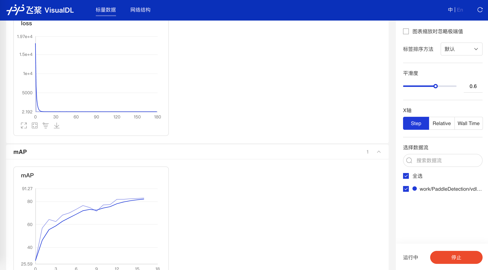

# 目标检测全流程教程

本教程以路标数据集为例，使用YOLOv3算法详细说明了PaddleDetection全流程使用教程，包括：准备数据、选择模型、训练模型、评估、预测、模型压缩和模型部署。


## 目录
- [准备数据](#准备数据)
- [模型选择](#模型选择)
- [选择和修改配置文件](#选择和修改配置文件)
- [训练](#训练)
- [评估和预测](#评估和预测)
- [推理部署](#推理部署)

## 准备数据
PaddleDetection默认支持[COCO](http://cocodataset.org)和[Pascal VOC](http://host.robots.ox.ac.uk/pascal/VOC/) 和[WIDER-FACE](http://shuoyang1213.me/WIDERFACE/) 数据。  
详细的数据准备文档请参考[如何准备训练数据](./PrepareDataSet.md)。  
如果您的数据为VOC标注形式，最终数据集文件组织结构如下。
```
├── annotations
│   ├── road0.xml
│   ├── road1.xml
│   ├── road10.xml
│   |   ...
├── images
│   ├── road0.jpg
│   ├── road1.jpg
│   ├── road2.jpg
│   |   ...
├── label_list.txt
├── train.txt
└── valid.txt
```
各个文件说明
```
# label_list.txt 是类别名称列表，指定了类别名称和类别id的映射关系
>>cat label_list.txt
classname1
classname2
...

# train.txt 是训练数据文件列表，每一行包括一条图像路径和图像对应标注xml文件路径（路径是相对于data_dir的路径或者全局路径），中间以空格隔开
>>cat train.txt
./images/xxx1.jpg ./annotations/xxx1.xml
./images/xxx2.jpg ./annotations/xxx2.xml
...

# valid.txt 是验证数据文件列表
>>cat valid.txt
./images/xxx3.jpg ./annotations/xxx3.xml
...
```

如果您的数据为COCO标注形式，最终数据集文件组织结构为：
```
dataset/xxx/
├── annotations
│   ├── train.json  # 训练集标注文件
│   ├── valid.json  # 验证集标注文件
├── images
│   ├── xxx1.jpg
│   ├── xxx2.jpg
│   ├── xxx3.jpg
│   |   ...
...
```

本教程以[Kaggle数据集](https://www.kaggle.com/andrewmvd/road-sign-detection) 比赛数据为例，包含877张图像，数据类别4类：speedlimit，crosswalk，trafficlight，stop。  
我们将数据集划分为训练集(701张图)和测试集(176张图)，下载连接为：VOC标注[roadsign_voc](https://paddlemodels.bj.bcebos.com/object_detection/roadsign_voc.tar) 和 COCO标注[roadsign_coco](https://paddlemodels.bj.bcebos.com/object_detection/roadsign_coco.tar) 。  
路标数据集示例图：  


**注意：  
（1）数据集中路径名、文件名不要包含空格，尽量不要使用中文  
（2）用户数据，建议在训练前仔细检查 数据，避免因数据标注格式错误或图像数据不完整造成训练过程中的中断  
（2）如果图像尺寸太大的话，在不限制读入数据尺寸情况下，占用内存较多，会造成内存/显存溢出，请合理设置batch_size，可从小到大尝试**  

## 模型选择

PaddleDetection中提供了丰富的模型库，具体可在[模型库](../MODEL_ZOO_cn.md)中查看各个模型的指标，您可依据实际部署算力的情况，选择合适的模型。  

本教程选用YOLOv3作为训练模型。

## 选择和修改配置文件
您可以在[模型库](../MODEL_ZOO_cn.md)中找到模型的指标，以及模型的配置文件（配置文件存放在[`configs/`](../../configs/) 文件夹下）和预训练权重地址。  
关于配置文件中参数详细解释，请参考：  
- [`yolov3_mobilenet_v1.md`](../advanced_tutorials/config_doc/yolov3_mobilenet_v1.md)  
- [`MaskRCNN.md`](../advanced_tutorials/config_doc/RCNN_PARAMS_DOC.md)  

配置文件设计思路请参考文档 [配置模块设计与介绍](../advanced_tutorials/config_doc/CONFIG_cn.md)  
如何新增模型请参考文档 [新增模型算法](../advanced_tutorials/MODEL_TECHNICAL.md)  

##### 配置文件中部分参数介绍

- 1、max_iters  
    max_iters为最大迭代次数，而一个iter会运行`batch_size * device_num`张图片。
    **注意:  
    (1) `LearningRate.schedulers.milestones`需要随`max_iters`变化而变化。
    (2) `milestones`设置的是在PiecewiseDecay学习率调整策略中，在训练轮数达到`milestones`中设置的轮数时，学习率以`gamma`倍数衰减变化。  
    (3) 1x表示训练12个epoch，1个epoch是将所有训练数据训练一轮。由于YOLO系列算法收敛比较慢，在COCO数据集上YOLO系列算法换算后约为270 epoch，PP-YOLO约380 epoch。**

- 2、pretrain_weights  
    pretrain_weights 参数用于设置预训练模型路径，可以设置为本地路径，也可以设置为远程路径。  
    pretrain_weights 可以是：  
    - 在ImageNet数据集上的预训练的分类模型权重，各个模型请参考[PaddleModels](https://github.com/PaddlePaddle/models)  
    - 在VOC或COCO数据集上的预训练的检测模型权重，各个模型请参考 [检测模型库](../MODEL_ZOO_cn.md)

    注意：加载模型时网络结构中和预训练模型中形状不匹配的参数将自动被忽略。

- 3、save_dir  
    save_dir 参数用于设置训练时模型保存文件夹，PaddleDetection会在`save_dir`文件夹下新建一个与指定的配置文件同名的子文件夹，并将模型存在这个子文件夹下。当开启`--eval`，会在这个子文件夹下保存名为`best_model`的模型文件。  
    **注意:  
    (1) 老版本模型权重文件是以`.tar`为后缀的文件，新版本模型权重文件是以`.pdparams`为后缀的文件。  
    (2) 新版Paddle在训练过程中会保存2个文件：  
        - 优化相关: `xxx.pdopt`  
        - 模型权重: `xxx.pdparams`**

- 4、weights  
    weights 参数用于设置评估预测使用的模型路径，这里可以是远程路径。  
    **本地路径是指以`pdparams`为后缀的模型权重文件。**

- 5、metric 评估度量方式
    mAP的metric评估方式可以选择COCO和VOC或WIDERFACE，其中VOC有`11point`和`integral`两种评估方法

- 6、num_classes 模型中分类数
    num_classes 模型中分类数量。注意在FasterRCNN中，需要将 `with_background=true 且 num_classes=数据num_classes + 1`  

- 7、dataset路径设置
    - `dataset_dir` : 数据路径设置
    - `image_dir`   : 图像文件夹路径，相对于`dataset_dir`的相对路径，也可以设置为全局路径。
    - `anno_path`   :
        - 训练和评估时，表示标注文件路径，相对于`dataset_dir`的相对路径，也可以设置为全局路径。
        - 测试时，表示类别映射文件路径，相对于`dataset_dir`的相对路径，也可以设置为全局路径。`VOC`数据中是`lable_list.txt`文件路径，`COCO`数据中是包含类别的`json`文件路径。  

    图像路径 = `os.path.join(dataset_dir, image_dir, image_path)`，`image_path`来自`train.txt`中
    xml标注文件路径 = `os.path.join(dataset_dir, image_dir, xml_path)`，`xml_path`来自`train.txt`中

- 8、with_background
    with_background 用于设置是否包含背景类。注意在FasterRCNN中，需要将 `with_background=true 且 num_classes+1`  

- 9、inputs_def 设置
    inputs_def 请参各个算法的配置文件设置

- 10、base_lr
    base_lr 配合 batch_size调整，参考 [学习率调整策略](../FAQ.md)  
    在使用ImageNet的预训练模型时，训练时使用1张卡，单卡batch_size=1, base_lr=0.00125，base_lr随着`(batch_size * GPU卡数)` 等比例变化。  
    **若loss出现nan，请将学习率再设置小一些试试。**  

- 11、batch_size
    请根据硬件设置batch_size大小。若需要设置内存使用量请参考[如何设置内存使用量](../FAQ.md)

- 12、sample_transforms and batch_transforms  
    sample_transforms是针对单张图像的操作，batch_transforms是针对一个batch数据的操作。文档请参考[数据处理模块](../advanced_tutorials/READER.md).  
    `configs中的sample_transforms`，各个函数说明请参考`ppdet/data/transform/operators.py`  
    `configs中的batch_transforms`，各个函数说明请参考`ppdet/data/transform/batch_operators.py`  

## 训练

可以通过命令行`tools/train.py`设置参数，其中的`-o`参数可以覆盖设置配置文件里的参数。  
`tools/train.py`训练参数列表
以下列表可以通过`--help`查看

|         FLAG             |     支持脚本    |        用途        |      默认值       |         备注         |
| :----------------------: | :------------: | :---------------: | :--------------: | :-----------------: |
|          -c              |      ALL       |  指定配置文件  |  None  |  **配置模块说明请参考[配置模块](../advanced_tutorials/config_doc/CONFIG_cn.md)** |
|          -o              |      ALL       |  设置配置文件里的参数内容  |  None  |  使用-o配置相较于-c选择的配置文件具有更高的优先级。例如：`-o use_gpu=False max_iter=10000`  |  
|   -r/--resume_checkpoint |     train      |  从某一检查点恢复训练  |  None  |  `-r output/faster_rcnn_r50_1x/10000`  |
|        --eval            |     train      |  是否边训练边测试  |  False  |    |
|      --output_eval       |     train/eval |  编辑评测保存json路径  |  当前路径  |  `--output_eval ./json_result`  |
|       --fp16             |     train      |  是否使用混合精度训练模式  |  False  |  需使用GPU训练  |
|       --loss_scale       |     train      |  设置混合精度训练模式中损失值的缩放比例  |  8.0  |  需先开启`--fp16`后使用  |  
|       --json_eval        |       eval     |  是否通过已存在的bbox.json或者mask.json进行评估  |  False  |  json文件路径在`--output_eval`中设置  |
|       --output_dir       |      infer     |  输出预测后可视化文件  |  `./output`  |  `--output_dir output`  |
|    --draw_threshold      |      infer     |  可视化时分数阈值  |  0.5  |  `--draw_threshold 0.7`  |
|      --infer_dir         |       infer     |  用于预测的图片文件夹路径  |  None  |    |
|      --infer_img         |       infer     |  用于预测的图片路径  |  None  |  相较于`--infer_dir`具有更高优先级  |
|        --use_vdl          |   train/infer   |  是否使用[VisualDL](https://github.com/paddlepaddle/visualdl) 记录数据，进而在VisualDL面板中显示  |  False  |  VisualDL需Python>=3.5    |
|        --vdl\_log_dir     |   train/infer   |  指定 VisualDL 记录数据的存储路径  |  train:`vdl_log_dir/scalar` infer: `vdl_log_dir/image`  |  VisualDL需Python>=3.5   |

**注意:**
**参数设置优先级， 命令行 -o 选项参数设置的优先级 > 配置文件参数设置优先级 > 配置文件中的`__READER__.yml`中的参数设置优先级，高优先级会覆盖低优先级的参数设置**

##### 开始训练
```
python tools/train.py -c configs/yolov3_mobilenet_v1_roadsign.yml -o use_gpu=true --eval
```

##### 通过visualdl命令实时查看变化曲线
```
# 设置visualdl参数
python tools/train.py -c configs/yolov3_mobilenet_v1_roadsign.yml --eval -o use_gpu=true --use_vdl=True --vdl_log_dir=vdl_dir/scalar

# 打开visualdl
visualdl --logdir vdl_dir/scalar/ --host <host_IP> --port <port_num>
```

VisualDL效果：
  


##### 分布式训练
PaddleDetection还支持分布式训练，并行训练方式速度较快，可以使用`tools/train_multi_machine.py`可以启动分布式训练。

目前同时支持单机单卡、单机多卡与多机多卡的训练过程，其训练参数与`tools/train.py`完全一致。

如单机多卡训练：
```
python -m paddle.distributed.launch \
    --selected_gpus 0,1,2,3,4,5,6,7 \
    tools/train_multi_machine.py \
        -c configs/yolov3_mobilenet_v1_roadsign.yml
```
详细请参考文档[分布式训练](MULTI_MACHINE_TRAINING_cn.md).  


## 评估和预测

##### 评估

- 使用配置文件中`weights`参数设定的权重文件进行评估
```bash
# 默认使用训练过程中保存的best_model，评估需使用单卡评估
CUDA_VISIBLE_DEVICES=0 python tools/eval.py -c configs/yolov3_mobilenet_v1_roadsign.yml -o use_gpu=true
```

- 通过`weights`参数指定权重文件进行评估
```
# 指定模型评估
CUDA_VISIBLE_DEVICES=0 python tools/eval.py -c configs/yolov3_mobilenet_v1_roadsign.yml -o use_gpu=true weights=output/yolov3_mobilenet_v1_roadsign/best_model
```

- 通过设置`save_prediction_only`参数保存评估结果，生成`bbox.json`文件
```
# 设置 save_prediction_only=true，会在当前文件夹下生成预测结果文件bbox.json
CUDA_VISIBLE_DEVICES=0 python tools/eval.py -c configs/yolov3_mobilenet_v1_roadsign.yml -o use_gpu=true save_prediction_only=true
```

##### 预测
```
# 预测结束后会在output文件夹中生成一张画有预测结果的同名图像
python tools/infer.py -c configs/yolov3_mobilenet_v1_roadsign.yml --infer_img=demo/road554.png
```

预测结果如下图：  


## 推理部署

在模型部署之前，如果您需要对模型进行压缩，`PaddleDetection`提供了基于[PaddleSlim](https://github.com/PaddlePaddle/Paddleslim) 进行模型压缩的完整教程和实验结果，详细请参考：[量化](../../slim/quantization)、[剪枝](../../slim/prune)、[蒸馏](../../slim/distillation)、[搜索](../../slim/nas) 。

`PaddleDetection`目前支持以下部署方式：

- [服务器端Python部署](../../deploy/python)
- [服务器端C++部署](../../deploy/cpp)
- [移动端部署](https://github.com/PaddlePaddle/Paddle-Lite-Demo)
- [在线Serving部署](https://github.com/PaddlePaddle/Serving)

详细部署文档请参考[PaddleDetection预测部署文档](../../deploy/README.md)。这里以PaddleServing部署方式为例说明。

##### 安装`paddle-serving-client`和`paddle-serving-server`  
```
# 安装 paddle-serving-client
pip install paddle-serving-client -i https://mirror.baidu.com/pypi/simple

# 安装 paddle-serving-server
pip install paddle-serving-server -i https://mirror.baidu.com/pypi/simple

# 安装 paddle-serving-server-gpu
pip install paddle-serving-server-gpu -i https://mirror.baidu.com/pypi/simple
```

##### 导出模型  
```
python tools/export_serving_model.py -c configs/yolov3_mobilenet_v1_roadsign.yml -o use_gpu=true weights=output/yolov3_mobilenet_v1_roadsign/best_model --output_dir=./inference_model
```

以上命令会在./inference_model文件夹下生成一个`yolov3_mobilenet_v1_roadsign`文件夹：
```
inference_model
│   ├── yolov3_mobilenet_v1_roadsign
│   │   ├── infer_cfg.yml
│   │   ├── serving_client
│   │   │   ├── serving_client_conf.prototxt
│   │   │   ├── serving_client_conf.stream.prototxt
│   │   ├── serving_server
│   │   │   ├── conv1_bn_mean
│   │   │   ├── conv1_bn_offset
│   │   │   ├── conv1_bn_scale
│   │   │   ├── ...
```

`serving_client`文件夹下`serving_client_conf.prototxt`详细说明了模型输入输出信息
`serving_client_conf.prototxt`文件内容为：
```
feed_var {
  name: "image"
  alias_name: "image"
  is_lod_tensor: false
  feed_type: 1
  shape: 3
  shape: 608
  shape: 608
}
feed_var {
  name: "im_size"
  alias_name: "im_size"
  is_lod_tensor: false
  feed_type: 2
  shape: 2
}
fetch_var {
  name: "multiclass_nms_0.tmp_0"
  alias_name: "multiclass_nms_0.tmp_0"
  is_lod_tensor: true
  fetch_type: 1
  shape: -1
}
```

##### 启动PaddleServing服务

```
cd inference_model/yolov3_mobilenet_v1_roadsign/

# GPU
python -m paddle_serving_server_gpu.serve --model serving_server --port 9393 --gpu_ids 0

# CPU
python -m paddle_serving_server.serve --model serving_server --port 9393
```

##### 测试部署的服务
准备`label_list.txt`文件
```
# 进入到导出模型文件夹
cd inference_model/yolov3_mobilenet_v1_roadsign/

# 将数据集对应的label_list.txt文件拷贝到当前文件夹下
cp ../../dataset/roadsign_voc/label_list.txt .
```

设置测试文件`test_client.py`中的`prototxt`文件路径为`serving_client/serving_client_conf.prototxt` 。  
设置`fetch`为`fetch=["multiclass_nms_0.tmp_0"])`

测试
```
# 进入目录
cd inference_model/yolov3_mobilenet_v1_roadsign/

# 测试代码 test_client.py 会自动创建output文件夹，并在output下生成`bbox.json`和`road554.png`两个文件
python ../../deploy/serving/test_client.py ../../demo/road554.png
```
