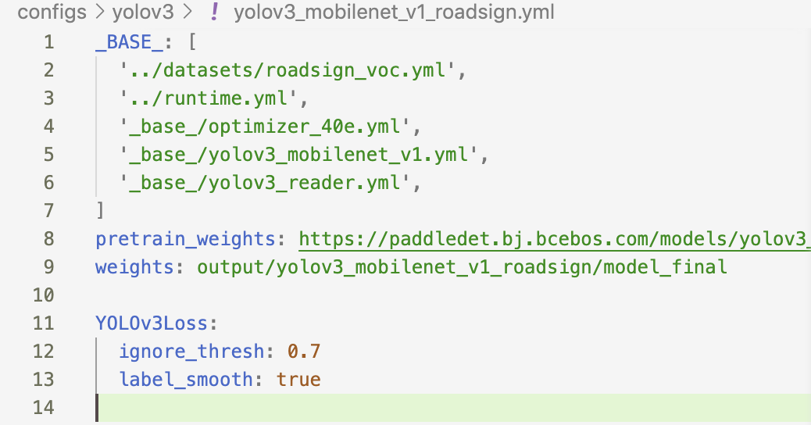
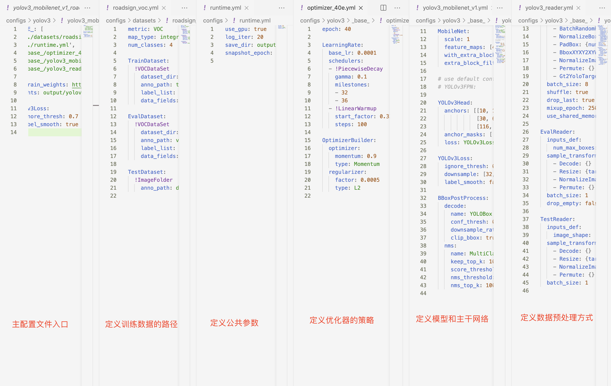

[English](GETTING_STARTED.md) | 简体中文


# 30分钟快速上手PaddleDetection

PaddleDetection作为成熟的目标检测开发套件，提供了从数据准备、模型训练、模型评估、模型导出到模型部署的全流程。在这个章节里面，我们以路标检测数据集为例，提供快速上手PaddleDetection的流程。

## 1 安装

关于安装配置运行环境，请参考[安装指南](INSTALL_cn.md)
在本演示案例中，假定用户将PaddleDetection的代码克隆并放置在`/home/paddle`目录中。用户执行的命令操作均在`/home/paddle/PaddleDetection`目录下完成

## 2 准备数据
目前PaddleDetection支持：COCO VOC WiderFace, MOT四种数据格式。
- 首先按照[准备数据文档](./data/PrepareDetDataSet.md) 准备数据。  
- 然后设置`configs/datasets`中相应的coco或voc等数据配置文件中的数据路径。
- 在本项目中，我们使用路标识别数据集
 ```bash
python dataset/roadsign_voc/download_roadsign_voc.py
```
- 下载后的数据格式为
```
  ├── download_roadsign_voc.py
  ├── annotations
  │   ├── road0.xml
  │   ├── road1.xml
  │   |   ...
  ├── images
  │   ├── road0.png
  │   ├── road1.png
  │   |   ...
  ├── label_list.txt
  ├── train.txt
  ├── valid.txt
```

## 3 配置文件改动和说明
我们使用`configs/yolov3/yolov3_mobilenet_v1_roadsign`配置进行训练。
在静态图版本下，一个模型往往可以通过两个配置文件（一个主配置文件、一个reader的读取配置）实现，在PaddleDetection 2.0后续版本，采用了模块解耦设计，用户可以组合配置模块实现检测器，并可自由修改覆盖各模块配置，如下图所示


<center>

</center>
<br><center>配置文件摘要</center></br>


从上图看到`yolov3_mobilenet_v1_roadsign.yml`配置需要依赖其他的配置文件。在该例子中需要依赖：

```bash
  roadsign_voc.yml

  runtime.yml

  optimizer_40e.yml

  yolov3_mobilenet_v1.yml

  yolov3_reader.yml
--------------------------------------


yolov3_mobilenet_v1_roadsign 文件入口

roadsign_voc 主要说明了训练数据和验证数据的路径

runtime.yml 主要说明了公共的运行参数，比如说是否使用GPU、每多少个epoch存储checkpoint等

optimizer_40e.yml 主要说明了学习率和优化器的配置。

ppyolov2_r50vd_dcn.yml 主要说明模型、和主干网络的情况。

ppyolov2_reader.yml 主要说明数据读取器配置，如batch size，并发加载子进程数等，同时包含读取后预处理操作，如resize、数据增强等等


```

<center></center>

<br><center>配置文件结构说明</center></br>

### 修改配置文件说明
* 关于数据的路径修改说明
在修改配置文件中，用户如何实现自定义数据集是非常关键的一步，如何定义数据集请参考[如何自定义数据集](https://aistudio.baidu.com/aistudio/projectdetail/1917140)
* 默认学习率是适配多GPU训练(8x GPU)，若使用单GPU训练，须对应调整学习率（例如，除以8）
* 更多使用问题，请参考[FAQ](FAQ)

## 4 训练

PaddleDetection提供了单卡/多卡训练模式，满足用户多种训练需求
* GPU单卡训练
```bash
export CUDA_VISIBLE_DEVICES=0 #windows和Mac下不需要执行该命令
python tools/train.py -c configs/yolov3/yolov3_mobilenet_v1_roadsign.yml
```

* GPU多卡训练
```bash
export CUDA_VISIBLE_DEVICES=0,1,2,3,4,5,6,7 #windows和Mac下不需要执行该命令
python -m paddle.distributed.launch --gpus 0,1,2,3,4,5,6,7 tools/train.py -c configs/yolov3/yolov3_mobilenet_v1_roadsign.yml
```

* [GPU多机多卡训练](./DistributedTraining_cn.md)
```bash
$fleetrun \
--ips="10.127.6.17,10.127.5.142,10.127.45.13,10.127.44.151" \
--selected_gpu 0,1,2,3,4,5,6,7 \
tools/train.py -c configs/yolov3/yolov3_mobilenet_v1_roadsign.yml \
```

* Fine-tune其他任务

  使用预训练模型fine-tune其他任务时，可以直接加载预训练模型，形状不匹配的参数将自动忽略，例如：

```bash
export CUDA_VISIBLE_DEVICES=0,1,2,3,4,5,6,7
  # 如果模型中参数形状与加载权重形状不同，将不会加载这类参数
python -m paddle.distributed.launch --gpus 0,1,2,3,4,5,6,7 tools/train.py -c configs/yolov3/yolov3_mobilenet_v1_roadsign.yml -o pretrain_weights=output/model_final
```

* 模型恢复训练

  在日常训练过程中，有的用户由于一些原因导致训练中断，用户可以使用-r的命令恢复训练

```bash
export CUDA_VISIBLE_DEVICES=0 #windows和Mac下不需要执行该命令
python tools/train.py -c configs/yolov3/yolov3_mobilenet_v1_roadsign.yml -r output/faster_rcnn_r50_1x_coco/10000
 ```

## 5 评估
* 默认将训练生成的模型保存在当前`output`文件夹下
 ```bash
export CUDA_VISIBLE_DEVICES=0 #windows和Mac下不需要执行该命令
python tools/eval.py -c configs/yolov3/yolov3_mobilenet_v1_roadsign.yml -o weights=https://paddledet.bj.bcebos.com/models/yolov3_mobilenet_v1_roadsign.pdparams
```
* 边训练，边评估

```bash
export CUDA_VISIBLE_DEVICES=0,1,2,3,4,5,6,7 #windows和Mac下不需要执行该命令
python -m paddle.distributed.launch --gpus 0,1,2,3,4,5,6,7 tools/train.py -c configs/yolov3/yolov3_mobilenet_v1_roadsign.yml --eval
```

  在训练中交替执行评估, 评估在每个epoch训练结束后开始。每次评估后还会评出最佳mAP模型保存到`best_model`文件夹下。

  如果验证集很大，测试将会比较耗时，建议调整`configs/runtime.yml` 文件中的 `snapshot_epoch`配置以减少评估次数，或训练完成后再进行评估。

- 通过json文件评估

```bash
export CUDA_VISIBLE_DEVICES=0 #windows和Mac下不需要执行该命令
python tools/eval.py -c configs/yolov3/yolov3_mobilenet_v1_roadsign.yml \
             --json_eval \
             -output_eval evaluation/
```
* 上述命令中没有加载模型的选项，则使用配置文件中weights的默认配置，`weights`表示训练过程中保存的最后一轮模型文件

* json文件必须命名为bbox.json或者mask.json，放在`evaluation`目录下。

## 6 预测

  ```bash
  python tools/infer.py -c configs/yolov3/yolov3_mobilenet_v1_roadsign.yml --infer_img=demo/road554.png -o weights=https://paddledet.bj.bcebos.com/models/yolov3_mobilenet_v1_roadsign.pdparams
  ```
 * 设置参数预测

  ```bash
  export CUDA_VISIBLE_DEVICES=0 #windows和Mac下不需要执行该命令
  python tools/infer.py -c configs/yolov3/yolov3_mobilenet_v1_roadsign.yml \
                      --infer_img=demo/road554.png \
                      --output_dir=infer_output/ \
                      --draw_threshold=0.5 \
                      -o weights=output/yolov3_mobilenet_v1_roadsign/model_final \
                      --use_vdl=True
  ```

  `--draw_threshold` 是个可选参数. 根据 [NMS](https://ieeexplore.ieee.org/document/1699659) 的计算，不同阈值会产生不同的结果
  `keep_top_k`表示设置输出目标的最大数量，默认值为100，用户可以根据自己的实际情况进行设定。

结果如下图：


## 7 训练可视化

当打开`use_vdl`开关后，为了方便用户实时查看训练过程中状态，PaddleDetection集成了VisualDL可视化工具，当打开`use_vdl`开关后，记录的数据包括：
1. loss变化趋势
2. mAP变化趋势

```bash
export CUDA_VISIBLE_DEVICES=0 #windows和Mac下不需要执行该命令
python tools/train.py -c configs/yolov3/yolov3_mobilenet_v1_roadsign.yml
                        --use_vdl=true \
                        --vdl_log_dir=vdl_dir/scalar \
```

使用如下命令启动VisualDL查看日志
```shell
# 下述命令会在127.0.0.1上启动一个服务，支持通过前端web页面查看，可以通过--host这个参数指定实际ip地址
visualdl --logdir vdl_dir/scalar/
```

在浏览器输入提示的网址，效果如下：
<center></center>

<br><center>图：VDL效果演示</center></br>

**参数列表**

以下列表可以通过`--help`查看

|         FLAG             |     支持脚本    |        用途        |      默认值       |         备注         |
| :----------------------: | :------------: | :---------------: | :--------------: | :-----------------: |
|          -c              |      ALL       |  指定配置文件  |  None  |  **必选**，例如-c configs/faster_rcnn/faster_rcnn_r50_fpn_1x_coco.yml |
|          -o              |      ALL       |  设置或更改配置文件里的参数内容  |  None  |  相较于`-c`设置的配置文件有更高优先级，例如：`-o use_gpu=False`  |
|        --eval            |     train      |  是否边训练边测试  |  False  |  如需指定，直接`--eval`即可 |
|   -r/--resume_checkpoint |     train      |  恢复训练加载的权重路径  |  None  |  例如：`-r output/faster_rcnn_r50_1x_coco/10000`  |
|       --slim_config             |     ALL      |  模型压缩策略配置文件  |  None  |  例如`--slim_config configs/slim/prune/yolov3_prune_l1_norm.yml`  |
|        --use_vdl          |   train/infer   |  是否使用[VisualDL](https://github.com/paddlepaddle/visualdl)记录数据，进而在VisualDL面板中显示  |  False  |  VisualDL需Python>=3.5   |
|        --vdl\_log_dir     |   train/infer   |  指定 VisualDL 记录数据的存储路径  |  train:`vdl_log_dir/scalar` infer: `vdl_log_dir/image`  |  VisualDL需Python>=3.5   |
|      --output_eval       |   eval |  评估阶段保存json路径  | None  |  例如 `--output_eval=eval_output`, 默认为当前路径  |
|       --json_eval        |       eval     |  是否通过已存在的bbox.json或者mask.json进行评估  |  False  |  如需指定，直接`--json_eval`即可， json文件路径在`--output_eval`中设置  |
|      --classwise         |       eval     |  是否评估单类AP和绘制单类PR曲线  |  False  |  如需指定，直接`--classwise`即可 |
|       --output_dir       |      infer/export_model     |  预测后结果或导出模型保存路径  |  `./output`  |  例如`--output_dir=output`  |
|    --draw_threshold      |      infer     |  可视化时分数阈值  |  0.5  |  例如`--draw_threshold=0.7`  |
|      --infer_dir         |       infer     |  用于预测的图片文件夹路径  |  None  |    `--infer_img`和`--infer_dir`必须至少设置一个 |
|      --infer_img         |       infer     |  用于预测的图片路径  |  None  |  `--infer_img`和`--infer_dir`必须至少设置一个，`infer_img`具有更高优先级  |
|      --save_results         |       infer     |  是否在文件夹下将图片的预测结果保存到文件中        |  False  |  可选  |


## 8 模型导出

在模型训练过程中保存的模型文件是包含前向预测和反向传播的过程，在实际的工业部署则不需要反向传播，因此需要将模型进行导成部署需要的模型格式。
在PaddleDetection中提供了 `tools/export_model.py`脚本来导出模型

```bash
python tools/export_model.py -c configs/yolov3/yolov3_mobilenet_v1_roadsign.yml --output_dir=./inference_model \
 -o weights=output/yolov3_mobilenet_v1_roadsign/best_model
```
预测模型会导出到`inference_model/yolov3_mobilenet_v1_roadsign`目录下，分别为`infer_cfg.yml`, `model.pdiparams`, `model.pdiparams.info`,`model.pdmodel` 如果不指定文件夹，模型则会导出在`output_inference`

* 更多关于模型导出的文档，请参考[模型导出文档](../../deploy/EXPORT_MODEL.md)

## 9 模型压缩

为了进一步对模型进行优化，PaddleDetection提供了基于PaddleSlim进行模型压缩的完整教程和benchmark。目前支持的方案：
* 裁剪
* 量化
* 蒸馏
* 联合策略
* 更多关于模型压缩的文档，请参考[模型压缩文档](../../configs/slim/README.md)。
## 10 预测部署
PaddleDetection提供了PaddleInference、PaddleServing、PaddleLite多种部署形式，支持服务端、移动端、嵌入式等多种平台，提供了完善的Python和C++部署方案。
* 在这里，我们以Python为例，说明如何使用PaddleInference进行模型部署
```bash
python deploy/python/infer.py --model_dir=./output_inference/yolov3_mobilenet_v1_roadsign --image_file=demo/road554.png --device=GPU
```
* 同时`infer.py`提供了丰富的接口，用户进行接入视频文件、摄像头进行预测，更多内容请参考[Python端预测部署](../../deploy/python)
### PaddleDetection支持的部署形式说明
|形式|语言|教程|设备/平台|
|-|-|-|-|
|PaddleInference|Python|已完善|Linux(arm X86)、Windows
|PaddleInference|C++|已完善|Linux(arm X86)、Windows|
|PaddleServing|Python|已完善|Linux(arm X86)、Windows|
|PaddleLite|C++|已完善|Android、IOS、FPGA、RK...

* 更多关于预测部署的文档，请参考[预测部署文档](../../deploy/README.md)。
