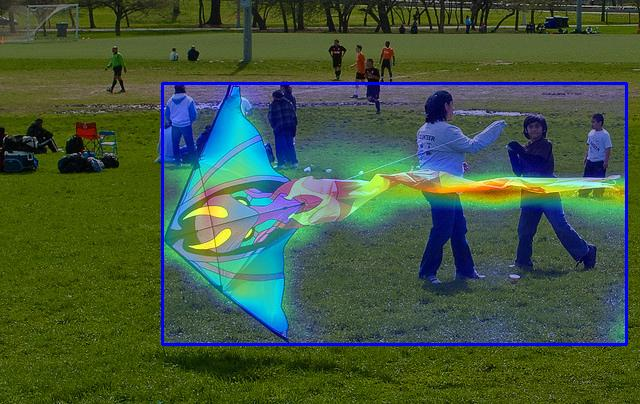

# Object detection grad_cam heatmap

## 1.Introduction
Calculate the cam (class activation map) of the object predict bbox based on the backbone/roi feature map, currently supports networks based on FasterRCNN/MaskRCNN series, PPYOLOE series and BlazeFace, SSD, Retinanet.

## 2.Usage
* Taking PP-YOLOE as an example, after preparing the data, specify the network configuration file, model weight address, image path and output folder path, and then use the script to call tools/cam_ppdet.py to calculate the grad_cam heat map of the prediction box. Below is an example run script.
```shell
python tools/cam_ppdet.py -c configs/ppyoloe/ppyoloe_crn_l_300e_coco.yml --infer_img demo/000000014439.jpg --cam_out cam_ppyoloe --target_feature_layer_name model.backbone -o weights=https://paddledet.bj.bcebos.com/models/ppyoloe_crn_l_300e_coco.pdparams
```

* **Arguments**

|         FLAG             |                                                            description                                                            |
| :----------------------: |:---------------------------------------------------------------------------------------------------------------------------------:|
|          -c              |                                                        Select config file                                                         |
|          --infer_img              |                                                            Image path                                                             |
|          --cam_out              |                                                       Directory for output                                                        |
|          --target_feature_layer_name              |        The position of featuremap to do gradcam, for example:model.backbone, model.bbox_head.roi_extractor        |
|          -o              | Set parameters in configure file, for example: -o weights=https://paddledet.bj.bcebos.com/models/ppyoloe_crn_l_300e_coco.pdparams |

* result

<center>

</center>
<br><center>cam_ppyoloe/225.jpg</center></br>


## 3.Currently supports networks based on FasterRCNN/MaskRCNN series, PPYOLOE series and BlazeFace, SSD, Retinanet.
* PPYOLOE bbox heat map visualization script (with backbone featuremap)
```bash
python tools/cam_ppdet.py -c configs/ppyoloe/ppyoloe_crn_l_300e_coco.yml --infer_img demo/000000014439.jpg --cam_out cam_ppyoloe -o weights=https://paddledet.bj.bcebos.com/models/ppyoloe_crn_l_300e_coco.pdparams
```

* MaskRCNN bbox heat map visualization script (with roi featuremap)
```bash
python tools/cam_ppdet.py -c configs/mask_rcnn/mask_rcnn_r50_vd_fpn_2x_coco.yml --infer_img demo/000000014439.jpg  --cam_out cam_mask_rcnn_roi --target_feature_layer_name model.bbox_head.roi_extractor -o weights=https://paddledet.bj.bcebos.com/models/mask_rcnn_r50_vd_fpn_2x_coco.pdparams
```

* MaskRCNN bbox heat map visualization script (with backbone featuremap)
```bash
python tools/cam_ppdet.py -c configs/mask_rcnn/mask_rcnn_r50_vd_fpn_2x_coco.yml --infer_img demo/000000014439.jpg  --cam_out cam_mask_rcnn_backbone --target_feature_layer_name model.backbone -o weights=https://paddledet.bj.bcebos.com/models/mask_rcnn_r50_vd_fpn_2x_coco.pdparams
```

* FasterRCNN bbox heat map visualization script (with roi featuremap)
```bash
python tools/cam_ppdet.py -c configs/faster_rcnn/faster_rcnn_r50_vd_fpn_2x_coco.yml --infer_img demo/000000014439.jpg  --cam_out cam_faster_rcnn_roi --target_feature_layer_name model.bbox_head.roi_extractor -o weights=https://paddledet.bj.bcebos.com/models/faster_rcnn_r50_vd_fpn_ssld_2x_coco.pdparams
```

* FasterRCNN bbox heat map visualization script (with backbone featuremap)
```bash
python tools/cam_ppdet.py -c configs/faster_rcnn/faster_rcnn_r50_vd_fpn_2x_coco.yml --infer_img demo/000000014439.jpg  --cam_out cam_faster_rcnn_backbone --target_feature_layer_name model.backbone -o weights=https://paddledet.bj.bcebos.com/models/faster_rcnn_r50_vd_fpn_ssld_2x_coco.pdparams
```

* BlaczeFace bbox heat map visualization script (with backbone featuremap)
```bash
python tools/cam_ppdet.py -c configs/face_detection/blazeface_1000e.yml --infer_img demo/hrnet_demo.jpg --cam_out cam_blazeface --target_feature_layer_name model.backbone -o weights=https://paddledet.bj.bcebos.com/models/blazeface_1000e.pdparams
```

* SSD bbox heat map visualization script (with backbone featuremap)
```bash
python tools/cam_ppdet.py -c configs/ssd/ssd_mobilenet_v1_300_120e_voc.yml --infer_img demo/000000014439.jpg --cam_out cam_ssd --target_feature_layer_name model.backbone -o weights=https://paddledet.bj.bcebos.com/models/ssd_mobilenet_v1_300_120e_voc.pdparams
```

* Retinanet bbox heat map visualization script (with backbone featuremap)
```bash
python tools/cam_ppdet.py -c configs/retinanet/retinanet_r50_fpn_2x_coco.yml --infer_img demo/000000014439.jpg --cam_out cam_retinanet --target_feature_layer_name model.backbone -o weights=https://bj.bcebos.com/v1/paddledet/models/retinanet_r50_fpn_2x_coco.pdparams
```


