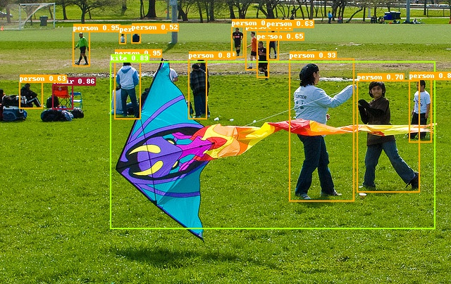

[English](INSTALL.md) | 简体中文


# 安装文档

本文档包含了如何安装PaddleDetection以及相关依赖

其他更多PaddleDetection信息，请参考[README.md](https://github.com/PaddlePaddle/PaddleDetection/blob/release/2.0).

## 环境要求

- PaddlePaddle 2.0.1
- OS 64位操作系统
- Python 3(3.5.1+/3.6/3.7)，64位版本
- pip/pip3(9.0.1+)，64位版本
- CUDA >= 9.0
- cuDNN >= 7.6

PaddleDetection 依赖 PaddlePaddle 版本关系：

|  PaddleDetection版本  | PaddlePaddle版本  |    备注    |
| :------------------: | :---------------: | :-------: |
|    release/2.0       |       >= 2.0.1    |     默认使用动态图模式    |
|    release/2.0-rc    |       >= 2.0.1    |     --    |
|    release/0.5       |       >= 1.8.4    |  大部分模型>=1.8.4即可运行，Cascade R-CNN系列模型与SOLOv2依赖2.0.0.rc版本 |
|    release/0.4       |       >= 1.8.4    |  PP-YOLO依赖1.8.4 |
|    release/0.3       |        >=1.7      |     --    |

## 安装说明

### 1. 安装PaddlePaddle

```
# CUDA9.0
python -m pip install paddlepaddle-gpu==2.0.1.post90 -i https://mirror.baidu.com/pypi/simple

# CUDA10.1
python -m pip install paddlepaddle-gpu==2.0.1.post101 -f https://mirror.baidu.com/pypi/simple

# CPU
python -m pip install paddlepaddle -i https://mirror.baidu.com/pypi/simple
```

更多安装方式例如conda或源码编译安装方法，请参考PaddlePaddle[安装文档](https://www.paddlepaddle.org.cn/documentation/docs/zh/install/index_cn.html)

请确保您的PaddlePaddle安装成功并且版本不低于需求版本。使用以下命令进行验证。

```
# 在您的Python解释器中确认PaddlePaddle安装成功
>>> import paddle
>>> paddle.utils.run_check()

# 确认PaddlePaddle版本
python -c "import paddle; print(paddle.__version__)"
```
**注意**
1. 如果您希望在多卡环境下使用PaddleDetection，请首先安装NCCL

### 2. 安装PaddleDetection

可通过如下两种方式安装PaddleDetection

#### 2.1 通过pip安装

**注意：** pip安装方式只支持Python3

```
# pip安装paddledet
pip install paddledet==2.0.1 -i https://mirror.baidu.com/pypi/simple

# 下载使用源码中的配置文件和代码示例
git clone https://github.com/PaddlePaddle/PaddleDetection.git
cd PaddleDetection
```

#### 2.2 源码编译安装

```
# 克隆PaddleDetection仓库
cd <path/to/clone/PaddleDetection>
git clone https://github.com/PaddlePaddle/PaddleDetection.git

# 编译安装paddledet
cd PaddleDetection
python setup.py install

# 安装其他依赖
pip install -r requirements.txt

```

**注意**

1. 若您使用的是Windows系统，由于原版cocoapi不支持Windows，`pycocotools`依赖可能安装失败，可采用第三方实现版本，该版本仅支持Python3

    ```pip install git+https://github.com/philferriere/cocoapi.git#subdirectory=PythonAPI```


安装后确认测试通过：

```
python ppdet/modeling/tests/test_architectures.py
```

测试通过后会提示如下信息：

```
.....
----------------------------------------------------------------------
Ran 5 tests in 4.280s
OK
```

## 快速体验

**恭喜！** 您已经成功安装了PaddleDetection，接下来快速体验目标检测效果

```
# 在GPU上预测一张图片
export CUDA_VISIBLE_DEVICES=0
python tools/infer.py -c configs/ppyolo/ppyolo_r50vd_dcn_1x_coco.yml -o use_gpu=true weights=https://paddledet.bj.bcebos.com/models/ppyolo_r50vd_dcn_1x_coco.pdparams --infer_img=demo/000000014439.jpg
```

会在`output`文件夹下生成一个画有预测结果的同名图像。

结果如下图：


