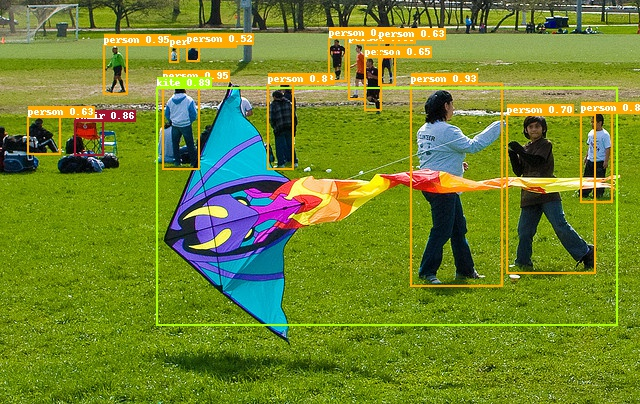

[English](INSTALL.md) | [简体中文](INSTALL_cn.md) | Español

# Instalación de PaddleDetection

Este documento cubre cómo instalar PaddleDetection y sus dependencias (incluyendo PaddlePaddle), junto con los datasets COCO y Pascal VOC.

> 💡 **¿Estás en Windows?** Consulta la **[Guía de Configuración en Windows (desde cero)](WINDOWS_SETUP_es.md)** para instrucciones más detalladas y específicas para Windows.

---

## Requisitos del sistema

| Componente | Versión mínima |
|-----------|----------------|
| PaddlePaddle | >= 2.2 |
| Sistema Operativo | 64 bit (Linux, Windows, macOS) |
| Python | 3.5.1+ / 3.6 / 3.7 / 3.8 / 3.9 / 3.10 (64 bit) |
| pip / pip3 | >= 9.0.1 (64 bit) |
| CUDA | >= 10.2 (solo si usas GPU NVIDIA) |
| cuDNN | >= 7.6 (solo si usas GPU NVIDIA) |

### Compatibilidad de versiones

| Versión PaddleDetection | Versión PaddlePaddle | Notas |
|:----------------------:|:--------------------:|:-----:|
| develop | >= 2.3.2 | Modo Dygraph por defecto |
| release/2.6 | >= 2.3.2 | Modo Dygraph por defecto |
| release/2.5 | >= 2.2.2 | Modo Dygraph por defecto |
| release/2.4 | >= 2.2.2 | Modo Dygraph por defecto |
| release/2.3 | >= 2.2.0rc | Modo Dygraph por defecto |
| release/2.2 | >= 2.1.2 | Modo Dygraph por defecto |
| release/2.1 | >= 2.1.0 | Modo Dygraph por defecto |
| release/2.0 | >= 2.0.1 | Modo Dygraph por defecto |

---

## Instrucciones de Instalación

### Paso 1: Instalar PaddlePaddle

#### Opción A: Con GPU NVIDIA (CUDA 10.2)

```bash
python -m pip install paddlepaddle-gpu==2.3.2 -i https://pypi.tuna.tsinghua.edu.cn/simple
```

#### Opción B: Solo CPU (sin GPU)

```bash
python -m pip install paddlepaddle==2.3.2 -i https://pypi.tuna.tsinghua.edu.cn/simple
```

> 📌 Para otras versiones de CUDA o entornos específicos, consulta la [Documentación de Instalación de PaddlePaddle](https://www.paddlepaddle.org.cn/install/quick).
>
> Para instalación mediante conda o compilación desde código fuente, consulta la [documentación oficial de instalación](https://www.paddlepaddle.org.cn/documentation/docs/en/install/index_en.html).

#### Verificar la instalación

```python
# Verificar que PaddlePaddle está instalado correctamente
import paddle
paddle.utils.run_check()

# Confirmar la versión instalada
python -c "import paddle; print(paddle.__version__)"
```

> ⚠️ **Nota**: Si planeas usar PaddleDetection con múltiples GPUs, instala NCCL primero.

---

### Paso 2: Instalar PaddleDetection

> ⚠️ La instalación mediante pip solo admite Python 3.

```bash
# Clonar el repositorio de PaddleDetection
cd <ruta/donde/clonar/PaddleDetection>
git clone https://github.com/PaddlePaddle/PaddleDetection.git

# Instalar otras dependencias
cd PaddleDetection
pip install -r requirements.txt

# Compilar e instalar paddledet
python setup.py install
```

#### Notas especiales para Windows

1. En Windows, la instalación de `pycocotools` puede fallar porque la versión original de cocoapi no soporta Windows. Usa esta versión alternativa (solo Python 3):

   ```bash
   pip install git+https://github.com/philferriere/cocoapi.git#subdirectory=PythonAPI
   ```

2. Si usas Python <= 3.6 y la instalación de `pycocotools` falla con el error `distutils.errors.DistutilsError: Could not find suitable distribution for Requirement.parse('cython>=0.27.3')`, instala `cython` primero:

   ```bash
   pip install cython
   ```

---

### Paso 3: Verificar la instalación

Después de la instalación, verifica que las pruebas pasen:

```bash
python ppdet/modeling/tests/test_architectures.py
```

Si las pruebas pasan, verás una salida similar a:

```
.......
----------------------------------------------------------------------
Ran 7 tests in 12.816s
OK
```

---

## Uso con imágenes Docker

> Si no tienes un entorno Docker, consulta [Docker](https://www.docker.com/).

Proporcionamos imágenes Docker que contienen el último código de PaddleDetection, con todas las dependencias pre-instaladas. Solo necesitas **descargar y ejecutar la imagen Docker**.

Obtén estas imágenes en [Docker Hub](https://hub.docker.com/repository/docker/paddlecloud/paddledetection), incluyendo versiones para CPU, GPU y ROCm.

---

## Demo de Inferencia

¡Felicitaciones! Si la instalación fue exitosa, prueba la demo de inferencia:

```bash
# Predecir una imagen con GPU
# En Linux/macOS:
export CUDA_VISIBLE_DEVICES=0
# En Windows (CMD):
set CUDA_VISIBLE_DEVICES=0

python tools/infer.py \
  -c configs/ppyolo/ppyolo_r50vd_dcn_1x_coco.yml \
  -o use_gpu=true \
  weights=https://paddledet.bj.bcebos.com/models/ppyolo_r50vd_dcn_1x_coco.pdparams \
  --infer_img=demo/000000014439.jpg
```

Se generará una imagen con el resultado de predicción en la carpeta `output`.


