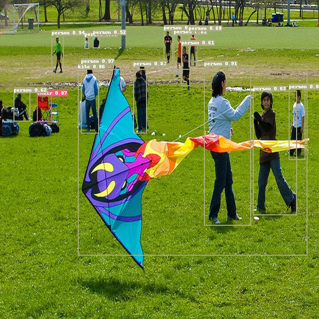

English | [简体中文](QUICK_STARTED_cn.md)

# Quick Start

This tutorial fine-tunes a tiny dataset by pretrained detection model for users to get a model and learn PaddleDetection quickly. The model can be trained in a short time with good performance.

## 一、YOLOv3 infer
```
python tools/infer.py -c configs/yolov3_mobilenet_v1.yml -o use_gpu=true weights=https://paddlemodels.bj.bcebos.com/object_detection/yolov3_mobilenet_v1.tar --infer_img=demo/000000014439_640x640.jpg
```
result：



## Data Preparation

Dataset refers to [Kaggle数据集](https://www.kaggle.com/andrewmvd/road-sign-detection) ， which contains 877 images in total. The data has 4 classes：crosswalk，speedlimit，stop，trafficlight.  
The data is divided into two parts, train data contains 701 images and valid data contains 176 images, [download](https://paddlemodels.bj.bcebos.com/object_detection/roadsign_voc.tar).

```bash
python dataset/fruit/download_fruit.py
```

## Train Eval Infer

### 1、training:

```bash this will take about 1 hour on CPU, 5 min on 1080Ti GPU.
python tools/train.py -c configs/templates/yolov3_mobilenet_v1_roadsign_voc_template.yml --eval -o use_gpu=true
```


### 2、eval
```
eval using best_model as default
python tools/eval.py -c configs/templates/yolov3_mobilenet_v1_roadsign_voc_template.yml-o use_gpu=true
```


### 3、Inference
```
python tools/infer.py -c configs/templates/yolov3_mobilenet_v1_roadsign_voc_template.yml -o use_gpu=true --infer_img=demo/road554.png
```

result as follows：


For detailed infomation of training and evalution, please refer to [GETTING_STARTED.md](GETTING_STARTED.md).
