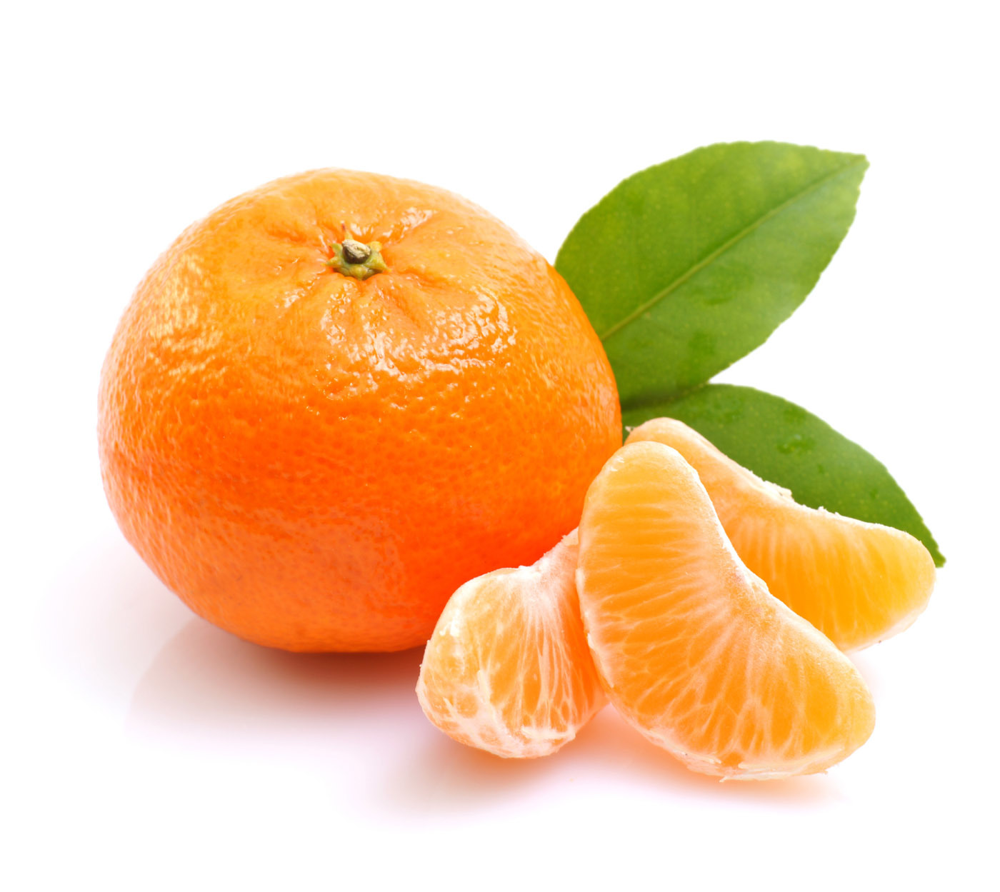

English | [简体中文](QUICK_STARTED_cn.md)

# Quick Start

This tutorial fine-tunes a tiny dataset by pretrained detection model for users to get a model and learn PaddleDetection quickly. The model can be trained in around 20min with good performance.

- **Note: before started, need to set PYTHONPATH and specifiy the GPU device as follows in Linux platform. For Windows users, also need to set PYTHONPATH correctly.**

```bash
export PYTHONPATH=$PYTHONPATH:.
export CUDA_VISIBLE_DEVICES=0
```

## Data Preparation

Dataset refers to [Kaggle](https://www.kaggle.com/mbkinaci/fruit-images-for-object-detection), which contains 240 images in train dataset and 60 images in test dataset. Data categories are apple, orange and banana. Download [here](https://dataset.bj.bcebos.com/PaddleDetection_demo/fruit-detection.tar) and uncompress the dataset after download, script for data preparation is located at [download_fruit.py](../../dataset/fruit/download_fruit.py). Command is as follows:

```bash
python dataset/fruit/download_fruit.py
```

Training:

```bash
python -u tools/train.py -c configs/yolov3_mobilenet_v1_fruit.yml \
                        --use_tb=True \
                        --tb_log_dir=tb_fruit_dir/scalar \
                        --eval
```

Use `yolov3_mobilenet_v1` to fine-tune the model from COCO dataset. Meanwhile, loss and mAP can be observed on tensorboard.  

```bash
tensorboard --logdir tb_fruit_dir/scalar/ --host <host_IP> --port <port_num>
```

Result on tensorboard is shown below:


Model can be downloaded [here](https://paddlemodels.bj.bcebos.com/object_detection/yolov3_mobilenet_v1_fruit.tar)

Evaluation:

```bash
python -u tools/eval.py -c configs/yolov3_mobilenet_v1_fruit.yml
```

Inference:

```bash
python -u tools/infer.py -c configs/yolov3_mobilenet_v1_fruit.yml \
                         -o weights=https://paddlemodels.bj.bcebos.com/object_detection/yolov3_mobilenet_v1_fruit.tar \
                         --infer_img=demo/orange_71.jpg
```

Inference images are shown below:





For detailed infomation of training and evalution, please refer to [GETTING_STARTED.md](GETTING_STARTED.md).
