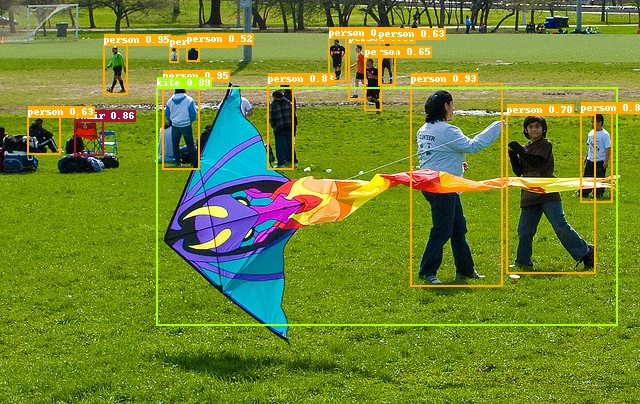
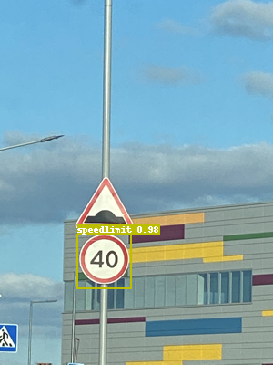

[English](QUICK_STARTED.md) | 简体中文

# 快速开始
为了使得用户能够在很短时间内快速产出模型，掌握PaddleDetection的使用方式，这篇教程通过一个预训练检测模型对小数据集进行finetune。在较短时间内即可产出一个效果不错的模型。实际业务中，建议用户根据需要选择合适模型配置文件进行适配。

- **设置显卡**
```bash
export CUDA_VISIBLE_DEVICES=0
```

## 一、快速体验
```
# 用PP-YOLO算法在COCO数据集上预训练模型预测一张图片
python tools/infer.py -c configs/ppyolo/ppyolo_r50vd_dcn_1x_coco.yml -o use_gpu=true weights=https://paddledet.bj.bcebos.com/models/ppyolo_r50vd_dcn_1x_coco.pdparams --infer_img=demo/000000014439.jpg
```

结果如下图：




## 二、准备数据
数据集参考[Kaggle数据集](https://www.kaggle.com/andrewmvd/road-sign-detection) ，包含877张图像，数据类别4类：crosswalk，speedlimit，stop，trafficlight。
将数据划分为训练集701张图和测试集176张图，[下载链接](https://paddlemodels.bj.bcebos.com/object_detection/roadsign_voc.tar).

```
# 注意：可跳过这步下载，后面训练会自动下载
python dataset/roadsign_voc/download_roadsign_voc.py
```


## 三、训练、评估、预测
### 1、训练
```
# 边训练边测试 CPU需要约1小时(use_gpu=false)，1080Ti GPU需要约10分钟
# -c 参数表示指定使用哪个配置文件
# -o 参数表示指定配置文件中的全局变量（覆盖配置文件中的设置），这里设置使用gpu
# --eval 参数表示边训练边评估，最后会自动保存一个名为model_final.pdparams的模型

python tools/train.py -c configs/yolov3/yolov3_mobilenet_v1_roadsign.yml --eval -o use_gpu=true
```

如果想通过VisualDL实时观察loss变化曲线，在训练命令中添加--use_vdl=true，以及通过--vdl_log_dir设置日志保存路径。

**但注意VisualDL需Python>=3.5**

首先安装[VisualDL](https://github.com/PaddlePaddle/VisualDL)
```
python -m pip install visualdl -i https://mirror.baidu.com/pypi/simple
```

```
python -u tools/train.py -c configs/yolov3/yolov3_mobilenet_v1_roadsign.yml \
                        --use_vdl=true \
                        --vdl_log_dir=vdl_dir/scalar \
                        --eval
```
通过visualdl命令实时查看变化曲线：
```
visualdl --logdir vdl_dir/scalar/ --host <host_IP> --port <port_num>
```


### 2、评估
```
# 评估 默认使用训练过程中保存的model_final.pdparams
# -c 参数表示指定使用哪个配置文件
# -o 参数表示指定配置文件中的全局变量（覆盖配置文件中的设置）
# 目前只支持单卡评估

python tools/eval.py -c configs/yolov3/yolov3_mobilenet_v1_roadsign.yml -o use_gpu=true
```
最终模型精度在mAP=0.85左右，由于数据集较小因此每次训练结束后精度会有一定波动


### 3、预测
```
# -c 参数表示指定使用哪个配置文件
# -o 参数表示指定配置文件中的全局变量（覆盖配置文件中的设置）
# --infer_img 参数指定预测图像路径
# 预测结束后会在output文件夹中生成一张画有预测结果的同名图像

python tools/infer.py -c configs/yolov3/yolov3_mobilenet_v1_roadsign.yml -o use_gpu=true --infer_img=demo/road554.png
```

结果如下图：


