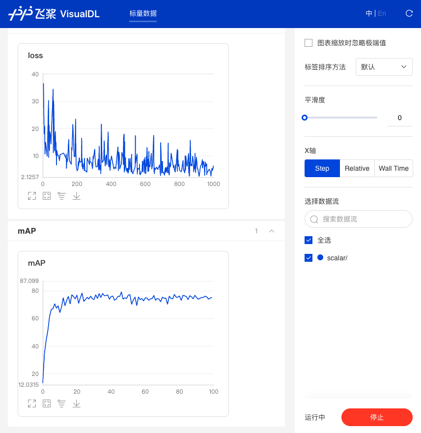

[English](QUICK_STARTED.md) | 简体中文

# 快速开始

为了使得用户能够在很短的时间内快速产出模型，掌握PaddleDetection的使用方式，这篇教程通过一个预训练检测模型对小数据集进行finetune。在P40上单卡大约20min即可产出一个效果不错的模型。

- **注：在开始前，如果有GPU设备，指定GPU设备号。**

```bash
export CUDA_VISIBLE_DEVICES=0
```

## 数据准备

数据集参考[Kaggle数据集](https://www.kaggle.com/mbkinaci/fruit-images-for-object-detection)，其中训练数据集240张图片，测试数据集60张图片，数据类别为3类：苹果，橘子，香蕉。[下载链接](https://dataset.bj.bcebos.com/PaddleDetection_demo/fruit-detection.tar)。数据下载后分别解压即可, 数据准备脚本位于[download_fruit.py](https://github.com/PaddlePaddle/PaddleDetection/tree/master/dataset/fruit/download_fruit.py)。下载数据方式如下：

```bash
python dataset/fruit/download_fruit.py
```

## 开始训练

训练命令如下：

```bash
python -u tools/train.py -c configs/yolov3_mobilenet_v1_fruit.yml --eval
```

训练使用`yolov3_mobilenet_v1`基于COCO数据集训练好的模型进行finetune。


如果想通过VisualDL实时观察loss和精度值，启动命令添加`--use_vdl=True`，以及通过`--vdl_log_dir`设置日志保存路径，但注意**VisualDL需Python>=3.5**：


```bash
python -u tools/train.py -c configs/yolov3_mobilenet_v1_fruit.yml \
                        --use_vdl=True \
                        --vdl_log_dir=vdl_fruit_dir/scalar \
                        --eval
```

通过`visualdl`命令实时查看变化曲线：

```bash
visualdl --logdir vdl_fruit_dir/scalar/ --host <host_IP> --port <port_num>
```

VisualDL结果显示如下：


<div align="center">
  
</div>

训练模型[下载链接](https://paddlemodels.bj.bcebos.com/object_detection/yolov3_mobilenet_v1_fruit.tar)

## 评估预测

评估命令如下：

```bash
python -u tools/eval.py -c configs/yolov3_mobilenet_v1_fruit.yml
```

预测命令如下

```bash
python -u tools/infer.py -c configs/yolov3_mobilenet_v1_fruit.yml \
                         -o weights=https://paddlemodels.bj.bcebos.com/object_detection/yolov3_mobilenet_v1_fruit.tar \
                         --infer_img=demo/orange_71.jpg
```

预测图片如下：


<div align="center">
  
</div>


<div align="center">
  
</div>


更多训练及评估流程，请参考[入门使用文档](GETTING_STARTED_cn.md)。
