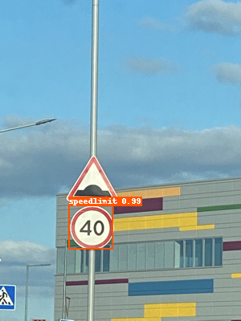

# 快速开始
为了使得用户能够在很短时间内快速产出模型，掌握PaddleDetection的使用方式，这篇教程通过一个预训练检测模型对小数据集进行finetune。在较短时间内即可产出一个效果不错的模型。

## 二、快速体验
```
# 如果有GPU
export CUDA_VISIBLE_DEVICES=0
python tools/infer.py -c configs/yolov3_mobilenet_v1.yml -o use_gpu=true weights=https://paddlemodels.bj.bcebos.com/object_detection/yolov3_mobilenet_v1.tar --infer_img=demo/000000014439_640x640.jpg
```
结果如下图：


## 三、准备数据
数据集参考[Kaggle数据集](https://www.kaggle.com/andrewmvd/road-sign-detection) ，包含877张图像，数据类别4类：crosswalk，speedlimit，stop，trafficlight。  
将数据划分为训练集701张图和测试集176张图，[下载链接](https://paddlemodels.bj.bcebos.com/object_detection/roadsign_voc.zip).

```
# 准备数据shell脚本
cd dataset
wget https://paddlemodels.bj.bcebos.com/object_detection/roadsign_voc.zip
unzip roadsign_voc.zip
rm -rf roadsign_voc.zip
```
最终数据集文件组织结构为：
```
tree
├── annotations
│   ├── road0.xml
│   ├── road1.xml
│   ├── road10.xml
│   |   ...
├── images
│   ├── road0.png
│   ├── road1.png
│   ├── road2.png
│   |   ...
├── label_list.txt
├── test.txt
├── train.txt
└── valid.txt
```

## 四、开始训练
### 1、训练
```
# 边训练边测试 CPU需要约1小时(use_gpu=false)，1080Ti GPU需要约5分钟。
python tools/train.py -c configs/yolov3_mobilenet_v1_roadsign_demo.yml --eval -o use_gpu=true
```

### 2、评估
```
评估 默认使用训练过程中保存的best_model
python tools/eval.py -c configs/yolov3_mobilenet_v1_roadsign_demo.yml -o use_gpu=true
'''
    inference time: xxx fps(不同硬件速度不同)
    mAP(0.50, 11point) = 64.09
'''
```


### 3、预测
```
python tools/infer.py -c configs/yolov3_mobilenet_v1_roadsign_demo.yml -o use_gpu=true --infer_img=demo/road554.png
```

结果如下图：




**如仍有疑惑，欢迎给我们提issue。**
