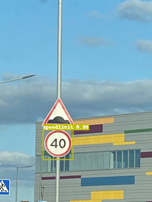

[English](QUICK_STARTED.md) | [简体中文](QUICK_STARTED_cn.md) | Español

# Inicio Rápido

Para permitir a los usuarios experimentar PaddleDetection y producir modelos en un corto tiempo, este tutorial presenta el pipeline para obtener un buen modelo de detección de objetos haciendo fine-tuning en un dataset pequeño en solo 10 minutos. En aplicaciones prácticas, se recomienda que los usuarios seleccionen un archivo de configuración apropiado para su demanda específica.

> 💡 **¿Primera vez configurando?** Consulta la [Guía de Configuración en Windows](WINDOWS_SETUP_es.md) o la [Guía de Instalación](INSTALL_es.md) primero.

---

## Configurar GPU

**Linux / macOS:**
```bash
export CUDA_VISIBLE_DEVICES=0
```

**Windows (CMD):**
```cmd
set CUDA_VISIBLE_DEVICES=0
```

**Windows (PowerShell):**
```powershell
$env:CUDA_VISIBLE_DEVICES="0"
```

---

## Demo de Inferencia con Modelos Pre-entrenados

```bash
# Predecir una imagen usando PP-YOLO
python tools/infer.py \
    -c configs/ppyolo/ppyolo_r50vd_dcn_1x_coco.yml \
    -o use_gpu=true \
    weights=https://paddledet.bj.bcebos.com/models/ppyolo_r50vd_dcn_1x_coco.pdparams \
    --infer_img=demo/000000014439.jpg
```

> 💡 Si no tienes GPU, usa `use_gpu=false` en el comando anterior.

Resultado de la predicción:


---

## Preparación de Datos

El dataset utilizado es un [dataset de Kaggle](https://www.kaggle.com/andrewmvd/road-sign-detection) que incluye 877 imágenes y 4 categorías de datos: crosswalk (paso de cebra), speedlimit (límite de velocidad), stop y trafficlight (semáforo). El dataset está dividido en conjunto de entrenamiento (701 imágenes) y conjunto de prueba (176 imágenes). [Enlace de descarga](https://paddlemodels.bj.bcebos.com/object_detection/roadsign_voc.tar).

```bash
# Nota: este comando puede omitirse, el dataset se descargará automáticamente durante el entrenamiento.
python dataset/roadsign_voc/download_roadsign_voc.py
```

---

## Entrenamiento, Evaluación e Inferencia

### 1. Entrenamiento

```bash
# Tomará aproximadamente 10 minutos en una GPU 1080Ti y 1 hora en CPU
# -c establece el archivo de configuración
# -o sobreescribe los ajustes en el archivo de configuración
# --eval Evalúa mientras entrena, y guardará automáticamente el mejor modelo

python tools/train.py -c configs/yolov3/yolov3_mobilenet_v1_roadsign.yml --eval -o use_gpu=true
```

> 💡 **Para CPU (sin GPU):** Cambia `use_gpu=true` por `use_gpu=false`

#### Monitoreo en tiempo real con VisualDL

Si deseas observar la curva de pérdida en tiempo real a través de VisualDL, agrega `--use_vdl=true` al comando de entrenamiento y establece la ruta de guardado del log mediante `--vdl_log_dir`.

**Nota: VisualDL requiere Python >= 3.5**

Primero instala VisualDL:

```bash
python -m pip install visualdl -i https://mirror.baidu.com/pypi/simple
```

Luego entrena con monitoreo:

```bash
python -u tools/train.py \
    -c configs/yolov3/yolov3_mobilenet_v1_roadsign.yml \
    --use_vdl=true \
    --vdl_log_dir=vdl_dir/scalar \
    --eval
```

Visualiza la curva de cambio en tiempo real mediante el comando visualdl:

```bash
visualdl --logdir vdl_dir/scalar/ --host <IP_del_host> --port <número_de_puerto>
```

---

### 2. Evaluación

```bash
# Evalúa best_model por defecto
# -c establece el archivo de configuración
# -o sobreescribe los ajustes en el archivo de configuración

python tools/eval.py -c configs/yolov3/yolov3_mobilenet_v1_roadsign.yml -o use_gpu=true
```

El mAP final debería ser alrededor de **0.85**. El dataset es pequeño, por lo que la precisión puede variar un poco después de cada entrenamiento.

---

### 3. Inferencia

```bash
# -c establece el archivo de configuración
# -o sobreescribe los ajustes en el archivo de configuración
# --infer_img ruta de la imagen
# Después de la predicción, se generará una imagen con el resultado en la carpeta output

python tools/infer.py \
    -c configs/yolov3/yolov3_mobilenet_v1_roadsign.yml \
    -o use_gpu=true \
    --infer_img=demo/road554.png
```

Resultado:



---

## Próximos pasos

- 📖 Consulta la [Guía Completa de Inicio](GETTING_STARTED_es.md) para más detalles
- 📊 Explora la [Biblioteca de Modelos](../../docs/MODEL_ZOO_en.md) para ver todos los modelos disponibles
- 🚀 Aprende sobre [Despliegue de Modelos](../../deploy/README.md)
