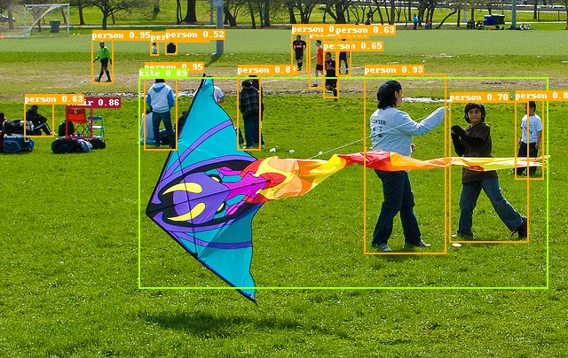

# 安装说明

---
## 目录

- [安装PaddlePaddle](#安装PaddlePaddle)
- [其他依赖安装](#其他依赖安装)
- [PaddleDetection](#PaddleDetection)


## 安装PaddlePaddle

**环境需求:**

- PaddlePaddle 2.0.1 或 PaddlePaddle release/2.0分支最新编译安装包
- OS 64位操作系统
- Python 3(3.5.1+/3.6/3.7)，64位版本
- pip/pip3(9.0.1+)，64位版本
- CUDA >= 9.0
- cuDNN >= 7.6

如果需要 GPU 多卡训练，请先安装NCCL。


## 其他依赖安装

[COCO-API](https://github.com/cocodataset/cocoapi):

运行需要COCO-API，安装方式如下：

    # 安装pycocotools
    pip install pycocotools

**windows用户安装COCO-API方式：**

    # 若Cython未安装，请安装Cython
    pip install Cython

    # 由于原版cocoapi不支持windows，采用第三方实现版本，该版本仅支持Python3
    pip install git+https://github.com/philferriere/cocoapi.git#subdirectory=PythonAPI

## PaddleDetection

**克隆PaddleDetection库：**

您可以通过以下命令克隆PaddleDetection：

```
cd <path/to/clone/PaddleDetection>
git clone https://github.com/PaddlePaddle/PaddleDetection.git
```

也可以通过 [https://gitee.com/paddlepaddle/PaddleDetection](https://gitee.com/paddlepaddle/PaddleDetection) 克隆。
```
cd <path/to/clone/PaddleDetection>
git clone https://gitee.com/paddlepaddle/PaddleDetection
```

**安装PaddleDetection库:**

```
cd PaddleDetection/dygraph
python setup.py install
```

**预训练模型预测**

使用预训练模型预测图像，快速体验模型预测效果：

```
# use_gpu参数设置是否使用GPU
python tools/infer.py -c configs/ppyolo/ppyolo_r50vd_dcn_1x_coco.yml -o use_gpu=true weights=https://paddlemodels.bj.bcebos.com/object_detection/dygraph/ppyolo_r50vd_dcn_1x_coco.pdparams --infer_img=demo/000000014439.jpg
```

会在`output`文件夹下生成一个画有预测结果的同名图像。

结果如下图：


