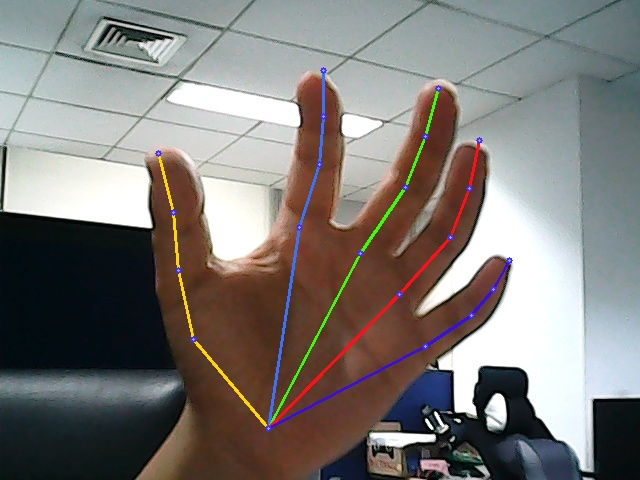

本项目是基于Paddle的手势21个关键点检测

本项目是基于[原项目](https://github.com/EricLee2021-72324/handpose_x)进行改进，感谢作者的贡献

* 增加摄像头识别模块
* 增加新的 backbone
* 待补充

### 项目介绍

* 手部 21 关键点检测



### 项目环境

* Python >= 3.7

* Paddle >= 2.0.2

* OpenCV-Python

### 数据集

本项目所用数据集包括网络图片以及 [Large-scale Multiview 3D Hand Pose Dataset](http://www.rovit.ua.es/dataset/mhpdataset/) 数据，由原作者筛选动作重复度低的部分图片，其数据集的出处 [handpose_x](https://codechina.csdn.net/EricLee/handpose_x)

[百度网盘下载数据集 (password: ara8)](https://pan.baidu.com/share/init?surl=KY7lAFXBTfrFHlApxTY8NA)

### 模型下载

本项目模型由原作者训练的模型权重转过来

- [x] ReXNet V1
- [ ] ResNet18 / 34 / 50
- [ ] ShuffleNet V2
- [ ] RepVGG

后续将支持更多的模型以及vit、mlp等新的模型

[模型下载地址(password: 6xal)](https://pan.baidu.com/s/12-GziEVeWNFqKUFJksevng)

### 快速开始

clone项目到本地，注意脚本的相关配置

* 模型训练

下载数据集后解压放入项目目录下，文件结构如下

```bash
handpose_x-paddle
    ├─handpose_datasets_v1  # 数据集
    ├─hand_data_iter        # 数据读取
    ├─image                 # 测试图像
    ├─loss                  # 损失函数
    ├─models                # 模型
    └─utils                 
```

然后在`handpose_x-paddle`目录下运行

```python
python train.py
```

note ：训练的各种参数，注意在脚本寻找，此处用默认训练参数

* 模型推理

下载预训练权重，放入`handpose_x-paddle/weights`目录下，然后运行

```python
python inference.py
```

会看到当前目录下产生`output`文件夹，`iamge`里面的测试图片将通过推理保存在此

* 开始摄像头

```python
python camera.py
```

