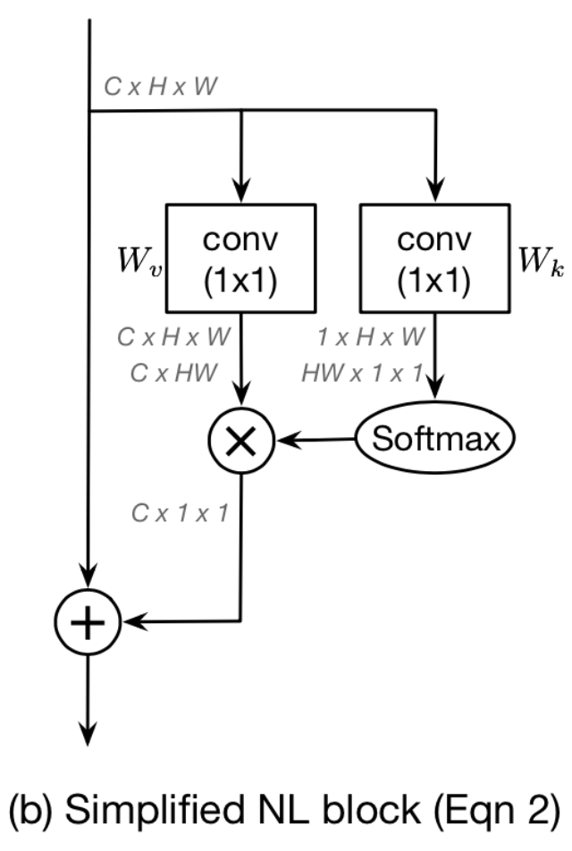
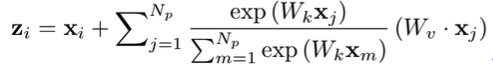
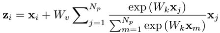
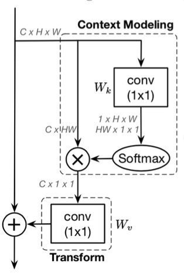
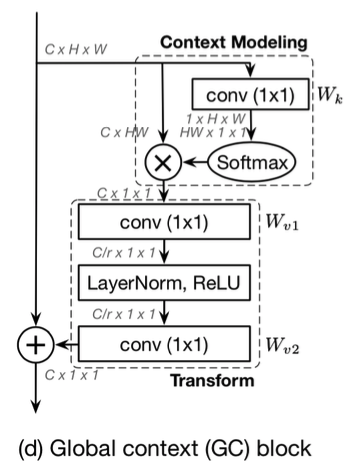

# GCNet: Non-local Networks Meet Squeeze-Excitation Networks and Beyond

## 简介

Nonlocal基于自注意力机制，给出了捕捉长时依赖的方法，但是在该论文中，作者通过可视化分析发现，相同图像中对于不同位置点的attention map几乎是一致的，也就是说在Nonlocal计算过程中有很大的资源浪费（冗余计算）。SENet使用全局上下文对不同的通道进行权重标定，计算量很小，但是这样无法充分利用全局上下文信息。论文中作者结合了Nonlocal和SENet两者的优点，提出了GCNet模块，在保证较小计算量的情况下，很好地融合了全局上下文信息。

论文中基于attention map差距很小的现象，设计了simplified nonlocal结构（SNL），结构如下图所示，对所有位置共享全局attention map。

<div align="center">
    
</div>


SNL的网络输出计算如下

<div align="center">
    
</div>

为进一步减少计算量，将$W_v$提取到attention pooling计算的外面，表示为

<div align="center">
    
</div>

对应结构如下所示。通过共享attention map，计算量减少为之前的1/WH。

<div align="center">
    
</div>

SNL模块可以抽象为上下文建模、特征转换和特征聚合三个部分，特征转化部分有大量参数，因此在这里参考SE的结构，最终GC block的结构如下所示。使用两层降维的1*1卷积降低计算量，由于两层卷积参数较难优化，在这里加入layer normalization的正则化层降低优化难度。

<div align="center">
    
</div>

该模块可以很方便地插入到骨干网络中，提升模型的全局上下文表达能力，可以提升检测和分割任务的模型性能。


## 模型库

| 骨架网络             | 网络类型 | Context设置     | 每张GPU图片个数 | 学习率策略 |推理时间(fps) | Box AP | Mask AP |                           下载                          | 配置文件 |
| :---------------------- | :-------------: |  :-------------:  | :-------: | :-----: | :------------: | :----: | :-----: | :----------------------------------------------------------: | :-----: |
| ResNet50-vd-FPN         | Mask       | GC(c3-c5, r16, add)  |     2     |   2x    |     15.31     |  41.4  |    36.8    | [model](https://paddlemodels.bj.bcebos.com/object_detection/mask_rcnn_r50_vd_fpn_gcb_add_r16_2x.tar) | [config](https://github.com/PaddlePaddle/PaddleDetection/tree/develop/static/configs/gcnet/mask_rcnn_r50_vd_fpn_gcb_add_r16_2x.yml) |
| ResNet50-vd-FPN         | Mask       | GC(c3-c5, r16, mul)  |     2     |   2x    |     15.35     |  40.7  |    36.1    | [model](https://paddlemodels.bj.bcebos.com/object_detection/mask_rcnn_r50_vd_fpn_gcb_mul_r16_2x.tar) | [config](https://github.com/PaddlePaddle/PaddleDetection/tree/develop/static/configs/gcnet/mask_rcnn_r50_vd_fpn_gcb_mul_r16_2x.yml) |


## 引用

```
@article{DBLP:journals/corr/abs-1904-11492,
  author    = {Yue Cao and
               Jiarui Xu and
               Stephen Lin and
               Fangyun Wei and
               Han Hu},
  title     = {GCNet: Non-local Networks Meet Squeeze-Excitation Networks and Beyond},
  journal   = {CoRR},
  volume    = {abs/1904.11492},
  year      = {2019},
  url       = {http://arxiv.org/abs/1904.11492},
  archivePrefix = {arXiv},
  eprint    = {1904.11492},
  timestamp = {Tue, 09 Jul 2019 16:48:55 +0200},
  biburl    = {https://dblp.org/rec/bib/journals/corr/abs-1904-11492},
  bibsource = {dblp computer science bibliography, https://dblp.org}
}
```
