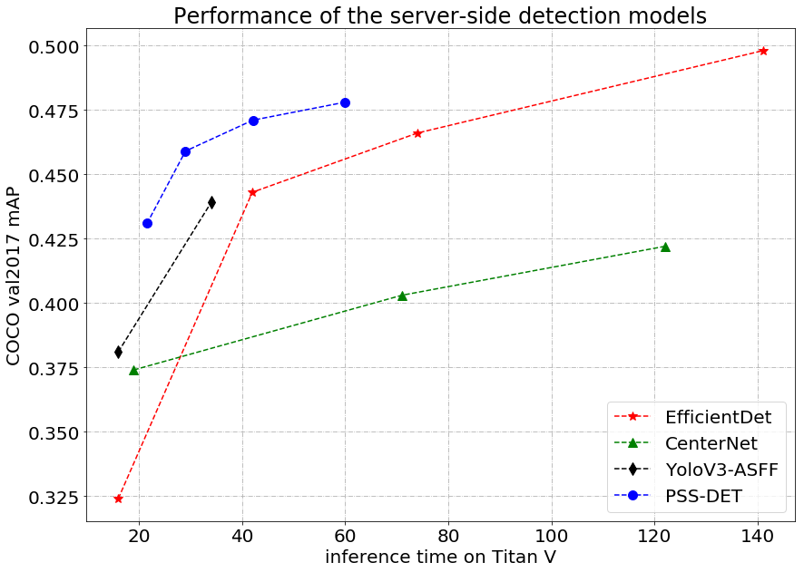

# Practical Server-side detection method base on RCNN

## Introduction

* In recent years, object detection tasks have attracted widespread attention. [PaddleClas](https://github.com/PaddlePaddle/PaddleClas) open-sourced the ResNet50_vd_SSLD pretrained model based on ImageNet(Top1 Acc 82.4%). And based on the pretrained model, PaddleDetection provided the PSS-DET (Practical Server-side detection) with the help of the rich operators in PaddleDetection. The inference speed can reach 61FPS on single V100 GPU when COCO mAP is 41.6%, and 20FPS when COCO mAP is 47.8%.

* We take the standard `Faster RCNN ResNet50_vd FPN` as an example. The following table shows ablation study of PSS-DET.

| Trick | Train scale | Test scale |  COCO mAP | Infer speed/FPS |
|- |:-: |:-: | :-: | :-: |
| `baseline` | 640x640 | 640x640 | 36.4% | 43.589 |
| +`test proposal=pre/post topk 500/300` | 640x640 | 640x640 | 36.2% | 52.512 |
| +`fpn channel=64` | 640x640 | 640x640 | 35.1% | 67.450 |
| +`ssld pretrain` | 640x640 | 640x640 | 36.3% | 67.450 |
| +`ciou loss` | 640x640 | 640x640 | 37.1% | 67.450 |
| +`DCNv2` | 640x640 | 640x640 | 39.4% | 60.345 |
| +`3x, multi-scale training` | 640x640 | 640x640 | 41.0% | 60.345 |
| +`auto augment` | 640x640 | 640x640 | 41.4% | 60.345 |
| +`libra sampling` | 640x640 | 640x640 | 41.6% | 60.345 |

And the following figure shows `mAP-Speed` curves for some common detectors.

**Note**
> For fair comparison, inference time for PSS-DET models on V100 GPU is transformed to Titan V GPU by multiplying by 1.2 times.

## Model Zoo

#### COCO dataset

| Backbone                | Type     | Image/gpu | Lr schd | Inf time (fps) | Box AP | Mask AP |                           Download                           | Configs |
| :---------------------- | :-------------:  | :-------: | :-----: | :------------: | :----: | :-----: | :----------------------------------------------------------: | :-----: |
| ResNet50-vd-FPN-Dcnv2         | Faster     |     2     |   3x    |     61.425     |  41.6  |    -    | [model](https://paddlemodels.bj.bcebos.com/object_detection/faster_rcnn_dcn_r50_vd_fpn_3x_server_side.tar) |  [config](https://github.com/PaddlePaddle/PaddleDetection/tree/develop/static/configs/rcnn_enhance/faster_rcnn_dcn_r50_vd_fpn_3x_server_side.yml) |
| ResNet50-vd-FPN-Dcnv2         | Cascade Faster     |     2     |   3x    |     20.001     |  47.8  |    -    | [model](https://paddlemodels.bj.bcebos.com/object_detection/cascade_rcnn_dcn_r50_vd_fpn_3x_server_side.tar) | [config](https://github.com/PaddlePaddle/PaddleDetection/tree/develop/static/configs/rcnn_enhance/cascade_rcnn_dcn_r50_vd_fpn_3x_server_side.yml) |
| ResNet101-vd-FPN-Dcnv2         | Cascade Faster     |     2     |   3x    |     19.523     |  49.4  |    -    | [model](https://paddlemodels.bj.bcebos.com/object_detection/cascade_rcnn_dcn_r101_vd_fpn_3x_server_side.pdparams) | [config](https://github.com/PaddlePaddle/PaddleDetection/tree/develop/static/configs/rcnn_enhance/cascade_rcnn_dcn_r101_vd_fpn_3x_server_side.yml) |

**Attention**: Pretrained models whose congigurations are in the directory `generic` just support inference but do not support training and evaluation as now.
