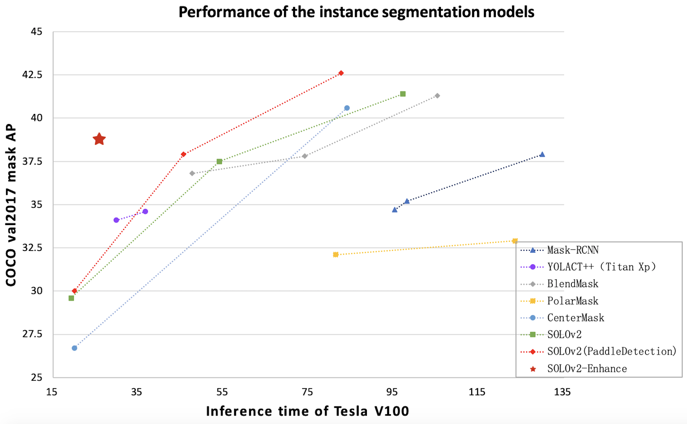

# SOLOv2 for instance segmentation

## Introduction

SOLOv2 (Segmenting Objects by Locations) is a fast instance segmentation framework with strong performance. We reproduced the model of the paper, and improved and optimized the accuracy and speed of the SOLOv2.

**Highlights:**

- Performance: `Light-R50-VD-DCN-FPN` model reached 38.6 FPS on single Tesla V100, and mask ap on the COCO-val dataset reached 38.8, which increased inference speed by 24%, mAP increased by 2.4 percentage points.
- Training Time: The training time of the model of `solov2_r50_fpn_1x` on Tesla v100 with 8 GPU is only 10 hours.

<div align="center">
  
</div>


## Model Zoo

| Detector  | Backbone                | Multi-scale training  | Lr schd |  Mask AP<sup>val</sup> |  V100 FP32(FPS) |    GPU  |    Download                  | Configs |
| :-------: | :---------------------: | :-------------------: | :-----: | :--------------------: | :-------------: | :-----: | :---------: | :------------------------: |
| YOLACT++  |  R50-FPN    | False      |  80w iter     |   34.1 (test-dev) |  33.5  | Xp |  -  |  -   |
| CenterMask | R50-FPN | True        |   2x    |     36.4        |  13.9  | Xp |   -  |  -  |
| CenterMask | V2-99-FPN | True        |   3x    |     40.2       |  8.9  | Xp |   -  |  -  |
| PolarMask | R50-FPN | True        |   2x    |     30.5        |  9.4  | V100 |   -  |  -  |
| BlendMask | R50-FPN | True        |   3x    |     37.8        |  13.5  | V100 |   -  |  -  |
| SOLOv2 (Paper) | R50-FPN | False        |   1x    |     34.8        |  18.5  | V100 |   -  |  -  |
| SOLOv2 (Paper) | X101-DCN-FPN | True        |   3x    |     42.4        |  5.9  | V100 |   -  |  -  |
| SOLOv2 | Mobilenetv3-FPN                 |  True                |   3x    |    30.0          |  50    | V100 | [model](https://paddlemodels.bj.bcebos.com/object_detection/solov2_mobilenetv3_fpn_448_3x.pdparams) | [config](https://github.com/PaddlePaddle/PaddleDetection/tree/develop/static/configs/solov2/solov2_mobilenetv3_fpn_448_3x.yml) |
| SOLOv2 | R50-FPN                 |  False                |   1x    |    35.6         |  21.9     | V100 |  [model](https://paddlemodels.bj.bcebos.com/object_detection/solov2_r50_fpn_1x.pdparams) | [config](https://github.com/PaddlePaddle/PaddleDetection/tree/develop/static/configs/solov2/solov2_r50_fpn_1x.yml) |
| SOLOv2 | R50-FPN                 |  True                |   3x    |     37.9         |   21.9    | V100 |  [model](https://paddlemodels.bj.bcebos.com/object_detection/solov2_r50_fpn_3x.pdparams) | [config](https://github.com/PaddlePaddle/PaddleDetection/tree/develop/static/configs/solov2/solov2_r50_fpn_3x.yml) |
| SOLOv2 | R101-VD-FPN                 |  True               |   3x    |   42.6        |  12.1     | V100 |  [model](https://paddlemodels.bj.bcebos.com/object_detection/solov2_r101_vd_fpn_3x.pdparams) | [config](https://github.com/PaddlePaddle/PaddleDetection/tree/develop/static/configs/solov2/solov2_r101_vd_fpn_3x.yml) |

## Enhanced model
| Backbone                | Input size  | Lr schd | V100 FP32(FPS) | Mask AP<sup>val</sup> |         Download                  | Configs |
| :---------------------: | :-------------------: | :-----: | :------------: | :-----: | :---------: | :------------------------: |
| Light-R50-VD-DCN-FPN          |  512     |   3x    |     38.6          |  38.8   | [model](https://paddlemodels.bj.bcebos.com/object_detection/solov2_light_r50_vd_fpn_dcn_512_3x.pdparams) | [config](https://github.com/PaddlePaddle/PaddleDetection/tree/develop/static/configs/solov2/solov2_light_r50_vd_fpn_dcn_512_3x.yml) |

**Notes:**

- SOLOv2 is trained on COCO train2017 dataset and evaluated on val2017 results of `mAP(IoU=0.5:0.95)`.

## Citations
```
@article{wang2020solov2,
  title={SOLOv2: Dynamic, Faster and Stronger},
  author={Wang, Xinlong and Zhang, Rufeng and  Kong, Tao and Li, Lei and Shen, Chunhua},
  journal={arXiv preprint arXiv:2003.10152},
  year={2020}
}
```
