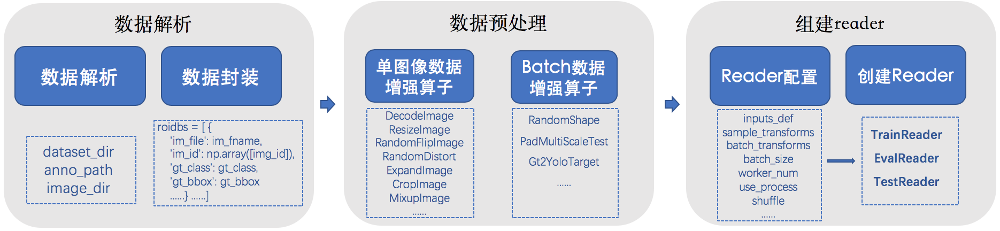

# 数据处理模块

## 目录
- [简介](#简介)
- [数据准备](#数据准备)
    - [数据解析](#数据解析)
        - [COCO数据源](#COCO数据源)
        - [Pascal VOC数据源](#Pascal-VOC数据源)
        - [添加新数据源](#添加新数据源)
    - [数据预处理](#数据预处理)
        - [数据增强算子](#数据增强算子)
        - [自定义数据增强算子](#自定义数据增强算子)
        - [组建Reader迭代器](#组建Reader迭代器)
- [配置及运行](#配置及运行)
    - [训练配置](#训练配置)
    - [评估配置](#评估配置)
    - [推理配置](#推理配置)
    - [运行](#运行)

## 简介
PaddleDetection的数据处理模块是一个Python模块，所有代码逻辑在`ppdet/data/`中，数据处理模块用于加载数据并将其转换成适用于物体检测模型的训练、评估、推理所需要的格式。
数据处理模块的主要构成如下架构所示：
```bash
  ppdet/data/
  ├── reader.py     # 数据处理模块的总接口
  ├── shared_queue  # 共享内存管理模块
  │   ├── queue.py        # 定义共享内存队列
  │   ├── sharedmemory.py # 负责分配内存
  ├── source  # 数据源管理模块
  │   ├── dataset.py      # 定义数据源基类，各类数据集继承于此
  │   ├── coco.py         # COCO数据集解析与格式化数据
  │   ├── voc.py          # Pascal VOC数据集解析与格式化数据
  │   ├── widerface.py    # WIDER-FACE数据集解析与格式化数据
  ├── tests  # 单元测试模块
  │   ├── test_dataset.py # 对数据集解析、加载等进行单元测试
  │   │   ...
  ├── transform  # 数据预处理模块
  │   ├── batch_operators.py  # 定义各类基于批量数据的预处理算子
  │   ├── op_helper.py    # 预处理算子的辅助函数
  │   ├── operators.py    # 定义各类基于单张图片的预处理算子
  ├── parallel_map.py     # 在多进程/多线程模式中对数据预处理操作进行加速
  ```



## 数据准备
PaddleDetection目前支持[COCO](http://cocodataset.org)、[Pascal VOC](http://host.robots.ox.ac.uk/pascal/VOC/)
和[WIDER-FACE](http://shuoyang1213.me/WIDERFACE/)数据源，默认数据集可自动下载，请参考[默认数据集安装方法](../tutorials/INSTALL_cn.md)。
同时我们还支持自定义数据源，包括(1)自定义数据源转换成COCO数据集；(2)定义新的数据源。

数据准备分为三步：
- （1）[数据解析](#数据解析)
- （2）[数据预处理](#数据预处理)
- （3）[组建Reader迭代器](#组建Reader迭代器)

下面为您分别介绍下这三步的具体内容：

### 数据解析
数据解析逻辑在`source`目录中，其中，`dataset.py`是数据源定义的基类，所有数据集继承于此，`DataSet`基类里定义了如下等方法：

| 方法                        | 输入   | 输出           |  备注                   |
| :------------------------: | :----: | :------------: | :--------------: |
| load_roidb_and_cname2cid() | 无     | 无     |加载`DataSet`中Roidb数据源list, 类别名到id的映射dict |
| get_roidb()                | 无     | list[dict], Roidb数据源  | 获取数据源 |
| get_cname2cid()            | 无     | dict，类别名到id的映射  |  获取标签ID |
| get_anno()                 | 无     | str, 标注文件路径  | 获取标注文件路径 |
| get_imid2path()            | 无     | dict, 图片路径  | 获取图片路径 |

**几点解释：**
- `load_roidb_and_cname2cid()`在Dataset基类中并没有做实际的操作，需要在子类中重写实际操作。
- `roidbs`:  
代表数据源列表。`load_roidb_and_cname2cid`方法中根据数据集标注文件(anno_path)，将每张标注好的图片解析为字典`coco_rec`和`voc_rec`等：
```python
xxx_rec = {
    'im_file': im_fname,         # 一张图像的完整路径
    'im_id': np.array([img_id]), # 一张图像的ID序号
    'h': im_h,                   # 图像高度
    'w': im_w,                   # 图像宽度
    'is_crowd': is_crowd,        # 是否是群落对象, 默认为0 (VOC中无此字段，为了使个别模型同时适配于COCO与VOC)
    'gt_class': gt_class,        # 标注框标签名称的ID序号
    'gt_bbox': gt_bbox,          # 标注框坐标(xmin, ymin, xmax, ymax)
    'gt_score': gt_score,        # 标注框置信度得分 (此字段为了适配Mixup操作)
    'gt_poly': gt_poly,          # 分割掩码，此字段只在coco_rec中出现，默认为None
    'difficult': difficult       # 是否是困难样本，此字段只在voc_rec中出现，默认为0
}
```
然后将所有`xxx_rec`字典封装到`records`列表中，最后传入`self.roidbs`中方便后续调用。

- `cname2cid`:  
保存了类别名到id的映射的一个dict。
  - COCO数据集中：会根据[COCO API](https://github.com/cocodataset/cocoapi)自动加载cname2cid。
  - VOC数据集中：如果在yaml配置文件中设置`use_default_label=False`，将从`label_list.txt`中读取类别列表，
反之则可以没有`label_list.txt`文件，PaddleDetection会使用`source/voc.py`里的默认类别字典。
`label_list.txt`的格式如下所示，每一行文本表示一个类别：
```bash
aeroplane
bicycle
bird
...
```

#### COCO数据源

该数据集目前分为COCO2014和COCO2017，主要由json文件和image文件组成，其组织结构如下所示：

  ```
  dataset/coco/
  ├── annotations
  │   ├── instances_train2014.json
  │   ├── instances_train2017.json
  │   ├── instances_val2014.json
  │   ├── instances_val2017.json
  │   │   ...
  ├── train2017
  │   ├── 000000000009.jpg
  │   ├── 000000580008.jpg
  │   │   ...
  ├── val2017
  │   ├── 000000000139.jpg
  │   ├── 000000000285.jpg
  │   │   ...
  ```
在`source/coco.py`中定义并注册了`COCODataSet`数据源类，它继承自`DataSet`基类，并重写了`load_roidb_and_cname2cid`：

根据标注文件路径（anno_path），调用[COCO API](https://github.com/cocodataset/cocoapi)加载并解析COCO格式数据源`roidbs`和`cname2cid`。


#### Pascal VOC数据源

该数据集目前分为VOC2007和VOC2012，主要由xml文件和image文件组成，其组织结构如下所示：

  ```
  dataset/voc/
  ├── trainval.txt
  ├── test.txt
  ├── label_list.txt (optional)
  ├── VOCdevkit/VOC2007
  │   ├── Annotations
  │       ├── 001789.xml
  │       │   ...
  │   ├── JPEGImages
  │       ├── 001789.jpg
  │       │   ...
  │   ├── ImageSets
  │       |   ...
  ├── VOCdevkit/VOC2012
  │   ├── Annotations
  │       ├── 2011_003876.xml
  │       │   ...
  │   ├── JPEGImages
  │       ├── 2011_003876.jpg
  │       │   ...
  │   ├── ImageSets
  │       │   ...
  ```
在`source/voc.py`中定义并注册了`VOCDataSet`数据源类，它继承自`DataSet`基类，并重写了`load_roidb_and_cname2cid`，解析VOC数据集中xml格式标注文件，更新`roidbs`和`cname2cid`。

#### 添加新数据源

- （1）新建`./source/xxx.py`，定义类`XXXDataSet`继承自`DataSet`基类，完成注册与序列化，并重写`load_roidb_and_cname2cid`方法对`roidbs`与`cname2cid`更新：
```python
@register
@serializable
class XXXDataSet(DataSet):
    def __init__(self,
                 dataset_dir=None,
                 image_dir=None,
                 anno_path=None,
                 ...
                 ):
        self.roidbs = None
        self.cname2cid = None
        ...

    def load_roidb_and_cname2cid(self):
        ...
        省略具体解析数据逻辑
        ...
        self.roidbs, self.cname2cid = records, cname2cid
```
- （2）在`source/__init__.py`中添加引用：
```python
from . import xxx
from .xxx import *
```
完成以上两步就将新的数据源`XXXDataSet`添加好了，操作非常简单。

### 数据预处理

#### 数据增强算子
PaddleDetection中支持了种类丰富的数据增强算子，有单图像数据增强算子与批数据增强算子两种方式，您可选取合适的算子组合使用，已支持的单图像数据增强算子详见下表：

| 名称                     |  作用                   |
| :---------------------: | :--------------: |
| DecodeImage             | 从图像文件或内存buffer中加载图像，格式为BGR、HWC格式，如果设置to_rgb=True，则转换为RGB格式。|
| ResizeImage             | 根据特定的插值方式调整图像大小 |
| RandomFlipImage         | 随机水平翻转图像 |
| NormalizeImage          | 对图像像素值进行归一化，如果设置is_scale=True，则先将像素值除以255.0，像素值缩放到到[0-1]区间。 |
| RandomDistort           | 随机扰动图片亮度、对比度、饱和度和色相 |
| ExpandImage             | 将原始图片放入用像素均值填充(随后会在减均值操作中减掉)的扩张图中，对此图进行裁剪、缩放和翻转 |
| CropImage               | 根据缩放比例、长宽比例生成若干候选框，再依据这些候选框和标注框的面积交并比(IoU)挑选出符合要求的裁剪结果 |
| CropImageWithDataAchorSampling | 基于CropImage，在人脸检测中，随机将图片尺度变换到一定范围的尺度，大大增强人脸的尺度变化 |
| NormalizeBox            | 对bounding box进行归一化 |
| Permute                 | 对图像的通道进行排列并转为BGR格式。假如输入是HWC顺序，通道C上是RGB格式，设置channel_first=True，将变成CHW，设置to_bgr=True，通道C上变成BGR格式。 |
| MixupImage              | 按比例叠加两张图像 |
| RandomInterpImage       | 使用随机的插值方式调整图像大小 |
| Resize                  | 根据特定的插值方式同时调整图像与bounding box的大小|
| MultiscaleTestResize    | 将图像重新缩放为多尺度list的每个尺寸 |
| ColorDistort            | 根据特定的亮度、对比度、饱和度和色相为图像增加噪声 |
| NormalizePermute        | 归一化图像并改变图像通道顺序|
| RandomExpand            | 原理同ExpandImage，以随机比例与角度对图像进行裁剪、缩放和翻转 |
| RandomCrop              | 原理同CropImage，以随机比例与IoU阈值进行处理 |
| PadBox                  | 如果bounding box的数量少于num_max_boxes，则将零填充到bbox |
| BboxXYXY2XYWH           | 将bounding box从(xmin,ymin,xmax,ymin)形式转换为(xmin,ymin,width,height)格式 |

**几点说明：**
- 上表中的数据增强算子的输入与输出都是单张图片`sample`，`sample`是由{'image':xx, 'im_info': xxx, ...}组成，来自于上文提到的`roidbs`中的字典信息。
- 数据增强算子注册后即可生效，在配置yaml文件中添加即可，配置文件中配置方法见下文。
- Mixup的操作可参考[论文](https://arxiv.org/pdf/1710.09412.pdf)。

批数据增强算子列表如下：

| 名称                     | 输入与输出 |  作用                   |
| :---------------------: | :------: | :--------------: |
| RandomShape           | samples  | 随机对每个batch的数据图片进行resize操作  |
| PadMultiScaleTest           | samples  | 在多尺度测试中对图像进行填充  |
| Gt2YoloTarget           | samples  | 通过gt数据生成YOLOv3目标，此OP仅在拆分后的YOLOv3损失模式下使用  |

- 批数据增强算子的输入输出都是批数据`samples`，是一个`sample`的list。
- 需要批数据增强算子的原因: CNN计算时需要一个batch内的图像大小相同，而一些数据增强算子，比如随机大小缩放，会随机选择一个缩放尺寸，为了使得一个batch内的图像大小相同，先组成batch，再做随机大小缩放的数据增强。

#### 自定义数据增强算子
假如我们定义一个新的单图像数据增强算子`XXXImage`。
- 在`transform/operators.py`中增加类`XXXImage`继承自BaseOperator，并注册：
```python
@register_op
class XXXImage(BaseOperator):
    def __init__(self,...):

        super(XXXImage, self).__init__()
        ...

    def __call__(self, sample, context=None):
        ...
        省略对输入的sample具体操作
        ...
        return sample
```
如此就完成新增单图像数据增强算子`XXXImage`，操作非常简单。

自定义批量数据增强算子方法同上，在`transform/batch_operators.py`中定义即可。

### 组建Reader迭代器
如上面提到，Reader预处理流程为: 单张图像处理 -> 组batch -> batch图像处理。用户一般不需要关注这些方法。
在`reader.py`中构建了Reader迭代器类，其中包含如下方法：

| 方法           | 输入   | 输出       |  备注              |
| :-----------: | :----: | :-------: | :--------------: |
| reset()       |  无    | 无     | 重置Reader迭代器 |
| next()        |  无    | list       | 返回Reader迭代器接下来输出的批数据  |
| worker()      | bool,list  | list       | 数据预处理的接口，输入(drop_empty, batch_samples)，输出批数据list  |
| size()        |  无    | int       | 返回roidbs的长度  |
| drained()     |  无    | bool     | 判断当前Reader迭代器中数据是否已经读完  |
| stop()        |  无    | 无        | 停止Reader迭代器  |

Reader迭代器的创建使用`reader.py`中的`create_reader`方法，在create_reader函数中需要传入`cfg`参数列表，参数列表详细内容如下：

| 参数名           | 类型      |  含义              |
| :-----------: | :-------: | :--------------: |
| sample_transforms | list of BaseOperator | 使用各种单图像数据增强算子的列表 |
| batch_transforms | list of BaseOperator | 使用批数据数据增强算子的列表 |
| batch_size | int | 批数据大小（图像个数/batch） |
| shuffle | bool | 是否随机打乱数据集中图像排序，默认False |
| drop_last | bool | 是否删除最后一个batch的数据，默认False |
| drop_empty | bool | 是否删除空数据，默认True |
| mixup_epoch | int | 在第几个epoch使用Mixup数据增强策略，默认不使用（-1） |
| class_aware_sampling |bool  | 是否使用class-aware数据增强方法，默认False |
| worker_num | int | 数据读取中使用多进程的数量 |
| use_process | bool | 数据读取中是否使用多进程 |
| bufsize | int | 多进程/多线程缓冲队列的大小，队列中每个元素为一个batch的数据 |
| memsize | str | 多进程下共享存储队列的大小，默认3G |
| inputs_def | dict | 用在网络输入定义中获取输入字段，该字段用于确定返回数据的顺序。 |


## 配置及运行

在模型的训练、评估与推理的数据处理，都是通过配置文件来实现，下面为您详细介绍配置的步骤。

### 训练配置
- 首先在yml配置文件中定义如下格式的`训练-数据处理`模块：
```yaml
TrainReader:
  inputs_def: # 网络输入的定义
    fields: ['image', 'gt_bbox', 'gt_class', 'gt_score']
  dataset:    # 数据源
      !COCODataSet  #序列化COCO数据源
      dataset_dir: dataset/coco   # 数据集根目录
      anno_path: annotations/instances_train2017.json  # 标注文件基于数据集根目录的相对路径
      image_dir: train2017    # 图像数据基于数据集根目录的相对路径
      with_background: false  # 背景是否作为一类标签
  sample_transforms:   # 单图像数据增强算子的列表
    - !DecodeImage     # 序列化DecodeImage算子，详细参数设置参见源码
      to_rgb: true
      with_mixup: true
    - !MixupImage      # 序列化MixupImage算子，详细参数设置参见源码
      alpha: 1.5
      beta: 1.5
    - !ColorDistort {} # 序列化ColorDistort算子，详细参数设置参见源码
    ...
  batch_transforms:   # 批数据数据增强算子的列表 （可选）
    - !RandomShape    # 序列化RandomShape算子，详细参数设置参见源码
      sizes: [320, 352, 384, 416, 448, 480, 512, 544, 576, 608]
      random_inter: True
  ...
  batch_size: 8       # 以下定义见上文Reader参数列表
  shuffle: true  
  mixup_epoch: 250  
  worker_num: 8  
  use_process: true  
```
**几点说明：**
- `训练-数据处理`模块的名称统一为`TrainReader`；
- PaddleDetection的yml配置文件中，使用`!`直接序列化模块实例（可以是函数、类等）；
- `dataset`下需要序列化数据源实例，如`COCODataSet`、`VOCDataSe`和自定义的`XXXDataSet`；
- `inputs_def`的具体定义与使用请参考[模型技术文档](MODEL_TECHNICAL.md#id6)
- Reader的参数可选择性配置，如未在yml配置文件中定义，则会选取各参数在源码中的默认值。


### 评估配置

```yaml
EvalReader:
  inputs_def:
    fields: ['image', 'im_size', 'im_id']
  dataset:
    !COCODataSet
      dataset_dir: dataset/coco
      anno_path: annotations/instances_val2017.json
      image_dir: val2017
      with_background: false
  sample_transforms:
    - !DecodeImage
      to_rgb: True
    ...  
  batch_size: 8
  drop_empty: false
```

**几点说明：**
- `评估-数据处理`模块的名称统一为`EvalReader`；
- 在评估配置中，数据增强需要去除各种含有随机操作的数据处理算子与操作。

### 推理配置
```yaml
TestReader:
  inputs_def:
    image_shape: [3, 608, 608]
    fields: ['image', 'im_size', 'im_id']
  dataset:
    !ImageFolder
      anno_path: annotations/instances_val2017.json
      with_background: false
  sample_transforms:
    - !DecodeImage
      to_rgb: True
    ...
  batch_size: 1
```

**几点说明：**
- `推理-数据处理`模块的名称统一为`TestReader`；
- 在推理配置中`dataset`的数据源一般都设置为`ImageFolder`数据源。ImageFolder可以指定图片的文件夹地址，将读取该文件夹下的所有图片。

到此就完成了yml配置文件中的`TrainReader`、`EvalReader`和`TestReader`的编写，您也可以将Reader部分封装到单独的yml文件`xxx_reader.yml`中，利用如下命令进行加载即可：
```yaml
_READER_: 'xxx_reader.yml'
```
加载完成后可以重写Reader中的方法，比如：
```yaml
_READER_: 'xxx_reader.yml'
TrainReader:
  batch_size: 2
  ...
EvalReader：
  ...
```
这样就可以复用同一份Reader配置文件了，重写更新其中某些参数也很方便。

### 运行

在PaddleDetection的训练、评估和测试运行程序中，都通过创建Reader迭代器，然后将reader封装在DataLoader对象中，
`DataLoader`的API详见[fluid.io.DataLoader](https://www.paddlepaddle.org.cn/documentation/docs/zh/develop/api_cn/io_cn/DataLoader_cn.html#dataloader)。
具体步骤如下：

- 在[train.py](https://github.com/PaddlePaddle/PaddleDetection/blob/develop/static/tools/train.py)、[eval.py](https://github.com/PaddlePaddle/PaddleDetection/blob/develop/static/tools/eval.py)和[infer.py](https://github.com/PaddlePaddle/PaddleDetection/blob/develop/static/tools/infer.py)里创建训练时的Reader：
```python
# 创建DataLoader对象
inputs_def = cfg['TestReader']['inputs_def']
_, loader = model.build_inputs(**inputs_def)
# 创建Reader迭代器
from ppdet.data.reader import create_reader
# train
train_reader = create_reader(cfg.TrainReader, max_iter=0, global_cfg=cfg)
# eval
reader = create_reader(cfg.EvalReader)
# infer
reader = create_reader(cfg.TestReader)
# 将reader设置为DataLoader数据源
loader.set_sample_list_generator(reader, place)
```
在运行程序中设置完数据处理模块后，就可以开始训练、评估与测试了，具体请参考相应运行程序python源码。

> 关于数据处理模块，如您有其他问题或建议，请给我们提issue，我们非常欢迎您的反馈。
