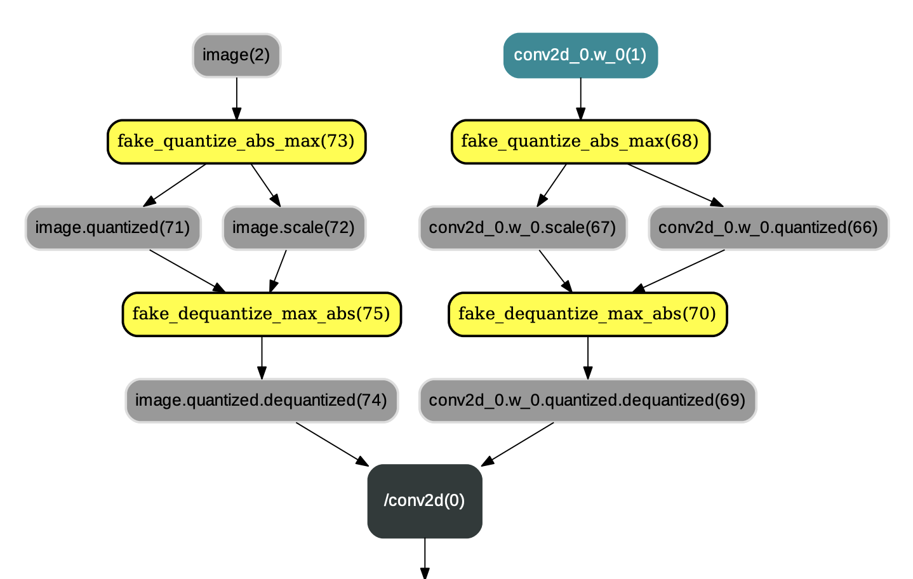

>运行该示例前请安装Paddle1.6或更高版本和PaddleSlim

# 检测模型量化压缩示例

## 概述

该示例使用PaddleSlim提供的[量化压缩API](https://paddlepaddle.github.io/PaddleSlim/api/quantization_api/)对检测模型进行压缩。
在阅读该示例前，建议您先了解以下内容：

- [检测模型的常规训练方法](https://github.com/PaddlePaddle/PaddleDetection)
- [PaddleSlim使用文档](https://paddlepaddle.github.io/PaddleSlim/)


## 安装PaddleSlim
可按照[PaddleSlim使用文档](https://paddlepaddle.github.io/PaddleSlim/)中的步骤安装PaddleSlim。


## 训练

根据 [tools/train.py](../../tools/train.py) 编写压缩脚本train.py。脚本中量化的步骤如下。

### 定义量化配置
config = {
        'weight_quantize_type': 'channel_wise_abs_max',
        'activation_quantize_type': 'moving_average_abs_max',
        'quantize_op_types': ['depthwise_conv2d', 'mul', 'conv2d'],
        'not_quant_pattern': ['yolo_output']
    }

如何配置以及含义请参考[PaddleSlim 量化API](https://paddlepaddle.github.io/PaddleSlim/api/quantization_api/)。

### 插入量化反量化OP
使用[PaddleSlim quant_aware API](https://paddlepaddle.github.io/PaddleSlim/api/quantization_api/#quant_aware)在Program中插入量化和反量化OP。
```
train_prog = quant_aware(train_prog, place, config, for_test=False)
```

### 关闭一些训练策略

因为量化要对Program做修改，所以一些会修改Program的训练策略需要关闭。``sync_batch_norm`` 和量化多卡训练同时使用时会出错，原因暂不知，因此也需要将其关闭。
```
build_strategy.fuse_all_reduce_ops = False
build_strategy.sync_batch_norm = False
```

### 开始训练

您可以通过运行以下命令运行该示例。(该示例是在COCO数据集上训练yolov3-mobilenetv1, 替换模型和数据集的方法和检测库类似，直接替换相应的配置文件即可)

step1: 设置gpu卡
```
export CUDA_VISIBLE_DEVICES=0
```
step2: 开始训练

请在PaddleDetection根目录下运行。

```
python slim/quantization/train.py \
    --eval \
    -c ./configs/yolov3_mobilenet_v1.yml \
    -o max_iters=30000 \
    save_dir=./output/mobilenetv1 \
    LearningRate.base_lr=0.0001 \
    LearningRate.schedulers='[!PiecewiseDecay {gamma: 0.1, milestones: [10000]}]' \
    pretrain_weights=https://paddlemodels.bj.bcebos.com/object_detection/yolov3_mobilenet_v1.tar
```

>通过命令行覆设置max_iters选项，因为量化的训练轮次比正常训练小很多，所以需要修改此选项。
如果要调整训练卡数，可根据需要调整配置文件`yolov3_mobilenet_v1_voc.yml`中的以下参数：

- **max_iters:** 训练的总轮次。
- **LeaningRate.base_lr:** 根据多卡的总`batch_size`调整`base_lr`，两者大小正相关，可以简单的按比例进行调整。
- **LearningRate.schedulers.PiecewiseDecay.milestones：** 请根据batch size的变化对其调整。


通过`python slim/quantization/train.py --help`查看可配置参数。
通过`python .tools/configure.py ${option_name} help`查看如何通过命令行覆盖配置文件中的参数。


### 训练时的模型结构
[PaddleSlim 量化API](https://paddlepaddle.github.io/PaddleSlim/api/quantization_api/)文档中介绍了``paddleslim.quant.quant_aware``和``paddleslim.quant.convert``两个接口。
``paddleslim.quant.quant_aware`` 作用是在网络中的conv2d、depthwise_conv2d、mul等算子的各个输入前插入连续的量化op和反量化op，并改变相应反向算子的某些输入。示例图如下：

<p align="center">
 <br />
<strong>图1：应用 paddleslim.quant.quant_aware 后的结果</strong>
</p>

### 保存断点（checkpoint）
在脚本中使用保存checkpoint的代码为：
```
# insert quantize op in eval_prog
eval_prog = quant_aware(eval_prog, place, config, for_test=True)
checkpoint.save(exe, eval_prog, os.path.join(save_dir, save_name))
```

### 边训练边测试

在脚本中边训练边测试得到的测试精度是基于图1中的网络结构进行的。

## 评估

### 最终评估模型

``paddleslim.quant.convert`` 主要用于改变Program中量化op和反量化op的顺序，即将类似图1中的量化op和反量化op顺序改变为图2中的布局。除此之外，``paddleslim.quant.convert`` 还会将`conv2d`、`depthwise_conv2d`、`mul`等算子参数变为量化后的int8_t范围内的值(但数据类型仍为float32)，示例如图2：

<p align="center">
 <br />
<strong>图2：paddleslim.quant.convert 后的结果</strong>
</p>

所以在调用 ``paddleslim.quant.convert`` 之后，才得到最终的量化模型。此模型可使用PaddleLite进行加载预测，可参见教程[Paddle-Lite如何加载运行量化模型](https://github.com/PaddlePaddle/Paddle-Lite/wiki/model_quantization)。

### 评估脚本
使用脚本[slim/quantization/eval.py](./eval.py)进行评估。

- 定义配置。使用和训练脚本中一样的量化配置，以得到和量化训练时同样的模型。
- 使用 ``paddleslim.quant.quant_aware`` 插入量化和反量化op。
- 使用 ``paddleslim.quant.convert`` 改变op顺序，得到最终量化模型进行评估。

评估命令：

```
python slim/quantization/eval.py -c ./configs/yolov3_mobilenet_v1.yml \
-o weights=./output/mobilenetv1/yolov3_mobilenet_v1/best_model
```

## 导出模型

使用脚本[slim/quantization/export_model.py](./export_model.py)导出模型。

- 定义配置。使用和训练脚本中一样的量化配置，以得到和量化训练时同样的模型。
- 使用 ``paddleslim.quant.quant_aware`` 插入量化和反量化op。
- 使用 ``paddleslim.quant.convert`` 改变op顺序，得到最终量化模型进行评估。

导出模型命令：

```
 python slim/quantization/export_model.py -c ./configs/yolov3_mobilenet_v1.yml --output_dir ${save path} \
-o weights=./output/mobilenetv1/yolov3_mobilenet_v1/best_model
```
## 预测

### python预测

在脚本<a href="./infer.py">slim/quantization/infer.py</a>中展示了如何使用fluid python API加载使用预测模型进行预测。

运行命令示例:
```
python slim/quantization/infer.py \
-c ./configs/yolov3_mobilenet_v1.yml \
--infer_dir ./demo \
-o weights=./output/mobilenetv1/yolov3_mobilenet_v1/best_model
```


### PaddleLite预测
导出模型步骤中导出的FP32模型可使用PaddleLite进行加载预测，可参见教程[Paddle-Lite如何加载运行量化模型](https://github.com/PaddlePaddle/Paddle-Lite/wiki/model_quantization)


## 量化结果


## FAQ
