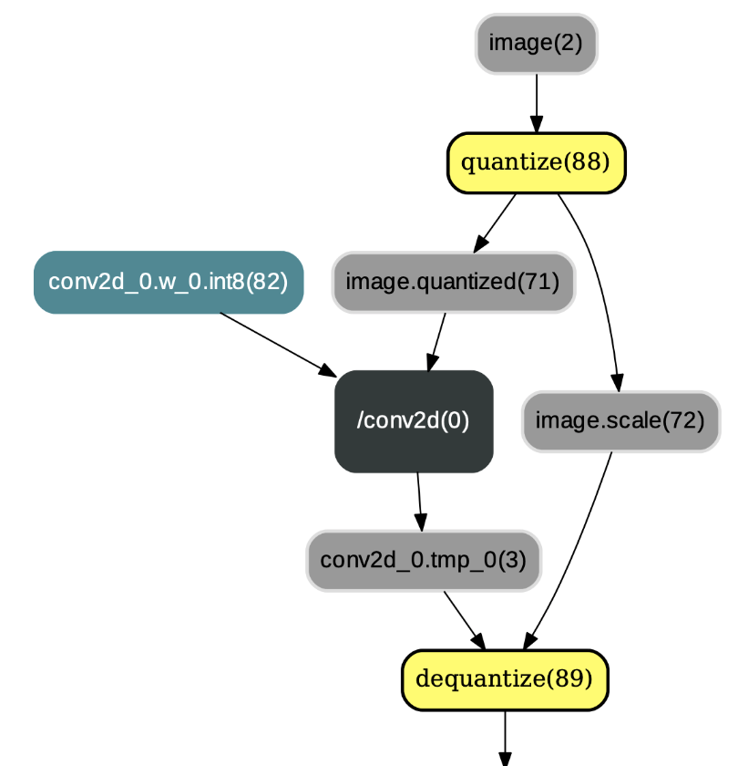

>运行该示例前请安装Paddle1.6或更高版本

# 检测模型量化压缩示例

## 概述

该示例使用PaddleSlim提供的[量化压缩策略](https://github.com/PaddlePaddle/models/blob/develop/PaddleSlim/docs/tutorial.md#1-quantization-aware-training%E9%87%8F%E5%8C%96%E4%BB%8B%E7%BB%8D)对分类模型进行压缩。
在阅读该示例前，建议您先了解以下内容：

- [检测模型的常规训练方法](https://github.com/PaddlePaddle/models/tree/develop/PaddleCV/PaddleDetection)
- [PaddleSlim使用文档](https://github.com/PaddlePaddle/models/blob/develop/PaddleSlim/docs/usage.md)


## 配置文件说明

关于配置文件如何编写您可以参考：

- [PaddleSlim配置文件编写说明](https://github.com/PaddlePaddle/models/blob/develop/PaddleSlim/docs/usage.md#122-%E9%85%8D%E7%BD%AE%E6%96%87%E4%BB%B6%E7%9A%84%E4%BD%BF%E7%94%A8)
- [量化策略配置文件编写说明](https://github.com/PaddlePaddle/models/blob/develop/PaddleSlim/docs/usage.md#21-%E9%87%8F%E5%8C%96%E8%AE%AD%E7%BB%83)

其中save_out_nodes需要得到检测结果的Variable的名称，下面介绍如何确定save_out_nodes的参数
以MobileNet V1为例，可在compress.py中构建好网络之后，直接打印Variable得到Variable的名称信息。
代码示例：
```
    eval_keys, eval_values, eval_cls = parse_fetches(fetches, eval_prog,
                                                         extra_keys)
    # print(eval_values)
```
根据运行结果可看到Variable的名字为：`multiclass_nms_0.tmp_0`。
## 训练

根据 [PaddleCV/PaddleDetection/tools/train.py](https://github.com/PaddlePaddle/models/blob/develop/PaddleCV/PaddleDetection/tools/train.py) 编写压缩脚本compress.py。
在该脚本中定义了Compressor对象，用于执行压缩任务。

通过`python compress.py --help`查看可配置参数，简述如下：

- config: 检测库的配置，其中配置了训练超参数、数据集信息等。
- slim_file: PaddleSlim的配置文件，参见[配置文件说明](#配置文件说明)。

您可以通过运行脚本`run.sh`运行该示例，请确保已正确下载[pretrained model](https://github.com/PaddlePaddle/models/tree/develop/PaddleCV/image_classification#%E5%B7%B2%E5%8F%91%E5%B8%83%E6%A8%A1%E5%9E%8B%E5%8F%8A%E5%85%B6%E6%80%A7%E8%83%BD)。

### 训练时的模型结构
这部分介绍来源于[量化low-level API介绍](https://github.com/PaddlePaddle/models/tree/develop/PaddleSlim/quant_low_level_api#1-%E9%87%8F%E5%8C%96%E8%AE%AD%E7%BB%83low-level-apis%E4%BB%8B%E7%BB%8D)。

PaddlePaddle框架中有四个和量化相关的IrPass, 分别是QuantizationTransformPass、QuantizationFreezePass、ConvertToInt8Pass以及TransformForMobilePass。在训练时，对网络应用了QuantizationTransformPass，作用是在网络中的conv2d、depthwise_conv2d、mul等算子的各个输入前插入连续的量化op和反量化op，并改变相应反向算子的某些输入。示例图如下：

<p align="center">
 <br />
<strong>图1：应用QuantizationTransformPass后的结果</strong>
</p>

### 保存断点（checkpoint）

如果在配置文件中设置了`checkpoint_path`, 则在压缩任务执行过程中会自动保存断点，当任务异常中断时，
重启任务会自动从`checkpoint_path`路径下按数字顺序加载最新的checkpoint文件。如果不想让重启的任务从断点恢复，
需要修改配置文件中的`checkpoint_path`，或者将`checkpoint_path`路径下文件清空。

>注意：配置文件中的信息不会保存在断点中，重启前对配置文件的修改将会生效。


## 评估

如果在配置文件中设置了`checkpoint_path`，则每个epoch会保存一个量化后的用于评估的模型，
该模型会保存在`${checkpoint_path}/${epoch_id}/eval_model/`路径下，包含`__model__`和`__params__`两个文件。
其中，`__model__`用于保存模型结构信息，`__params__`用于保存参数（parameters）信息。模型结构和训练时一样。

如果不需要保存评估模型，可以在定义Compressor对象时，将`save_eval_model`选项设置为False（默认为True）。

脚本<a href="eval.py">slim/quantization/eval.py</a>中为使用该模型在评估数据集上做评估的示例。


## 预测

如果在配置文件的量化策略中设置了`float_model_save_path`, `int8_model_save_path`, `mobile_model_save_path`, 在训练结束后，会保存模型量化压缩之后用于预测的模型。接下来介绍这三种预测模型的区别。

### float预测模型
在介绍量化训练时的模型结构时介绍了PaddlePaddle框架中有四个和量化相关的IrPass, 分别是QuantizationTransformPass、QuantizationFreezePass、ConvertToInt8Pass以及TransformForMobilePass。float预测模型是在应用QuantizationFreezePass并删除eval_program中多余的operators之后，保存的模型。

QuantizationFreezePass主要用于改变IrGraph中量化op和反量化op的顺序，即将类似图1中的量化op和反量化op顺序改变为图2中的布局。除此之外，QuantizationFreezePass还会将`conv2d`、`depthwise_conv2d`、`mul`等算子的权重离线量化为int8_t范围内的值(但数据类型仍为float32)，以减少预测过程中对权重的量化操作，示例如图2：

<p align="center">
 <br />
<strong>图2：应用QuantizationFreezePass后的结果</strong>
</p>

### int8预测模型
在对训练网络进行QuantizationFreezePass之后，执行ConvertToInt8Pass，
其主要目的是将执行完QuantizationFreezePass后输出的权重类型由`FP32`更改为`INT8`。换言之，用户可以选择将量化后的权重保存为float32类型（不执行ConvertToInt8Pass）或者int8_t类型（执行ConvertToInt8Pass），示例如图3：

<p align="center">
 <br />
<strong>图3：应用ConvertToInt8Pass后的结果</strong>
</p>

### mobile预测模型
经TransformForMobilePass转换后，用户可得到兼容[paddle-lite](https://github.com/PaddlePaddle/Paddle-Lite)移动端预测库的量化模型。paddle-mobile中的量化op和反量化op的名称分别为`quantize`和`dequantize`。`quantize`算子和PaddlePaddle框架中的`fake_quantize_abs_max`算子簇的功能类似，`dequantize` 算子和PaddlePaddle框架中的`fake_dequantize_max_abs`算子簇的功能相同。若选择paddle-mobile执行量化训练输出的模型，则需要将`fake_quantize_abs_max`等算子改为`quantize`算子以及将`fake_dequantize_max_abs`等算子改为`dequantize`算子，示例如图4：

<p align="center">
 <br />
<strong>图4：应用TransformForMobilePass后的结果</strong>
</p>

### python预测


### PaddleLite预测
float预测模型可使用PaddleLite进行加载预测，可参见教程[Paddle-Lite如何加载运行量化模型](https://github.com/PaddlePaddle/Paddle-Lite/wiki/model_quantization)

## 从评估模型保存预测模型
从[配置文件说明](#配置文件说明)中可以看到，在 `end_epoch` 时将保存可用于预测的 `float`, `int8`, `mobile`模型，但是在训练之前不能准确地保存结果最好的epoch的结果，因此，提供了从`${checkpoint_path}/${epoch_id}/eval_model/`下保存的评估模型转化为预测模型的接口 `freeze.py `, 需要配置的参数为：

- model_path, 加载的模型路径，`为${checkpoint_path}/${epoch_id}/eval_model/`
- weight_quant_type 模型参数的量化方式，和配置文件中的类型保持一致
- save_path `float`, `int8`, `mobile`模型的保存路径，分别为 `${save_path}/float/`, `${save_path}/int8/`, `${save_path}/mobile/`

## 示例结果

### MobileNetV1

| weight量化方式 | activation量化方式| Box ap |Paddle Fluid inference time(ms)| Paddle Lite inference time(ms)|
|---|---|---|---|---|
|baseline|- |76.2%|- |-|
|abs_max|abs_max|- |- |-|
|abs_max|moving_average_abs_max|- |- |-|
|channel_wise_abs_max|abs_max|- |- |-|

>训练超参：


## FAQ
