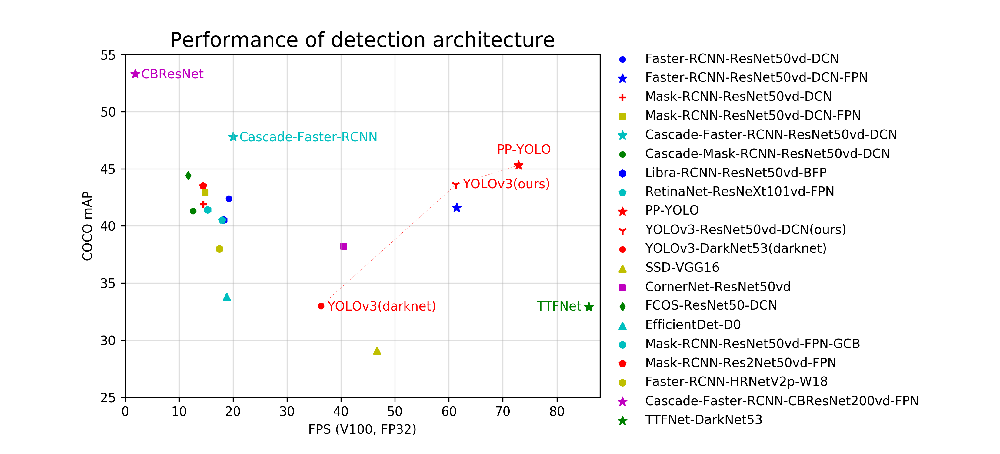

简体中文 | [English](README_en.md)

文档：[https://paddledetection.readthedocs.io](https://paddledetection.readthedocs.io)

# 简介

PaddleDetection飞桨目标检测开发套件，旨在帮助开发者更快更好地完成检测模型的组建、训练、优化及部署等全开发流程。

PaddleDetection模块化地实现了多种主流目标检测算法，提供了丰富的数据增强策略、网络模块组件（如骨干网络）、损失函数等，并集成了模型压缩和跨平台高性能部署能力。

经过长时间产业实践打磨，PaddleDetection已拥有顺畅、卓越的使用体验，被工业质检、遥感图像检测、无人巡检、新零售、互联网、科研等十多个行业的开发者广泛应用。

  

### 产品动态
- 2021.02.07: 发布release/2.0-rc版本，PaddleDetection动态图试用版本，详情参考[PaddleDetection动态图](dygraph)。
- 2020.11.20: 发布release/0.5版本,详情请参考[版本更新文档](docs/CHANGELOG.md)。
- 2020.11.10: 添加实例分割模型[SOLOv2](configs/solov2)，在Tesla V100上达到38.6 FPS, COCO-val数据集上mask ap达到38.8，预测速度提高24%，mAP提高2.4个百分点。
- 2020.10.30: PP-YOLO支持矩形图像输入，并新增PACT模型量化策略。
- 2020.09.30: 发布[移动端检测demo](deploy/android_demo)，可直接扫码安装体验。
- 2020.09.21-27: 【目标检测7日打卡课】手把手教你从入门到进阶，深入了解目标检测算法的前世今生。立即加入课程QQ交流群(1136406895)一起学习吧 :)
- 2020.07.24: 发布**产业最实用**目标检测模型 [PP-YOLO](https://arxiv.org/abs/2007.12099) ，深入考虑产业应用对精度速度的双重面诉求，COCO数据集精度45.2%(最新45.9%)，Tesla V100预测速度72.9 FPS，详细信息见[文档](configs/ppyolo/README_cn.md)。
- 2020.06.11: 发布676类大规模服务器端实用目标检测模型，适用于绝大部分使用场景，可以直接用来预测，也可以用于微调其他任务。

### 特性

- **模型丰富**: 包含**目标检测**、**实例分割**、**人脸检测**等**100+个预训练模型**，涵盖多种**全球竞赛冠军**方案
- **使用简洁**：模块化设计，解耦各个网络组件，开发者轻松搭建、试用各种检测模型及优化策略，快速得到高性能、定制化的算法。
- **端到端打通**: 从数据增强、组网、训练、压缩、部署端到端打通，并完备支持**云端**/**边缘端**多架构、多设备部署。
- **高性能**: 基于飞桨的高性能内核，模型训练速度及显存占用优势明显。支持FP16训练, 支持多机训练。

#### 套件结构概览

<table>
  <tbody>
    <tr align="center" valign="bottom">
      <td>
        <b>Architectures</b>
      </td>
      <td>
        <b>Backbones</b>
      </td>
      <td>
        <b>Components</b>
      </td>
      <td>
        <b>Data Augmentation</b>
      </td>
    </tr>
    <tr valign="top">
      <td>
        <ul><li><b>Two-Stage Detection</b></li>
          <ul>
            <li>Faster RCNN</li>
            <li>FPN</li>
            <li>Cascade-RCNN</li>
            <li>Libra RCNN</li>
            <li>Hybrid Task RCNN</li>
            <li>PSS-Det RCNN</li>
          </ul>
        </ul>
        <ul><li><b>One-Stage Detection</b></li>
          <ul>
            <li>RetinaNet</li>
            <li>YOLOv3</li>
            <li>YOLOv4</li>  
            <li>PP-YOLO</li>
            <li>SSD</li>
          </ul>
        </ul>
        <ul><li><b>Anchor Free</b></li>
          <ul>
            <li>CornerNet-Squeeze</li>
            <li>FCOS</li>  
            <li>TTFNet</li>
          </ul>
        </ul>
        <ul>
          <li><b>Instance Segmentation</b></li>
            <ul>
             <li>Mask RCNN</li>
             <li>SOLOv2</li>
            </ul>
        </ul>
        <ul>
          <li><b>Face-Detction</b></li>
            <ul>
             <li>FaceBoxes</li>
             <li>BlazeFace</li>
             <li>BlazeFace-NAS</li>
            </ul>
        </ul>
      </td>
      <td>
        <ul>
          <li>ResNet(&vd)</li>
          <li>ResNeXt(&vd)</li>
          <li>SENet</li>
          <li>Res2Net</li>
          <li>HRNet</li>
          <li>Hourglass</li>
          <li>CBNet</li>
          <li>GCNet</li>
          <li>DarkNet</li>
          <li>CSPDarkNet</li>
          <li>VGG</li>
          <li>MobileNetv1/v3</li>  
          <li>GhostNet</li>
          <li>Efficientnet</li>  
        </ul>
      </td>
      <td>
        <ul><li><b>Common</b></li>
          <ul>
            <li>Sync-BN</li>
            <li>Group Norm</li>
            <li>DCNv2</li>
            <li>Non-local</li>
          </ul>  
        </ul>
        <ul><li><b>FPN</b></li>
          <ul>
            <li>BiFPN</li>
            <li>BFP</li>  
            <li>HRFPN</li>
            <li>ACFPN</li>
          </ul>  
        </ul>  
        <ul><li><b>Loss</b></li>
          <ul>
            <li>Smooth-L1</li>
            <li>GIoU/DIoU/CIoU</li>  
            <li>IoUAware</li>
          </ul>  
        </ul>  
        <ul><li><b>Post-processing</b></li>
          <ul>
            <li>SoftNMS</li>
            <li>MatrixNMS</li>  
          </ul>  
        </ul>
        <ul><li><b>Speed</b></li>
          <ul>
            <li>FP16 training</li>
            <li>Multi-machine training </li>  
          </ul>  
        </ul>  
      </td>
      <td>
        <ul>
          <li>Resize</li>  
          <li>Flipping</li>  
          <li>Expand</li>
          <li>Crop</li>
          <li>Color Distort</li>  
          <li>Random Erasing</li>  
          <li>Mixup </li>
          <li>Cutmix </li>
          <li>Grid Mask</li>
          <li>Auto Augment</li>  
        </ul>  
      </td>  
    </tr>

</td>
    </tr>
  </tbody>
</table>

#### 模型性能概览

各模型结构和骨干网络的代表模型在COCO数据集上精度mAP和单卡Tesla V100上预测速度(FPS)对比图。

  

**说明：**
- `CBResNet`为`Cascade-Faster-RCNN-CBResNet200vd-FPN`模型，COCO数据集mAP高达53.3%
- `Cascade-Faster-RCNN`为`Cascade-Faster-RCNN-ResNet50vd-DCN`，PaddleDetection将其优化到COCO数据mAP为47.8%时推理速度为20FPS
- PaddleDetection增强版`YOLOv3-ResNet50vd-DCN`在COCO数据集mAP高于原作10.6个绝对百分点，推理速度为61.3FPS，快于原作约70%
- 图中模型均可在[模型库](#模型库)中获取

## 文档教程

### 入门教程

- [安装说明](docs/tutorials/INSTALL_cn.md)
- [快速开始](docs/tutorials/QUICK_STARTED_cn.md)
- [如何准备数据](docs/tutorials/PrepareDataSet.md)
- [训练/评估/预测/部署流程](docs/tutorials/DetectionPipeline.md)
- [如何自定义数据集](docs/tutorials/Custom_DataSet.md)
- [常见问题汇总](docs/FAQ.md)

### 进阶教程
- 参数配置
  - [配置模块设计和介绍](docs/advanced_tutorials/config_doc/CONFIG_cn.md)
  - [RCNN参数说明](docs/advanced_tutorials/config_doc/RCNN_PARAMS_DOC.md)
  - [YOLOv3参数说明](docs/advanced_tutorials/config_doc/yolov3_mobilenet_v1.md)
- 迁移学习
    - [如何加载预训练](docs/advanced_tutorials/TRANSFER_LEARNING_cn.md)
- 模型压缩(基于[PaddleSlim](https://github.com/PaddlePaddle/PaddleSlim))
    - [压缩benchmark](slim)
    - [量化](slim/quantization), [剪枝](slim/prune), [蒸馏](slim/distillation), [搜索](slim/nas)
- 推理部署
    - [模型导出教程](docs/advanced_tutorials/deploy/EXPORT_MODEL.md)
    - [服务器端Python部署](deploy/python)
    - [服务器端C++部署](deploy/cpp)
    - [移动端部署](https://github.com/PaddlePaddle/Paddle-Lite-Demo)
    - [在线Serving部署](deploy/serving)
    - [推理Benchmark](docs/advanced_tutorials/deploy/BENCHMARK_INFER_cn.md)
- 进阶开发
    - [新增数据预处理](docs/advanced_tutorials/READER.md)
    - [新增检测算法](docs/advanced_tutorials/MODEL_TECHNICAL.md)

## 模型库

- 通用目标检测:
    - [模型库和基线](docs/MODEL_ZOO_cn.md)
    - [移动端模型](configs/mobile/README.md)
    - [Anchor Free](configs/anchor_free/README.md)
    - [PP-YOLO模型](configs/ppyolo/README_cn.md)
    - [676类目标检测](docs/featured_model/LARGE_SCALE_DET_MODEL.md)
    - [两阶段实用模型PSS-Det](configs/rcnn_enhance/README.md)
- 通用实例分割：
    - [SOLOv2](configs/solov2/README.md)
- 垂类领域
    - [人脸检测](docs/featured_model/FACE_DETECTION.md)
    - [行人检测](docs/featured_model/CONTRIB_cn.md)
    - [车辆检测](docs/featured_model/CONTRIB_cn.md)
- 比赛方案
    - [Objects365 2019 Challenge夺冠模型](docs/featured_model/champion_model/CACascadeRCNN.md)
    - [Open Images 2019-Object Detction比赛最佳单模型](docs/featured_model/champion_model/OIDV5_BASELINE_MODEL.md)

## 应用案例

- [人像圣诞特效自动生成工具](application/christmas)

## 第三方教程推荐

- [PaddleDetection在Windows下的部署(一)](https://zhuanlan.zhihu.com/p/268657833)
- [PaddleDetection在Windows下的部署(二)](https://zhuanlan.zhihu.com/p/280206376)
- [Jetson Nano上部署PaddleDetection经验分享](https://zhuanlan.zhihu.com/p/319371293)
- [安全帽检测YOLOv3模型在树莓派上的部署](https://github.com/PaddleCV-FAQ/PaddleDetection-FAQ/blob/main/Lite%E9%83%A8%E7%BD%B2/yolov3_for_raspi.md)
- [使用SSD-MobileNetv1完成一个项目--准备数据集到完成树莓派部署](https://github.com/PaddleCV-FAQ/PaddleDetection-FAQ/blob/main/Lite%E9%83%A8%E7%BD%B2/ssd_mobilenet_v1_for_raspi.md)

## 版本更新
v2.0-rc版本已经在`02/2021`发布，新增动态图版本，支持RCNN, YOLOv3, PP-YOLO, SSD/SSDLite, FCOS, TTFNet, SOLOv2等系列模型，支持模型剪裁和量化，支持预测部署及TensorRT推理加速，详细内容请参考[版本更新文档](docs/CHANGELOG.md)。

## 许可证书
本项目的发布受[Apache 2.0 license](LICENSE)许可认证。

## 贡献代码

我们非常欢迎你可以为PaddleDetection提供代码，也十分感谢你的反馈。
