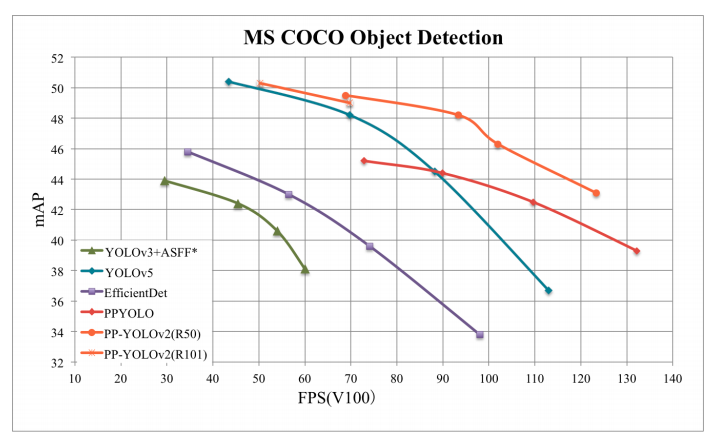

English | [简体中文](README_cn.md)

# PP-YOLO

## Table of Contents
- [Introduction](#Introduction)
- [Model Zoo](#Model_Zoo)
- [Getting Start](#Getting_Start)
- [Future Work](#Future_Work)
- [Appendix](#Appendix)

## Introduction

[PP-YOLO](https://arxiv.org/abs/2007.12099) is a optimized model based on YOLOv3 in PaddleDetection，whose performance(mAP on COCO) and inference spped are better than [YOLOv4](https://arxiv.org/abs/2004.10934)，PaddlePaddle 1.8.4(available on pip now) or [Daily Version](https://www.paddlepaddle.org.cn/documentation/docs/zh/install/Tables.html#whl-dev) is required to run this PP-YOLO。

PP-YOLO reached mmAP(IoU=0.5:0.95) as 45.9% on COCO test-dev2017 dataset, and inference speed of FP32 on single V100 is 72.9 FPS, inference speed of FP16 with TensorRT on single V100 is 155.6 FPS.

<div align="center">
  
</div>

PP-YOLO improved performance and speed of YOLOv3 with following methods:

- Better backbone: ResNet50vd-DCN
- Larger training batch size: 8 GPUs and mini-batch size as 24 on each GPU
- [Drop Block](https://arxiv.org/abs/1810.12890)
- [Exponential Moving Average](https://www.investopedia.com/terms/e/ema.asp)
- [IoU Loss](https://arxiv.org/pdf/1902.09630.pdf)
- [Grid Sensitive](https://arxiv.org/abs/2004.10934)
- [Matrix NMS](https://arxiv.org/pdf/2003.10152.pdf)
- [CoordConv](https://arxiv.org/abs/1807.03247)
- [Spatial Pyramid Pooling](https://arxiv.org/abs/1406.4729)
- Better ImageNet pretrain weights

## Model Zoo

### PP-YOLO

|          Model           | GPU number | images/GPU |  backbone  | input shape | Box AP<sup>val</sup> | Box AP<sup>test</sup> | V100 FP32(FPS) | V100 TensorRT FP16(FPS) | download | config  |
|:------------------------:|:----------:|:----------:|:----------:| :----------:| :------------------: | :-------------------: | :------------: | :---------------------: | :------: | :-----: |
| YOLOv4(AlexyAB)          |     -      |      -     | CSPDarknet |     608     |           -          |         43.5          |       62       |          105.5          | [model](https://paddlemodels.bj.bcebos.com/object_detection/yolov4_cspdarknet.pdparams) | [config](https://github.com/PaddlePaddle/PaddleDetection/tree/master/configs/yolov4/yolov4_csdarknet.yml)                   |
| YOLOv4(AlexyAB)          |     -      |      -     | CSPDarknet |     512     |           -          |         43.0          |       83       |          138.4          | [model](https://paddlemodels.bj.bcebos.com/object_detection/yolov4_cspdarknet.pdparams) | [config](https://github.com/PaddlePaddle/PaddleDetection/tree/master/configs/yolov4/yolov4_csdarknet.yml)                   |
| YOLOv4(AlexyAB)          |     -      |      -     | CSPDarknet |     416     |           -          |         41.2          |       96       |          164.0          | [model](https://paddlemodels.bj.bcebos.com/object_detection/yolov4_cspdarknet.pdparams) | [config](https://github.com/PaddlePaddle/PaddleDetection/tree/master/configs/yolov4/yolov4_csdarknet.yml)                   |
| YOLOv4(AlexyAB)          |     -      |      -     | CSPDarknet |     320     |           -          |         38.0          |      123       |          199.0          | [model](https://paddlemodels.bj.bcebos.com/object_detection/yolov4_cspdarknet.pdparams) | [config](https://github.com/PaddlePaddle/PaddleDetection/tree/master/configs/yolov4/yolov4_csdarknet.yml)                   |
| PP-YOLO                  |     8      |     24     | ResNet50vd |     608     |         44.8         |         45.2          |      72.9      |          155.6          | [model](https://paddlemodels.bj.bcebos.com/object_detection/ppyolo.pdparams) | [config](https://github.com/PaddlePaddle/PaddleDetection/tree/master/configs/ppyolo/ppyolo.yml)                   |
| PP-YOLO                  |     8      |     24     | ResNet50vd |     512     |         43.9         |         44.4          |      89.9      |          188.4          | [model](https://paddlemodels.bj.bcebos.com/object_detection/ppyolo.pdparams) | [config](https://github.com/PaddlePaddle/PaddleDetection/tree/master/configs/ppyolo/ppyolo.yml)                   |
| PP-YOLO                  |     8      |     24     | ResNet50vd |     416     |         42.1         |         42.5          |     109.1      |          215.4          | [model](https://paddlemodels.bj.bcebos.com/object_detection/ppyolo.pdparams) | [config](https://github.com/PaddlePaddle/PaddleDetection/tree/master/configs/ppyolo/ppyolo.yml)                   |
| PP-YOLO                  |     8      |     24     | ResNet50vd |     320     |         38.9         |         39.3          |     132.2      |          242.2          | [model](https://paddlemodels.bj.bcebos.com/object_detection/ppyolo.pdparams) | [config](https://github.com/PaddlePaddle/PaddleDetection/tree/master/configs/ppyolo/ppyolo.yml)                   |
| PP-YOLO_2x               |     8      |     24     | ResNet50vd |     608     |         45.3         |         45.9          |      72.9      |          155.6          | [model](https://paddlemodels.bj.bcebos.com/object_detection/ppyolo_2x.pdparams) | [config](https://github.com/PaddlePaddle/PaddleDetection/tree/master/configs/ppyolo/ppyolo_2x.yml)                   |
| PP-YOLO_2x               |     8      |     24     | ResNet50vd |     512     |         44.4         |         45.0          |      89.9      |          188.4          | [model](https://paddlemodels.bj.bcebos.com/object_detection/ppyolo_2x.pdparams) | [config](https://github.com/PaddlePaddle/PaddleDetection/tree/master/configs/ppyolo/ppyolo_2x.yml)                   |
| PP-YOLO_2x               |     8      |     24     | ResNet50vd |     416     |         42.7         |         43.2          |     109.1      |          215.4          | [model](https://paddlemodels.bj.bcebos.com/object_detection/ppyolo_2x.pdparams) | [config](https://github.com/PaddlePaddle/PaddleDetection/tree/master/configs/ppyolo/ppyolo_2x.yml)                   |
| PP-YOLO_2x               |     8      |     24     | ResNet50vd |     320     |         39.5         |         40.1          |     132.2      |          242.2          | [model](https://paddlemodels.bj.bcebos.com/object_detection/ppyolo_2x.pdparams) | [config](https://github.com/PaddlePaddle/PaddleDetection/tree/master/configs/ppyolo/ppyolo_2x.yml)                   |
| PP-YOLO_ResNet18vd       |     4      |     32     | ResNet18vd |     512     |         29.3         |         29.5          |     357.1      |          657.9          | [model](https://paddlemodels.bj.bcebos.com/object_detection/ppyolo_r18vd.pdparams) | [config](https://github.com/PaddlePaddle/PaddleDetection/tree/master/configs/ppyolo/ppyolo_r18vd.yml)                  |
| PP-YOLO_ResNet18vd       |     4      |     32     | ResNet18vd |     416     |         28.6         |         28.9          |     409.8      |          719.4          | [model](https://paddlemodels.bj.bcebos.com/object_detection/ppyolo_r18vd.pdparams) | [config](https://github.com/PaddlePaddle/PaddleDetection/tree/master/configs/ppyolo/ppyolo_r18vd.yml)                  |
| PP-YOLO_ResNet18vd       |     4      |     32     | ResNet18vd |     320     |         26.2         |         26.4          |     480.7      |          763.4          | [model](https://paddlemodels.bj.bcebos.com/object_detection/ppyolo_r18vd.pdparams) | [config](https://github.com/PaddlePaddle/PaddleDetection/tree/master/configs/ppyolo/ppyolo_r18vd.yml)                   |

**Notes:**

- PP-YOLO is trained on COCO train2017 dataset and evaluated on val2017 & test-dev2017 dataset，Box AP<sup>test</sup> is evaluation results of `mAP(IoU=0.5:0.95)`.
- PP-YOLO used 8 GPUs for training and mini-batch size as 24 on each GPU, if GPU number and mini-batch size is changed, learning rate and iteration times should be adjusted according [FAQ](../../docs/FAQ.md).
- PP-YOLO inference speed is tesed on single Tesla V100 with batch size as 1, CUDA 10.2, CUDNN 7.5.1, TensorRT 5.1.2.2 in TensorRT mode.
- PP-YOLO FP32 inference speed testing uses inference model exported by `tools/export_model.py` and benchmarked by running `depoly/python/infer.py` with `--run_benchmark`. All testing results do not contains the time cost of data reading and post-processing(NMS), which is same as [YOLOv4(AlexyAB)](https://github.com/AlexeyAB/darknet) in testing method.
- TensorRT FP16 inference speed testing exclude the time cost of bounding-box decoding(`yolo_box`) part comparing with FP32 testing above, which means that data reading, bounding-box decoding and post-processing(NMS) is excluded(test method same as [YOLOv4(AlexyAB)](https://github.com/AlexeyAB/darknet) too)
- YOLOv4(AlexyAB) performance and inference speed is copy from single Tesla V100 testing results in [YOLOv4 github repo](https://github.com/AlexeyAB/darknet), Tesla V100 TensorRT FP16 inference speed is testing with tkDNN configuration and TensorRT 5.1.2.2 on single Tesla V100 based on [AlexyAB/darknet repo](https://github.com/AlexeyAB/darknet).
- Download and configuration of YOLOv4(AlexyAB) is reproduced model of YOLOv4 in PaddleDetection, whose evaluation performance is same as YOLOv4(AlexyAB), and finetune training is supported in PaddleDetection currently, reproducing by training from backbone pretrain weights is on working, see [PaddleDetection YOLOv4](../yolov4/README.md) for details.
- PP-YOLO trained with `batch_size=24` in each GPU with memory as 32G, configuation yaml with `batch_size=12` which can be trained on GPU with memory as 16G is provided as `ppyolo_2x_bs12.yml`, training with `batch_size=12` reached `mAP(IoU=0.5:0.95) = 45.1%` on COCO val2017 dataset, download weights by [ppyolo_2x_bs12 model](https://paddlemodels.bj.bcebos.com/object_detection/ppyolo_2x_bs12.pdparams)

### PP-YOLO for mobile

|            Model             | GPU number | images/GPU | Model Size | input shape | Box AP<sup>val</sup> |  Box AP50<sup>val</sup> | Kirin 990 1xCore(FPS) | download | inference model download | config  |
|:----------------------------:|:----------:|:----------:| :--------: | :----------:| :------------------: |  :--------------------: | :-------------------: | :------: | :----------------------: | :-----: |
| PP-YOLO_MobileNetV3_large    |     4      |      32    |    18MB    |     320     |         23.2         |           42.6          |          15.6         | [model](https://paddlemodels.bj.bcebos.com/object_detection/ppyolo_mobilenet_v3_large.pdparams) | [model](https://paddlemodels.bj.bcebos.com/object_detection/ppyolo_mobilenet_v3_large.tar) | [config](https://github.com/PaddlePaddle/PaddleDetection/tree/master/configs/ppyolo/ppyolo_mobilenet_v3_large.yml)                   |
| PP-YOLO_MobileNetV3_small    |     4      |      32    |    11MB    |     320     |         17.2         |           33.8          |          28.6         | [model](https://paddlemodels.bj.bcebos.com/object_detection/ppyolo_mobilenet_v3_small.pdparams) | [model](https://paddlemodels.bj.bcebos.com/object_detection/ppyolo_mobilenet_v3_small.tar) | [config](https://github.com/PaddlePaddle/PaddleDetection/tree/master/configs/ppyolo/ppyolo_mobilenet_v3_small.yml)                   |

**Notes:**

- PP-YOLO_MobileNetV3 is trained on COCO train2017 datast and evaluated on val2017 dataset，Box AP<sup>val</sup> is evaluation results of `mAP(IoU=0.5:0.95)`, Box AP<sup>val</sup> is evaluation results of `mAP(IoU=0.5)`.
- PP-YOLO_MobileNetV3 used 4 GPUs for training and mini-batch size as 32 on each GPU, if GPU number and mini-batch size is changed, learning rate and iteration times should be adjusted according [FAQ](../../docs/FAQ.md).
- PP-YOLO_MobileNetV3 inference speed is tested on Kirin 990 with 1 thread.

### Slim PP-YOLO

|            Model             | GPU number | images/GPU | Prune Ratio |        Teacher Model      | Model Size | input shape | Box AP<sup>val</sup> | Kirin 990 1xCore(FPS) | download | inference model download | config  |
|:----------------------------:|:----------:|:----------:| :---------: | :-----------------------: | :--------: | :----------:| :------------------: | :-------------------: | :------: | :----------------------: | :-----: |
| PP-YOLO_MobileNetV3_small    |     4      |      32    |     75%     | PP-YOLO_MobileNetV3_large |   4.2MB    |     320     |         16.2         |      39.8      | [model](https://paddlemodels.bj.bcebos.com/object_detection/ppyolo_mobilenet_v3_small_prune75_distillby_mobilenet_v3_large.pdparams) | [model](https://paddlemodels.bj.bcebos.com/object_detection/ppyolo_mobilenet_v3_small_prune75_distillby_mobilenet_v3_large.tar) | [config](https://github.com/PaddlePaddle/PaddleDetection/tree/master/configs/ppyolo/ppyolo_mobilenet_v3_small.yml)                   |

- Slim PP-YOLO is trained by slim traing method from [Distill pruned model](../../slim/extentions/distill_pruned_model/README.md)，distill training pruned PP-YOLO_MobileNetV3_small model with PP-YOLO_MobileNetV3_large model as the teacher model
- Pruning detectiom head of PP-YOLO model with ratio as 75%, while the arguments are `--pruned_params="yolo_block.0.2.conv.weights,yolo_block.0.tip.conv.weights,yolo_block.1.2.conv.weights,yolo_block.1.tip.conv.weights" --pruned_ratios="0.75,0.75,0.75,0.75"`
- For Slim PP-YOLO training, evaluation, inference and model exporting, please see [Distill pruned model](../../slim/extentions/distill_pruned_model/README.md)

### PP-YOLO on Pascal VOC

PP-YOLO trained on Pascal VOC dataset as follows:

|       Model        | GPU number | images/GPU |  backbone  | input shape | Box AP50<sup>val</sup> | download | config  |
|:------------------:|:----------:|:----------:|:----------:| :----------:| :--------------------: | :------: | :-----: |
| PP-YOLO            |     8      |      12    | ResNet50vd |     608     |          84.9          | [model](https://paddlemodels.bj.bcebos.com/object_detection/ppyolo_voc.pdparams) | [config](https://github.com/PaddlePaddle/PaddleDetection/tree/master/configs/ppyolo/ppyolo_voc.yml)                   |
| PP-YOLO            |     8      |      12    | ResNet50vd |     416     |          84.3          | [model](https://paddlemodels.bj.bcebos.com/object_detection/ppyolo_voc.pdparams) | [config](https://github.com/PaddlePaddle/PaddleDetection/tree/master/configs/ppyolo/ppyolo_voc.yml)                   |
| PP-YOLO            |     8      |      12    | ResNet50vd |     320     |          82.2          | [model](https://paddlemodels.bj.bcebos.com/object_detection/ppyolo_voc.pdparams) | [config](https://github.com/PaddlePaddle/PaddleDetection/tree/master/configs/ppyolo/ppyolo_voc.yml)                   |

## Getting Start

### 1. Training

Training PP-YOLO on 8 GPUs with following command(all commands should be run under PaddleDetection root directory as default), use `--eval` to enable alternate evaluation during training.

```bash
CUDA_VISIBLE_DEVICES=0,1,2,3,4,5,6,7 python tools/train.py -c configs/ppyolo/ppyolo.yml --eval
```

optional: Run `tools/anchor_cluster.py` to get anchors suitable for your dataset, and modify the anchor setting in `configs/ppyolo/ppyolo.yml`.

``` bash
python tools/anchor_cluster.py -c configs/ppyolo/ppyolo.yml -n 9 -s 608 -m v2 -i 1000
```

### 2. Evaluation

Evaluating PP-YOLO on COCO val2017 dataset in single GPU with following commands:

```bash
# use weights released in PaddleDetection model zoo
CUDA_VISIBLE_DEVICES=0 python tools/eval.py -c configs/ppyolo/ppyolo.yml -o weights=https://paddlemodels.bj.bcebos.com/object_detection/ppyolo.pdparams

# use saved checkpoint in training
CUDA_VISIBLE_DEVICES=0 python tools/eval.py -c configs/ppyolo/ppyolo.yml -o weights=output/ppyolo/best_model
```

For evaluation on COCO test-dev2017 dataset, `configs/ppyolo/ppyolo_test.yml` should be used, please download COCO test-dev2017 dataset from [COCO dataset download](https://cocodataset.org/#download) and decompress to pathes configured by `EvalReader.dataset` in `configs/ppyolo/ppyolo_test.yml` and run evaluation by following command:

```bash
# use weights released in PaddleDetection model zoo
CUDA_VISIBLE_DEVICES=0 python tools/eval.py -c configs/ppyolo/ppyolo_test.yml -o weights=https://paddlemodels.bj.bcebos.com/object_detection/ppyolo.pdparams

# use saved checkpoint in training
CUDA_VISIBLE_DEVICES=0 python tools/eval.py -c configs/ppyolo/ppyolo_test.yml -o weights=output/ppyolo/best_model
```

Evaluation results will be saved in `bbox.json`, compress it into a `zip` package and upload to [COCO dataset evaluation](https://competitions.codalab.org/competitions/20794#participate) to evaluate.

**NOTE:** `configs/ppyolo/ppyolo_test.yml` is only used for evaluation on COCO test-dev2017 dataset, could not be used for training or COCO val2017 dataset evaluating.

### 3. Inference

Inference images in single GPU with following commands, use `--infer_img` to inference a single image and `--infer_dir` to inference all images in the directory.

```bash
# inference single image
CUDA_VISIBLE_DEVICES=0 python tools/infer.py -c configs/ppyolo/ppyolo.yml -o weights=https://paddlemodels.bj.bcebos.com/object_detection/ppyolo.pdparams --infer_img=demo/000000014439_640x640.jpg

# inference all images in the directory
CUDA_VISIBLE_DEVICES=0 python tools/infer.py -c configs/ppyolo/ppyolo.yml -o weights=https://paddlemodels.bj.bcebos.com/object_detection/ppyolo.pdparams --infer_dir=demo
```

### 4. Inferece deployment and benchmark

For inference deployment or benchmard, model exported with `tools/export_model.py` should be used and perform inference with Paddle inference library with following commands:

```bash
# export model, model will be save in output/ppyolo as default
python tools/export_model.py -c configs/ppyolo/ppyolo.yml -o weights=https://paddlemodels.bj.bcebos.com/object_detection/ppyolo.pdparams

# inference with Paddle Inference library
CUDA_VISIBLE_DEVICES=0 python deploy/python/infer.py --model_dir=output/ppyolo --image_file=demo/000000014439_640x640.jpg --use_gpu=True
```

Benchmark testing for PP-YOLO uses model without data reading and post-processing(NMS), export model with `--exclude_nms` to prunce NMS for benchmark testing from mode with following commands:

```bash
# export model, --exclude_nms to prune NMS part, model will be save in output/ppyolo as default
python tools/export_model.py -c configs/ppyolo/ppyolo.yml -o weights=https://paddlemodels.bj.bcebos.com/object_detection/ppyolo.pdparams --exclude_nms

# FP32 benchmark
CUDA_VISIBLE_DEVICES=0 python deploy/python/infer.py --model_dir=output/ppyolo --image_file=demo/000000014439_640x640.jpg --use_gpu=True --run_benchmark=True

# TensorRT FP16 benchmark
CUDA_VISIBLE_DEVICES=0 python deploy/python/infer.py --model_dir=output/ppyolo --image_file=demo/000000014439_640x640.jpg --use_gpu=True --run_benchmark=True --run_mode=trt_fp16
```

## Future work

1. more PP-YOLO tiny model
2. PP-YOLO model with more backbones

## Appendix

Optimizing method and ablation experiments of PP-YOLO compared with YOLOv3.

| NO.  |        Model                 | Box AP<sup>val</sup> | Box AP<sup>test</sup> | Params(M) | FLOPs(G) | V100 FP32 FPS |
| :--: | :--------------------------- | :------------------: |:--------------------: | :-------: | :------: | :-----------: |
|  A   | YOLOv3-DarkNet53             |         38.9         |           -           |   59.13   |  65.52   |      58.2     |
|  B   | YOLOv3-ResNet50vd-DCN        |         39.1         |           -           |   43.89   |  44.71   |      79.2     |
|  C   | B + LB + EMA + DropBlock     |         41.4         |           -           |   43.89   |  44.71   |      79.2     |
|  D   | C + IoU Loss                 |         41.9         |           -           |   43.89   |  44.71   |      79.2     |
|  E   | D + IoU Aware                |         42.5         |           -           |   43.90   |  44.71   |      74.9     |
|  F   | E + Grid Sensitive           |         42.8         |           -           |   43.90   |  44.71   |      74.8     |
|  G   | F + Matrix NMS               |         43.5         |           -           |   43.90   |  44.71   |      74.8     |
|  H   | G + CoordConv                |         44.0         |           -           |   43.93   |  44.76   |      74.1     |
|  I   | H + SPP                      |         44.3         |         45.2          |   44.93   |  45.12   |      72.9     |
|  J   | I + Better ImageNet Pretrain |         44.8         |         45.2          |   44.93   |  45.12   |      72.9     |
|  K   | J + 2x Scheduler             |         45.3         |         45.9          |   44.93   |  45.12   |      72.9     |

**Notes:**

- Performance and inference spedd are measure with input shape as 608
- All models are trained on COCO train2017 datast and evaluated on val2017 & test-dev2017 dataset，`Box AP` is evaluation results as `mAP(IoU=0.5:0.95)`.
- Inference speed is tested on single Tesla V100 with batch size as 1 following test method and environment configuration in benchmark above.
- [YOLOv3-DarkNet53](../yolov3_darknet.yml) with mAP as 38.9 is optimized YOLOv3 model in PaddleDetection，see [Model Zoo](../../docs/MODEL_ZOO.md) for details.
