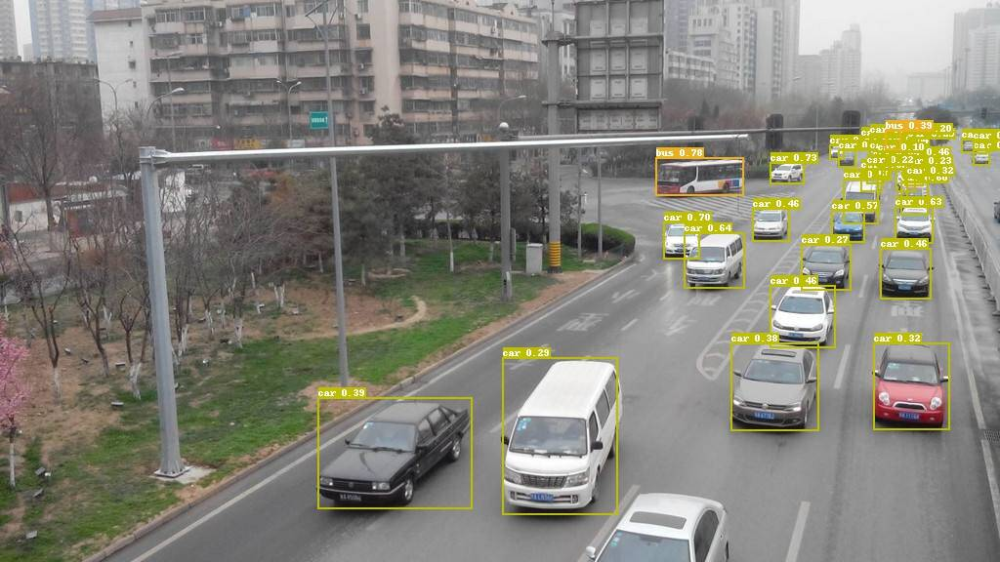
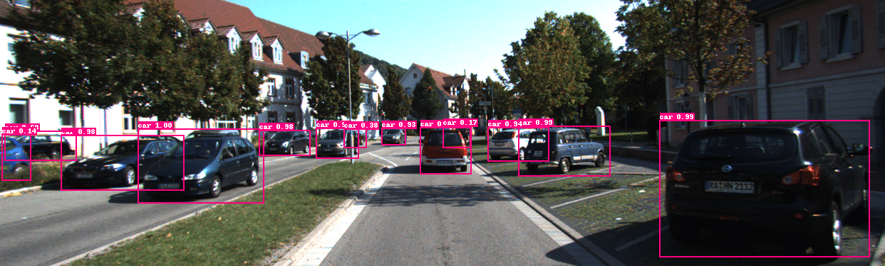
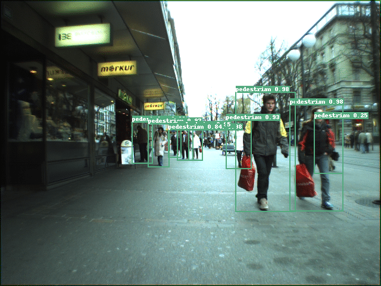
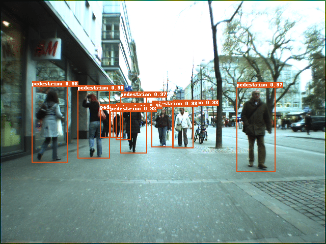

English | [简体中文](CONTRIB_cn.md)
# PaddleDetection applied for specific scenarios

We provide some models implemented by PaddlePaddle to detect objects in specific scenarios, users can download the models and use them in these scenarios.

| Task                 | Algorithm | Box AP | Download                                                                                | Configs |
|:---------------------|:---------:|:------:| :-------------------------------------------------------------------------------------: |:------:|
| Vehicle Detection    |  YOLOv3  |  54.5  | [model](https://paddlemodels.bj.bcebos.com/object_detection/vehicle_yolov3_darknet.tar) | [config](https://github.com/PaddlePaddle/PaddleDetection/tree/develop/static/contrib/VehicleDetection/vehicle_yolov3_darknet.yml) |
| Pedestrian Detection |  YOLOv3  |  51.8  | [model](https://paddlemodels.bj.bcebos.com/object_detection/pedestrian_yolov3_darknet.tar) | [config](https://github.com/PaddlePaddle/PaddleDetection/tree/develop/static/contrib/PedestrianDetection/pedestrian_yolov3_darknet.yml) |

## Vehicle Detection

One of major applications of vehichle detection is traffic monitoring. In this scenary, vehicles to be detected are mostly captured by the cameras mounted on top of traffic light columns.

### 1. Network

The network for detecting vehicles is YOLOv3, the backbone of which is Dacknet53.

### 2. Configuration for training

PaddleDetection provides users with a configuration file [yolov3_darknet.yml](https://github.com/PaddlePaddle/PaddleDetection/blob/develop/static/configs/yolov3_darknet.yml) to train YOLOv3 on the COCO dataset, compared with this file, we modify some parameters as followed to conduct the training for vehicle detection:

* max_iters: 120000
* num_classes: 6
* anchors: [[8, 9], [10, 23], [19, 15], [23, 33], [40, 25], [54, 50], [101, 80], [139, 145], [253, 224]]
* label_smooth: false
* nms/nms_top_k: 400
* nms/score_threshold: 0.005
* milestones: [60000, 80000]
* dataset_dir: dataset/vehicle

### 3. Accuracy

The accuracy of the model trained and evaluated on our private data is shown as followed:

AP at IoU=.50:.05:.95 is 0.545.

AP at IoU=.50 is 0.764.

### 4. Inference

Users can employ the model to conduct the inference:

```
export CUDA_VISIBLE_DEVICES=0
python -u tools/infer.py -c contrib/VehicleDetection/vehicle_yolov3_darknet.yml \
                         -o weights=https://paddlemodels.bj.bcebos.com/object_detection/vehicle_yolov3_darknet.tar \
                         --infer_dir contrib/VehicleDetection/demo \
                         --draw_threshold 0.2 \
                         --output_dir contrib/VehicleDetection/demo/output

```

Some inference results are visualized below:





## Pedestrian Detection

The main applications of pedetestrian detection include intelligent monitoring. In this scenary, photos of pedetestrians are taken by surveillance cameras in public areas, then pedestrian detection are conducted on these photos.

### 1. Network

The network for detecting vehicles is YOLOv3, the backbone of which is Dacknet53.

### 2. Configuration for training

PaddleDetection provides users with a configuration file [yolov3_darknet.yml](https://github.com/PaddlePaddle/PaddleDetection/blob/develop/static/configs/yolov3_darknet.yml) to train YOLOv3 on the COCO dataset, compared with this file, we modify some parameters as followed to conduct the training for pedestrian detection:

* max_iters: 200000
* num_classes: 1
* snapshot_iter: 5000
* milestones: [150000, 180000]
* dataset_dir: dataset/pedestrian

### 3. Accuracy

The accuracy of the model trained and evaluted on our private data is shown as followed:

AP at IoU=.50:.05:.95 is 0.518.

AP at IoU=.50 is 0.792.

### 4. Inference

Users can employ the model to conduct the inference:

```
export CUDA_VISIBLE_DEVICES=0
python -u tools/infer.py -c contrib/PedestrianDetection/pedestrian_yolov3_darknet.yml \
                         -o weights=https://paddlemodels.bj.bcebos.com/object_detection/pedestrian_yolov3_darknet.tar \
                         --infer_dir contrib/PedestrianDetection/demo \
                         --draw_threshold 0.3 \
                         --output_dir contrib/PedestrianDetection/demo/output
```

Some inference results are visualized below:




