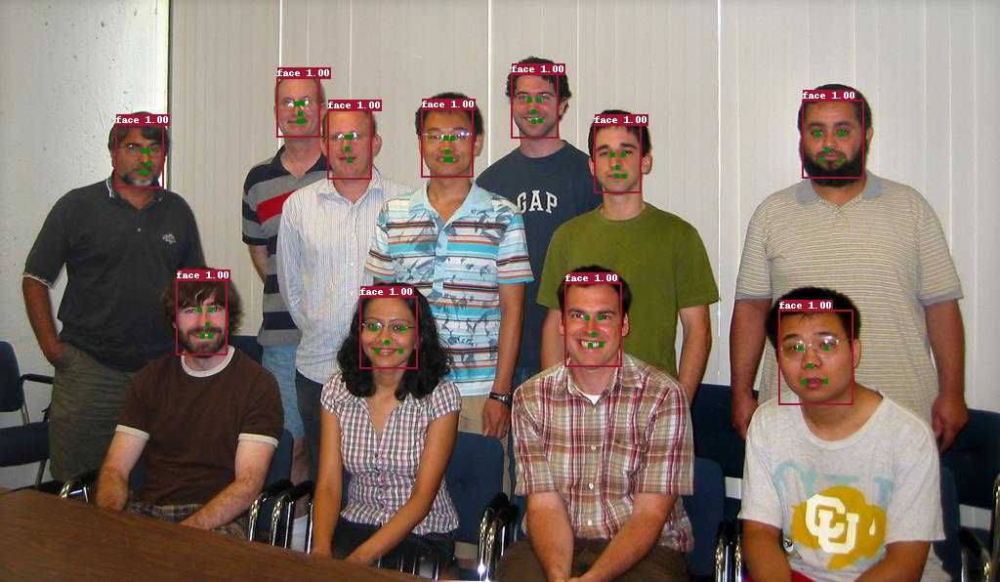

English | [简体中文](FACE_DETECTION.md)
# FaceDetection

## Table of Contents
- [Introduction](#Introduction)
- [Benchmark and Model Zoo](#Benchmark-and-Model-Zoo)
- [Quick Start](#Quick-Start)
    - [Data Pipline](#Data-Pipline)
    - [Training and Inference](#Training-and-Inference)
    - [Evaluation](#Evaluation)
- [Face key-point detection](#Face-key-point-detection)
- [Algorithm Description](#Algorithm-Description)
- [Contributing](#Contributing)

## Introduction
The goal of FaceDetection is to provide efficient and high-speed face detection solutions,
including cutting-edge and classic models.


## Benchmark and Model Zoo
PaddleDetection Supported architectures is shown in the below table, please refer to
[Algorithm Description](#Algorithm-Description) for details of the algorithm.

|                          | Original | Lite <sup>[1](#lite)</sup> | NAS <sup>[2](#nas)</sup> |
|:------------------------:|:--------:|:--------------------------:|:------------------------:|
| [BlazeFace](#BlazeFace)  | ✓        |                          ✓ | ✓                        |
| [FaceBoxes](#FaceBoxes)  | ✓        |                          ✓ | x                        |

<a name="lite">[1]</a> `Lite` edition means reduces the number of network layers and channels.  
<a name="nas">[2]</a> `NAS` edition means use `Neural Architecture Search` algorithm to
optimized network structure.


### Model Zoo

#### mAP in WIDER FACE

| Architecture | Type     | Size | Img/gpu | Lr schd | Easy Set  | Medium Set | Hard Set  | Download | Configs |
|:------------:|:--------:|:----:|:-------:|:-------:|:---------:|:----------:|:---------:|:--------:|:--------:|
| BlazeFace    | Original | 640  |    8    | 32w     | **0.915** | **0.892**  | **0.797** | [model](https://paddlemodels.bj.bcebos.com/object_detection/blazeface_original.tar) | [config](https://github.com/PaddlePaddle/PaddleDetection/tree/develop/static/configs/face_detection/blazeface.yml) |
| BlazeFace    | Lite     | 640  |    8    | 32w     | 0.909     | 0.885      | 0.781     | [model](https://paddlemodels.bj.bcebos.com/object_detection/blazeface_lite.tar) | [config](https://github.com/PaddlePaddle/PaddleDetection/tree/develop/static/configs/face_detection/blazeface.yml) |
| BlazeFace    | NAS      | 640  |    8    | 32w     | 0.837     | 0.807      | 0.658     | [model](https://paddlemodels.bj.bcebos.com/object_detection/blazeface_nas.tar) | [config](https://github.com/PaddlePaddle/PaddleDetection/tree/develop/static/configs/face_detection/blazeface_nas.yml) |
| BlazeFace    | NAS_V2   | 640  |    8    | 32W     | 0.870     | 0.837      | 0.685     | [model](https://paddlemodels.bj.bcebos.com/object_detection/blazeface_nas2.tar) |  [config](https://github.com/PaddlePaddle/PaddleDetection/tree/develop/static/configs/face_detection/blazeface_nas_v2.yml) |
| FaceBoxes    | Original | 640  |    8    | 32w     | 0.878     | 0.851      | 0.576     | [model](https://paddlemodels.bj.bcebos.com/object_detection/faceboxes_original.tar) |  [config](https://github.com/PaddlePaddle/PaddleDetection/tree/develop/static/configs/face_detection/faceboxes.yml) |
| FaceBoxes    | Lite     | 640  |    8    | 32w     | 0.901     | 0.875      | 0.760     | [model](https://paddlemodels.bj.bcebos.com/object_detection/faceboxes_lite.tar) | [config](https://github.com/PaddlePaddle/PaddleDetection/tree/develop/static/configs/face_detection/faceboxes_lite.yml) |

**NOTES:**  
- Get mAP in `Easy/Medium/Hard Set` by multi-scale evaluation in `tools/face_eval.py`.
For details can refer to [Evaluation](#Evaluate-on-the-WIDER-FACE).
- BlazeFace-Lite Training and Testing ues [blazeface.yml](https://github.com/PaddlePaddle/PaddleDetection/blob/develop/static/configs/face_detection/blazeface.yml)
configs file and set `lite_edition: true`.

#### mAP in FDDB

| Architecture | Type     | Size | DistROC | ContROC |
|:------------:|:--------:|:----:|:-------:|:-------:|
| BlazeFace    | Original | 640  | **0.992**   | **0.762**   |
| BlazeFace    | Lite     | 640  | 0.990   | 0.756   |
| BlazeFace    | NAS      | 640  | 0.981   | 0.741   |
| FaceBoxes    | Original | 640  | 0.987   | 0.736   |
| FaceBoxes    | Lite     | 640  | 0.988   | 0.751   |

**NOTES:**  
- Get mAP by multi-scale evaluation on the FDDB dataset.
For details can refer to [Evaluation](#Evaluate-on-the-FDDB).

#### Infer Time and Model Size comparison  

| Architecture | Type     | Size | P4(trt32) (ms) | CPU (ms) | CPU (ms)(enable_mkldmm) | Qualcomm SnapDragon 855(armv8) (ms)   | Model size (MB) |
|:------------:|:--------:|:----:|:--------------:|:--------:|:--------:|:-------------------------------------:|:---------------:|
| BlazeFace    | 原始版本 | 128  | 1.387          | 23.461   | 4.92 |  6.036                                | 0.777           |
| BlazeFace    | Lite版本   | 128  | 1.323          | 12.802   | 7.16 | 6.193                                | 0.68            |
| BlazeFace    | NAS版本    | 128  | 1.03           | 6.714    | 3.641 | 2.7152                               | 0.234           |
| BlazeFace    | NAS_V2版本    | 128  | 0.909        |   9.58  | 7.903 | 3.499                               | 0.383           |
| FaceBoxes    | 原始版本 | 128  | 3.144          | 14.972   | 9,852 | 19.2196                              | 3.6             |
| FaceBoxes    | Lite版本   | 128  | 2.295          | 11.276   | 6.969 | 8.5278                               | 2               |
| BlazeFace    | 原始版本 | 320  | 3.01           | 132.408  | 20.762 | 70.6916                              | 0.777           |
| BlazeFace    | Lite版本   | 320  | 2.535          | 69.964   | 35.612 | 69.9438                              | 0.68            |
| BlazeFace    | NAS版本    | 320  | 2.392          | 36.962   | 14.443 | 39.8086                              | 0.234           |
| BlazeFace    | NAS_V2版本    | 320  | 1.487          | 52.038   | 38.693 | 56.137                              | 0.383           |
| FaceBoxes    | 原始版本 | 320  | 7.556          | 84.531   | 48.465 | 52.1022                              | 3.6             |
| FaceBoxes    | Lite版本   | 320  | 18.605         | 78.862   | 46.488 |  59.8996                              | 2               |
| BlazeFace    | 原始版本 | 640  | 8.885          | 519.364  | 78.825 | 149.896                              | 0.777           |
| BlazeFace    | Lite版本   | 640  | 6.988          | 284.13   | 131.385 | 149.902                              | 0.68            |
| BlazeFace    | NAS版本    | 640  | 7.448          | 142.91   | 56.725 | 69.8266                              | 0.234           |
| BlazeFace    | NAS_V2版本    | 640  | 4.201          | 197.695   | 153.626 | 88.278                             | 0.383           |
| FaceBoxes    | 原始版本 | 640  | 78.201         | 394.043  |  239.201 | 169.877                              | 3.6             |
| FaceBoxes    | Lite版本  | 640  | 59.47          | 313.683  | 168.73 | 139.918                              | 2               |

**NOTES:**  
- CPU: Intel(R) Xeon(R) CPU E5-2650 v4 @ 2.20GHz.
- P4(trt32) and CPU tests based on PaddlePaddle, PaddlePaddle version is 1.8.0.
- ARM test environment:
    - Qualcomm SnapDragon 855(armv8);
    - Single thread;
    - Paddle-Lite version develop.

## Quick Start

### Data Pipline
We use the [WIDER FACE dataset](http://shuoyang1213.me/WIDERFACE/) to carry out the training
and testing of the model, the official website gives detailed data introduction.
- WIDER Face data source:  
Loads `wider_face` type dataset with directory structures like this:

  ```
  dataset/wider_face/
  ├── wider_face_split
  │   ├── wider_face_train_bbx_gt.txt
  │   ├── wider_face_val_bbx_gt.txt
  ├── WIDER_train
  │   ├── images
  │   │   ├── 0--Parade
  │   │   │   ├── 0_Parade_marchingband_1_100.jpg
  │   │   │   ├── 0_Parade_marchingband_1_381.jpg
  │   │   │   │   ...
  │   │   ├── 10--People_Marching
  │   │   │   ...
  ├── WIDER_val
  │   ├── images
  │   │   ├── 0--Parade
  │   │   │   ├── 0_Parade_marchingband_1_1004.jpg
  │   │   │   ├── 0_Parade_marchingband_1_1045.jpg
  │   │   │   │   ...
  │   │   ├── 10--People_Marching
  │   │   │   ...
  ```

- Download dataset manually:  
To download the WIDER FACE dataset, run the following commands:
```
cd dataset/wider_face && ./download.sh
```

- Download dataset automatically:
If a training session is started but the dataset is not setup properly
(e.g, not found in dataset/wider_face), PaddleDetection can automatically
download them from [WIDER FACE dataset](http://shuoyang1213.me/WIDERFACE/),
the decompressed datasets will be cached in ~/.cache/paddle/dataset/ and can be discovered
automatically subsequently.

#### Data Augmentation

- **Data-anchor-sampling:** Randomly transform the scale of the image to a certain range of scales,
greatly enhancing the scale change of the face. The specific operation is to obtain $v=\sqrt{width * height}$
according to the randomly selected face height and width, and judge the value of `v` in which interval of
 `[16,32,64,128]`. Assuming `v=45` && `32<v<64`, and any value of `[16,32,64]` is selected with a probability
 of uniform distribution. If `64` is selected, the face's interval is selected in `[64 / 2, min(v * 2, 64 * 2)]`.

- **Other methods:** Including `RandomDistort`,`ExpandImage`,`RandomInterpImage`,`RandomFlipImage` etc.
Please refer to [READER.md](../advanced_tutorials/READER.md) for details.

### Training and Inference
`Training` and `Inference` please refer to [GETTING_STARTED.md](../tutorials/GETTING_STARTED.md)  
**NOTES:**
- `BlazeFace` and `FaceBoxes` is trained in 4 GPU with `batch_size=8` per gpu (total batch size as 32)
and trained 320000 iters.(If your GPU count is not 4, please refer to the rule of training parameters
in the table of [calculation rules](../FAQ.md)).
- Currently we do not support evaluation in training.

### Evaluation
Currently we support evaluation on the `WIDER FACE` dataset and the` FDDB` dataset. First run `tools / face_eval.py`
to generate the evaluation result file, and then use matlab(WIDER FACE)
or OpenCV(FDDB) calculates specific evaluation indicators.  
Among them, the optional arguments list for running `tools / face_eval.py` is as follows:
- `-f` or `--output_eval`: Evaluation file directory, default is `output/pred`.
- `-e` or `--eval_mode`: Evaluation mode, include `widerface` and `fddb`, default is `widerface`.
- `--multi_scale`: If you add this action button in the command, it will select `multi_scale` evaluation.
Default is `False`, it will select `single-scale` evaluation.

#### Evaluate on the WIDER FACE
- Evaluate and generate results files:
```
export CUDA_VISIBLE_DEVICES=0
python -u tools/face_eval.py -c configs/face_detection/blazeface.yml \
       -o weights=output/blazeface/model_final \
       --eval_mode=widerface
```
After the evaluation is completed, the test result in txt format will be generated in `output/pred`.

- Download the official evaluation script to evaluate the AP metrics:
```
wget http://mmlab.ie.cuhk.edu.hk/projects/WIDERFace/support/eval_script/eval_tools.zip
unzip eval_tools.zip && rm -f eval_tools.zip
```
- Modify the result path and the name of the curve to be drawn in `eval_tools/wider_eval.m`:
```
# Modify the folder name where the result is stored.
pred_dir = './pred';  
# Modify the name of the curve to be drawn
legend_name = 'Fluid-BlazeFace';
```
- `wider_eval.m` is the main execution program of the evaluation module. The run command is as follows:
```
matlab -nodesktop -nosplash -nojvm -r "run wider_eval.m;quit;"
```

#### Evaluate on the FDDB
We provide a FDDB dataset evaluation process (currently only supports Linux systems),
please refer to [FDDB official website](http://vis-www.cs.umass.edu/fddb/) for other specific details.

- 1)Download and install OpenCV：  
Download OpenCV: go to [OpenCV library](https://opencv.org/releases/) to Manual download  
Install OpenCV：Please refer to [Official OpenCV Installation Tutorial](https://docs.opencv.org/master/d7/d9f/tutorial_linux_install.html)
to install through source code.

- 2)Download datasets, evaluation code, and formatted data:  
```
./dataset/fddb/download.sh
```

- 3)Compile FDDB evaluation code:
Go to the `dataset/fddb/evaluation` directory and modify the contents of the MakeFile file as follows:
```
evaluate: $(OBJS)
    $(CC) $(OBJS) -o $@ $(LIBS)
```
Modify the content in `common.hpp` to the following form:
```
#define __IMAGE_FORMAT__ ".jpg"
//#define __IMAGE_FORMAT__ ".ppm"
#define __CVLOADIMAGE_WORKING__
```
According to the `grep -r "CV_RGB"` command, find the code segment containing `CV_RGB`, change `CV_RGB` to `Scalar`,
and add `using namespace cv;` in cpp, then compile:
```
make clean && make
```

- 4)Start evaluation:  
Modify the contents of the `dataset_dir` and` annotation` fields in the config file:
```
EvalReader:
  ...
  dataset:
    dataset_dir: dataset/fddb
    anno_path: FDDB-folds/fddb_annotFile.txt
    ...
```
Evaluate and generate results files:
```
python -u tools/face_eval.py -c configs/face_detection/blazeface.yml \
       -o weights=output/blazeface/model_final \
       --eval_mode=fddb
```
After the evaluation is completed, the test result in txt format will be generated in `output/pred/pred_fddb_res.txt`.  
Generate ContROC and DiscROC data:  
```
cd dataset/fddb/evaluation
./evaluate -a ./FDDB-folds/fddb_annotFile.txt \
           -f 0 -i ./ -l ./FDDB-folds/filePath.txt -z .jpg \
           -d {RESULT_FILE} \
           -r {OUTPUT_DIR}
```
**NOTES:**  
(1)`RESULT_FILE` is the FDDB prediction result file output by `tools/face_eval.py`;  
(2)`OUTPUT_DIR` is the prefix of the FDDB evaluation output file,
which will generate two files `{OUTPUT_DIR}ContROC.txt`、`{OUTPUT_DIR}DiscROC.txt`;  
(3)The interpretation of the argument can be performed by `./evaluate --help`.

## Face key-point detection

(1)Download face key-point annotation file in WIDER FACE dataset([Link](https://dataset.bj.bcebos.com/wider_face/wider_face_train_bbx_lmk_gt.txt)), and copy to the folder `wider_face/wider_face_split`:

```shell
cd dataset/wider_face/wider_face_split/
wget https://dataset.bj.bcebos.com/wider_face/wider_face_train_bbx_lmk_gt.txt
```

(2)Use `configs/face_detection/blazeface_keypoint.yml` configuration file for training and evaluation, the method of use is the same as the previous section.

### Evaluation

| Architecture  | Size | Img/gpu | Lr schd | Easy Set  | Medium Set | Hard Set  | Download | Configs |
|:------------:|:----:|:-------:|:-------:|:---------:|:----------:|:---------:|:--------:|:--------:|
| BlazeFace Keypoint     | 640  |    16    | 16w     | 0.852     | 0.816      | 0.662     | [download](https://paddlemodels.bj.bcebos.com/object_detection/blazeface_keypoint.pdparams) | [config](https://github.com/PaddlePaddle/PaddleDetection/tree/develop/static/configs/face_detection/blazeface_keypoint.yml) |




## Algorithm Description

### BlazeFace
**Introduction:**  
[BlazeFace](https://arxiv.org/abs/1907.05047) is Google Research published face detection model.
It's lightweight but good performance, and tailored for mobile GPU inference. It runs at a speed
of 200-1000+ FPS on flagship devices.

**Particularity:**  
- Anchor scheme stops at 8×8(input 128x128), 6 anchors per pixel at that resolution.
- 5 single, and 6 double BlazeBlocks: 5×5 depthwise convs, same accuracy with fewer layers.
- Replace the non-maximum suppression algorithm with a blending strategy that estimates the
regression parameters of a bounding box as a weighted mean between the overlapping predictions.

**Edition information:**
- Original: Reference original paper reproduction.
- Lite: Replace 5x5 conv with 3x3 conv, fewer network layers and conv channels.
- NAS: use `Neural Architecture Search` algorithm to optimized network structure,
less network layer and conv channel number than `Lite`.
- NAS_V2: this version of model architecture searched based on blazeface-NAS by the SANAS in PaddleSlim, the average precision is 3% higher than blazeface-NAS, the latency is only 5% higher than blazeface-NAS on chip 855.

### FaceBoxes
**Introduction:**  
[FaceBoxes](https://arxiv.org/abs/1708.05234) which named A CPU Real-time Face Detector
with High Accuracy is face detector proposed by Shifeng Zhang, with high performance on
both speed and accuracy. This paper is published by IJCB(2017).

**Particularity:**
- Anchor scheme stops at 20x20, 10x10, 5x5, which network input size is 640x640,
including 3, 1, 1 anchors per pixel at each resolution. The corresponding densities
are 1, 2, 4(20x20), 4(10x10) and 4(5x5).
- 2 convs with CReLU, 2 poolings, 3 inceptions and 2 convs with ReLU.
- Use density prior box to improve detection accuracy.

**Edition information:**
- Original: Reference original paper reproduction.
- Lite: 2 convs with CReLU, 1 pooling, 2 convs with ReLU, 3 inceptions and 2 convs with ReLU.
Anchor scheme stops at 80x80 and 40x40, including 3, 1 anchors per pixel at each resolution.
The corresponding densities are 1, 2, 4(80x80) and 4(40x40), using less conv channel number than lite.


## Contributing
Contributions are highly welcomed and we would really appreciate your feedback!!
