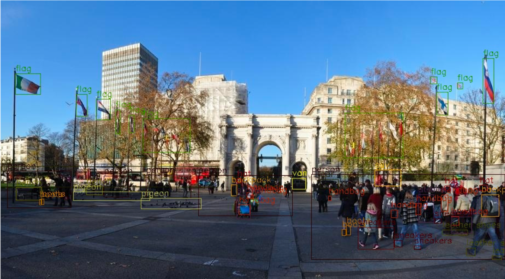
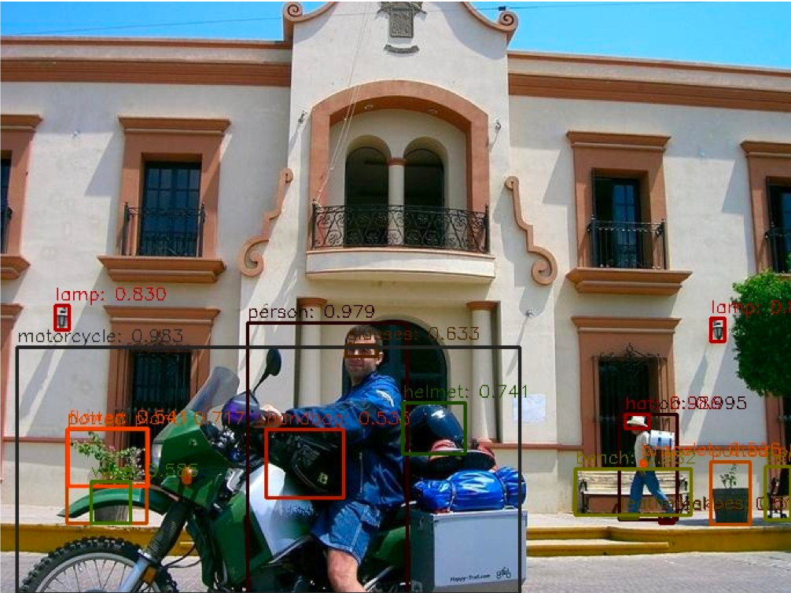

# CACascade RCNN
## Intorduction
Objects365 2019 Challenge CACascade RCNN is one of the best single models won by Baidu Visual Technology Department in Objects365 2019 Challenge. Objects365 is a new dataset in the field of universal object detection, which aims to promote detection research on different objects in natural scenes. Objects365 marks 365 object classes on 630,000 images, and there are more than 10 million boundary boxes in the training set. This is one of the best single models in Full Track.



## Methods described

According to the characteristics of large-scale object detection algorithm, we propose a Class Aware Sampling method based on the number of object categories contained in the image. Training model based on this method can make the model converge to a better effect in a shorter time.


The best single model published this time is a two-stage detection model based on Cascade RCNN, which replaces Backbone with a more powerful SENet154 model, Deformable Conv module and a more complex two-stage network structure. As the Batch Size is relatively small, Group Normalization operation is added and multi-scale training is used, which has achieved very good results. The pre-training model was trained on ImageNet and COCO dataset successively, among which Mask branch was added in COCO dataset training, and the rest structure was the same as CACascade RCNN, which was automatically downloaded when the training started.

## Method of use

1.Data preparation

Data need to be [Objects365 official website](https://www.objects365.org/download.html) to apply for download, download data after placing data in a dataset directory.
```
${THIS REPO ROOT}
  \--dataset
      \-- objects365
           \-- annotations
                |-- train.json
                |-- val.json
           \-- train
           \-- val
```

2.Priming training model

```bash
python tools/train.py -c configs/obj365/cascade_rcnn_dcnv2_se154_vd_fpn_gn_cas.yml
```

3.Model prediction results

|        Model         | Val set mAP |                           Download link                           | Configuration File |
| :-----------------: | :--------: | :----------------------------------------------------------: | :--------: |
| CACascadeRCNN SE154 |    31.6    | [model](https://paddlemodels.bj.bcebos.com/object_detection/cascade_rcnn_dcnv2_se154_vd_fpn_gn_cas_obj365.tar) |  [Configuration File](https://github.com/PaddlePaddle/PaddleDetection/tree/develop/static/configs/obj365/cascade_rcnn_dcnv2_se154_vd_fpn_gn_cas.yml) |

## Model effect


