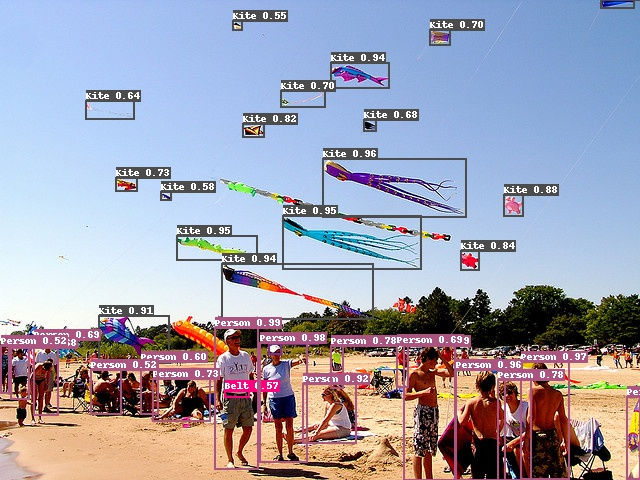

# CascadeCA RCNN
## Introduction
CascadeCA RCNN is the best single model of Baidu Visual Technology Department in Google AI Open Images 2019 Object Detction competition. This single model helped the team win the second place among more than 500 parameter teams. Open Images Dataset V5(OIDV5) contains 500 categories, 173W training Images and more than 1400W labeled borders. It is the largest Open Dataset of object detection known at present. Dataset address [https://storage.googleapis.com/openimages/web/index.html](https://storage.googleapis.com/openimages/web/index.html), Address of team's technical proposal report in competition [https://arxiv.org/pdf/1911.07171.pdf](https://arxiv.org/pdf/1911.07171.pdf)


## Methods described
This model combines the current better detection methods. Specifically, it uses ResNet200-vd as the backbone of the detection model, The imagenet classification the training model in [here](https://github.com/PaddlePaddle/models/blob/develop/PaddleCV/image_classification/README_en.md) download; CascadeCA RCNN, Feature Pyramid Networks, Non-local, Deformable-V2 and other methods are combined. It should be noted here that the standard CascadeRCNN only predicts two boxes (foreground and background, using the score information to determine the category to which the final foreground belongs), while this model separately predicts one box (Cascade Class Aware) for each category. The final block diagram of the model is shown in the figure below.


Due to the serious category imbalance of OIDV5, the strategy of dynamic sampling is adopted to select samples and carry out training. Multi-scale training is used to solve the problem of large border area. In addition, the team used Libra Loss instead of Smooth L1 Loss to calculate the loss of the prediction box; In the prediction, SoftNMS method is used for post-processing to ensure that more boxes can be recalled.

About 189 categories of Objects365 Dataset and OIDV5 are repeated, so the two datasets are combined for training to expand the training data of OIDV5. Finally, the model and its performance indicators are shown in the following table. More specific model training and integration strategies can be seen: [OIDV5 technical report](https://arxiv.org/pdf/1911.07171.pdf)。

The training results of OIDV5 model are as follows.


|        Model structure         | Public/Private Score |                           Download link                           | Configuration File |
| :-----------------: | :--------: | :----------------------------------------------------------: | :--------: |
| CascadeCARCNN-FPN-Dcnv2-Nonlocal ResNet200-vd |    0.62690/0.59459    | [model](https://paddlemodels.bj.bcebos.com/object_detection/oidv5_cascade_rcnn_cls_aware_r200_vd_fpn_dcnv2_nonlocal_softnms.tar) |  [Configuration File](https://github.com/PaddlePaddle/PaddleDetection/tree/develop/static/configs/oidv5/cascade_rcnn_cls_aware_r200_vd_fpn_dcnv2_nonlocal_softnms.yml) |


In addition, to verify the performance of the model, Paddle Detection also trained models for COCO2017 and Objects365 Dataset based on the model structure. The model and validation set indicators are shown in the following table.

|        Model structure         | Dataset |  val set mAP |                           Download link                           | Configuration File |
| :-----------------: | :--------: | :--------: | :----------------------------------------------------------: | :--------: |
| CascadeCARCNN-FPN-Dcnv2-Nonlocal ResNet200-vd | COCO2017 |    51.7%    | [Model](https://paddlemodels.bj.bcebos.com/object_detection/cascade_rcnn_cls_aware_r200_vd_fpn_dcnv2_nonlocal_softnms.tar) | [Configuration File](https://github.com/PaddlePaddle/PaddleDetection/tree/develop/static/configs/dcn/cascade_rcnn_cls_aware_r200_vd_fpn_dcnv2_nonlocal_softnms.yml) |
| CascadeCARCNN-FPN-Dcnv2-Nonlocal ResNet200-vd | Objects365 |    34.5%    | [Model](https://paddlemodels.bj.bcebos.com/object_detection/obj365_cascade_rcnn_cls_aware_r200_vd_fpn_dcnv2_nonlocal_softnms.tar) | [Configuration File](https://github.com/PaddlePaddle/PaddleDetection/tree/develop/static/configs/obj365/cascade_rcnn_cls_aware_r200_vd_fpn_dcnv2_nonlocal_softnms.yml) |

COCO and Objects365 Dataset have the same data format. Currently, they only support prediction and evaluation.

## Method of use

OIDV5 dataset format is different from COCO, currently only single image prediction is supported. OIDV5 model evaluation method can be referred to [documentation](https://github.com/tensorflow/models/blob/master/research/object_detection/g3doc/challenge_evaluation.md)

1. Download the model and unzip it.

2. Run the prediction program.

```bash
python -u tools/infer.py -c configs/oidv5/cascade_rcnn_cls_aware_r200_vd_fpn_dcnv2_nonlocal_softnms.yml -o weights=./oidv5_cascade_rcnn_cls_aware_r200_vd_fpn_dcnv2_nonlocal_softnms/ --infer_img=demo/000000570688.jpg
```

The folder where the model is located needs to be modified according to its position.

Detection result images can be viewed in the `output` folder.

## Model detection effect


