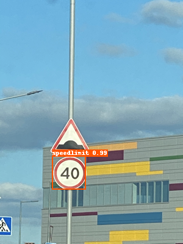

English | [简体中文](QUICK_STARTED_cn.md)

# Quick Start
In order to enable users to quickly produce models in a short time and master the use of PaddleDetection, this tutorial uses a pre-trained detection model to finetune small datasets. A good model can be produced in a short period of time. In actual business, it is recommended that users select a suitable model configuration file for adaptation according to their needs.
- **Set GPU**
```bash
export CUDA_VISIBLE_DEVICES=0
```

## Quick Start
```
# predict an image using PP-YOLO
python tools/infer.py -c configs/ppyolo/ppyolo.yml -o use_gpu=true weights=https://paddlemodels.bj.bcebos.com/object_detection/ppyolo.pdparams --infer_img=demo/000000014439.jpg
```
the result：


## Prepare Dataset
The Dataset is [Kaggle dataset](https://www.kaggle.com/andrewmvd/road-sign-detection) ，Contains 877 images, 4 data categories: crosswalk, speedlimit, stop, trafficlight.
The dataset is divided into training set(contains 701 images) and test set(contains 176 images)，[download link](https://paddlemodels.bj.bcebos.com/object_detection/roadsign_voc.tar).

```
#
python dataset/roadsign_voc/download_roadsign_voc.py
```

## Train、Eval、Infer
### 1、Train
```
# It will takes about 5 minutes on GPU
# -c set configt file
# -o overwrite the settings in the configuration file
# --eval Evaluate while training, and a model named best_model.pdmodel with the most evaluation results will be automatically saved


python tools/train.py -c configs/yolov3_mobilenet_v1_roadsign.yml --eval -o use_gpu=true
```

If you want to observe the loss change curve in real time through VisualDL, add --use_vdl=true to the training command, and set the log save path through --vdl_log_dir.
**Note: VisualDL need Python>=3.5**

Please install [VisualDL](https://github.com/PaddlePaddle/VisualDL) first
```
python -m pip install visualdl -i https://mirror.baidu.com/pypi/simple
```

```
python -u tools/train.py -c configs/yolov3_mobilenet_v1_roadsign.yml \
                        --use_vdl=true \
                        --vdl_log_dir=vdl_dir/scalar \
                        --eval
```
View the change curve in real time through the visualdl command:
```
visualdl --logdir vdl_dir/scalar/ --host <host_IP> --port <port_num>
```

### 2、Eval
```
# Eval using best_model by default
# -c set config file
# -o overwrite the settings in the configuration file

CUDA_VISIBLE_DEVICES=0 python tools/eval.py -c configs/yolov3_mobilenet_v1_roadsign.yml -o use_gpu=true
```


### 3、Infer
```
# -c set config file
# -o overwrite the settings in the configuration file
# --infer_img image path
# After the prediction is over, an image of the same name with the prediction result will be generated in the output folder

python tools/infer.py -c configs/yolov3_mobilenet_v1_roadsign.yml -o use_gpu=true --infer_img=demo/road554.png
```

The result is as shown below：


