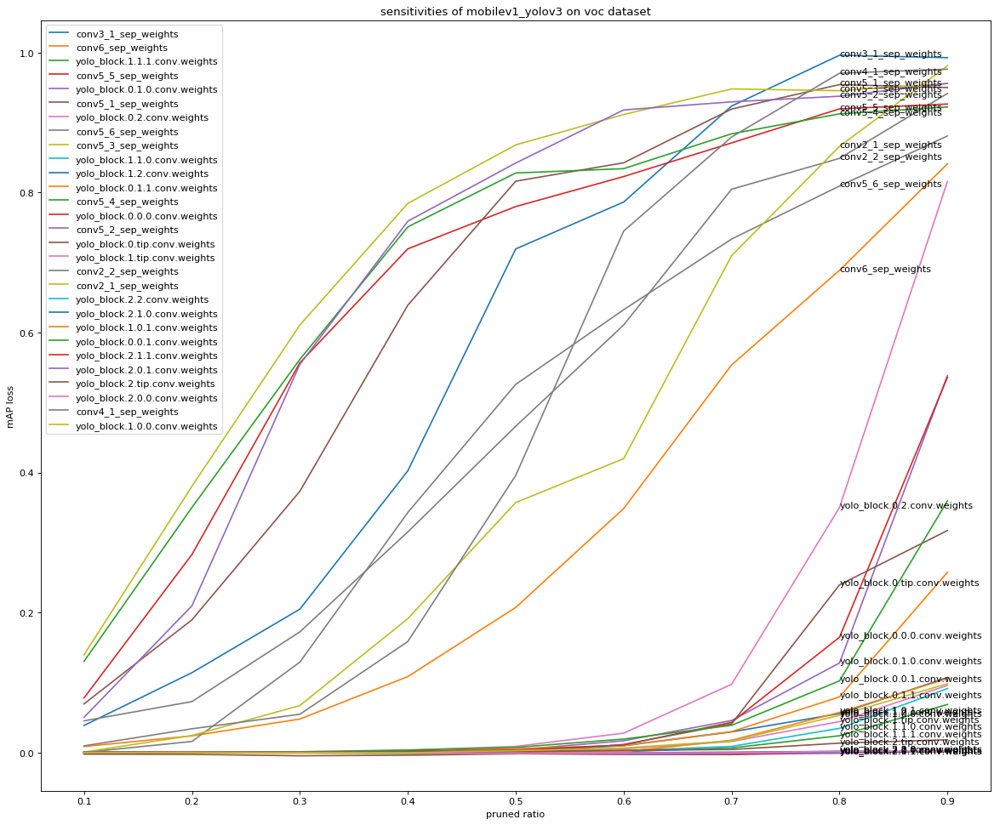

# 卷积层敏感度分析教程

请确保已正确[安装PaddleDetection](https://github.com/PaddlePaddle/PaddleDetection/blob/develop/static/docs/tutorials/INSTALL_cn.md)及其依赖。

该文档介绍如何使用[PaddleSlim](https://paddlepaddle.github.io/PaddleSlim)的敏感度分析接口对检测库中的模型的卷积层进行敏感度分析。

在检测库中，可以直接调用`PaddleDetection/slim/sensitive/sensitive.py`脚本实现敏感度分析，在该脚本中调用了PaddleSlim的[paddleslim.prune.sensitivity](https://paddlepaddle.github.io/PaddleSlim/api/prune_api/#sensitivity)接口。

该教程中所示操作，如无特殊说明，均在`PaddleDetection/slim/sensitive/`路径下执行。

## 数据准备

请参考检测库[数据模块](https://github.com/PaddlePaddle/PaddleDetection/blob/develop/static/docs/tutorials/INSTALL_cn.md)文档准备数据。

## 模型选择

通过`-c`选项指定待分析模型的配置文件的相对路径，更多可选配置文件请参考: [检测库配置文件](https://github.com/PaddlePaddle/PaddleDetection/blob/develop/static/configs)

通过`-o weights`指定模型的权重，可以指定url或本地文件系统的路径。如下所示：

```
-o weights=https://paddlemodels.bj.bcebos.com/object_detection/yolov3_mobilenet_v1_voc.tar
```

或

```
-o weights=output/yolov3_mobilenet_v1_voc/model_final
```

官方已发布的模型请参考: [模型库](https://github.com/PaddlePaddle/PaddleDetection/blob/develop/static/docs/MODEL_ZOO_cn.md)

## 确定待分析参数

在计算敏感度之前，需要查出待分析的卷积层的参数的名称。通过以下命令查看当前模型的所有参数：

```
python sensitive.py \
-c ../../configs/yolov3_mobilenet_v1_voc.yml \
--print_params
```

通过观察参数名称和参数的形状，筛选出所有卷积层参数，并确定要分析的卷积层参数。

## 执行分析

通过选项`--pruned_params`指定待分析的卷积层参数名，参数名间以英文字符逗号分割。
通过选项`--sensitivities_file`指定敏感度信息保存的文件，敏感度信息会追加到该文件中。重启敏感度计算任务，该文件中已计算的信息不会再被计算。

示例如下：

```
nohup python sensitive.py \
-c ../../configs/yolov3_mobilenet_v1_voc.yml \
--pruned_params "yolo_block.0.0.0.conv.weights,yolo_block.0.0.1.conv.weights,yolo_block.0.1.0.conv.weights,yolo_block.0.1.1.conv.weights,yolo_block.0.2.conv.weights,yolo_block.0.tip.conv.weights,yolo_block.1.0.0.conv.weights,yolo_block.1.0.1.conv.weights,yolo_block.1.1.0.conv.weights,yolo_block.1.1.1.conv.weights,yolo_block.1.2.conv.weights,yolo_block.1.tip.conv.weights,yolo_block.2.0.0.conv.weights,yolo_block.2.0.1.conv.weights,yolo_block.2.1.0.conv.weights,yolo_block.2.1.1.conv.weights,yolo_block.2.2.conv.weights,yolo_block.2.tip.conv.weights" \
--sensitivities_file "./demo.data"
```

执行`python sensitive.py --help`查看更多选项。

## 分析敏感度信息

可以通过[paddleslim.prune.load_sensitivities](https://paddlepaddle.github.io/PaddleSlim/api/prune_api/#load_sensitivities)从文件中加载敏感度信息，并使用Python数据分析工具画图分析。下图展示了`MobileNetv1-YOLOv3-VOC`模型在VOC数据上的敏感度信息：

<div align="center">
  
</div>

通过画图分析，可以确定一组合适的剪裁率，或者通过[paddleslim.prune.get_ratios_by_loss](https://paddlepaddle.github.io/PaddleSlim/api/prune_api/#get_ratios_by_losssensitivities-loss)获得合适的剪裁率。

## 分布式计算敏感度信息

如果模型评估速度比较慢，可以考虑使用多进程加速敏感度计算的过程。
通过`--pruned_ratios`指定当前进程计算敏感度时用的剪裁率，默认为"0.1 0.2 0.3 0.4 0.5 0.6 0.7 0.8 0.9"。可以将该组剪切率分配到不同的进程进行计算，如下所示：

```
# 进程1
nohup python sensitive.py \
-c ../../configs/yolov3_mobilenet_v1_voc.yml \
--pruned_params "yolo_block.0.0.0.conv.weights" \
--pruned_ratios "0.1 0.2 0.3 0.4 0.5"
--sensitivities_file "./demo.data.1"
```

```
# 进程2
nohup python sensitive.py \
-c ../../configs/yolov3_mobilenet_v1_voc.yml \
--pruned_params "yolo_block.0.0.0.conv.weights" \
--pruned_ratios "0.6 0.7 0.8 0.9"
--sensitivities_file "./demo.data.2"
```

待以上两个进程执行完毕，通过[paddleslim.prune.merge_sensitive](https://paddlepaddle.github.io/PaddleSlim/api/prune_api/#merge_sensitive)将`demo.data.1`和`demo.data.2`两个文件合并分析。
